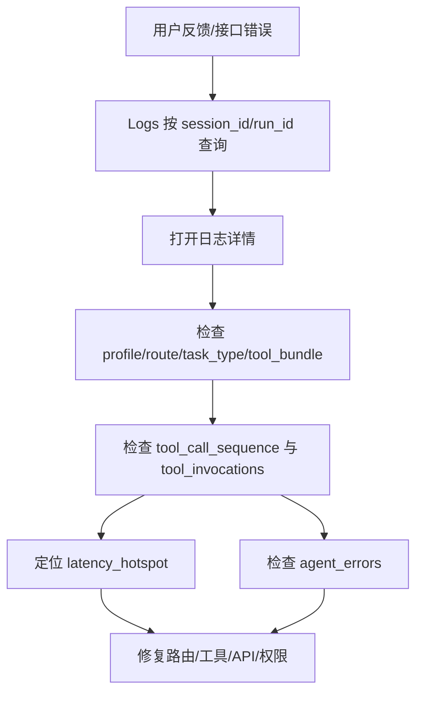

# 管理台与观测指南

本文合并原“后台使用指南”和“管理平台开发者总览”，覆盖管理台入口、核心页面、后端代码地图和排障方法。

## 1. 入口

```text
http://127.0.0.1:10123/admin-ui
```

如果配置了 `ADMIN_API_KEY`，所有 `/admin/*` 请求需要：

```bash
-H "x-admin-api-key: ${ADMIN_API_KEY}"
```

## 2. 管理台架构

```mermaid
flowchart LR
    UI[React /admin-ui] --> Client[frontend/src/api/client.ts]
    Client --> Router[src/admin_api/router.py]
    Router --> Service[src/admin_api/service.py]
    Service --> Repo[src/observability/repository.py]
    Repo --> DB[(Postgres observability schema)]
    Router --> Test[/admin/test/run]
    Test --> Agent[/run or /stream_run]
```

管理台不单独部署服务，静态资源由 `src/main.py` 挂载在 `/admin-ui`，API 挂载在 `/admin/*`。

## 3. 页面能力

| 页面 | 用途 |
| --- | --- |
| Dashboard | 调用量、成功率、延迟、工具成功率、渠道/Profile 分布、高风险会话 |
| Sessions | 按用户、会话、Profile 回放消息 |
| Chat Debug | 多会话调试，支持 `agent_profile`、附件、SSE、案例保存 |
| Logs | 按 run_id/session_id/user_id/source_channel/profile/route/status 检索 |
| API Playground | 构造 `/run`、`/stream_run` 请求 |
| Config | 配置中心骨架页 |

## 4. 关键接口

| 接口 | 说明 |
| --- | --- |
| `GET /admin/dashboard/summary` | Dashboard 聚合 |
| `GET /admin/logs` | 调用日志列表 |
| `GET /admin/logs/{run_id}` | 单次调用详情 |
| `GET /admin/sessions` | 会话列表 |
| `GET /admin/sessions/{session_id}` | 会话详情 |
| `POST /admin/test/run` | 代理调用 Agent |
| `GET /admin/chat-debug/sessions` | Chat Debug 案例列表 |
| `POST /admin/chat-debug/sessions` | 保存调试案例 |

常用查询：

```bash
curl "http://127.0.0.1:10123/admin/logs?page=1&page_size=20&agent_profile=customer_support&status=error" \
  -H "x-admin-api-key: ${ADMIN_API_KEY}"
```

## 5. 代码地图

后端：

| 文件 | 说明 |
| --- | --- |
| `src/admin_api/router.py` | `/admin/*` HTTP 路由 |
| `src/admin_api/schemas.py` | 请求/响应 schema |
| `src/admin_api/service.py` | Dashboard、Logs、Sessions、测试代理聚合 |
| `src/observability/repository.py` | 观测 SQL 查询 |
| `src/observability/writer.py` | 异步写入 API 调用、工具调用、错误 |
| `src/observability/sql/` | 数据库 schema 初始化 |

前端：

| 文件 | 说明 |
| --- | --- |
| `frontend/src/App.tsx` | 页面路由 |
| `frontend/src/layouts/AdminShell.tsx` | 管理台布局 |
| `frontend/src/api/client.ts` | API client |
| `frontend/src/pages/*` | Dashboard、Logs、Sessions、Chat Debug、Playground |

## 6. 观测数据模型

主要表：

- `observability.api_calls`：请求主记录。
- `observability.tool_invocations`：工具调用明细。
- `observability.agent_errors`：运行错误。
- `observability.chat_debug_sessions`：Chat Debug 案例。

重要字段：

- `run_id`：单次调用主键。
- `session_id`：多轮会话主键。
- `user_id`：用户定位。
- `source_channel`：渠道。
- `agent_profile`：从 request JSON 派生。
- `route` / `task_type`：客服 routed graph 的分类结果。

## 7. 排障流程



客服 Agent 重点检查：

- `route` 是否符合问题类型。
- `tool_bundle` 是否收缩正确。
- `entity_resolution` 是否抽到了 MMSI/IMO/船名/区域/日期。
- `tool_call_sequence` 是否有不必要调用。
- `fallback_reason` 是否暴露授权、无数据或校验失败。

## 8. 新增 Profile 或工具后的检查

1. 更新 `config/agent_profiles.json`。
2. 更新 `config/agent_llm_config.json` 工具列表。
3. 跑：

```bash
.venv/bin/python - <<'PY'
import sys
sys.path.insert(0, 'src')
from skills import SkillLoader
print(SkillLoader.validate_registry_consistency())
PY
```

4. 在 Chat Debug 中分别测试 `customer_support` 和 `employee_assistant`。
5. 到 Logs 检查 profile、route、tool 调用是否正确落库。

