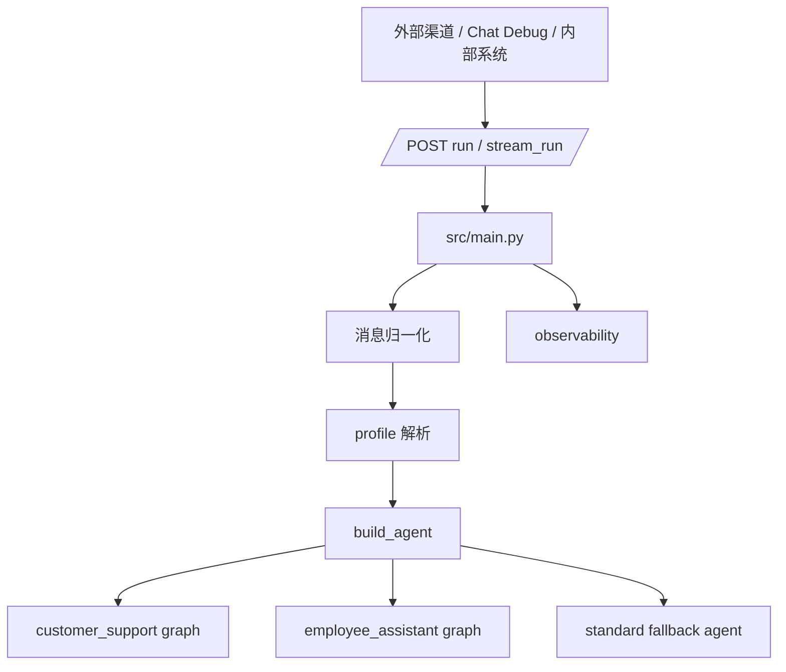
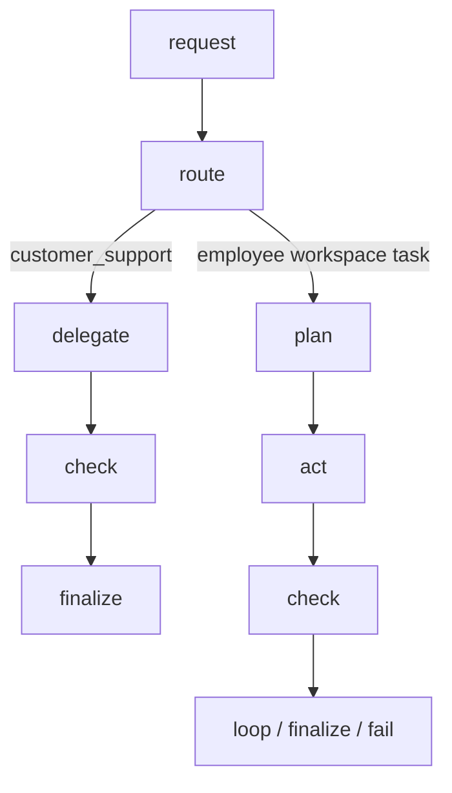
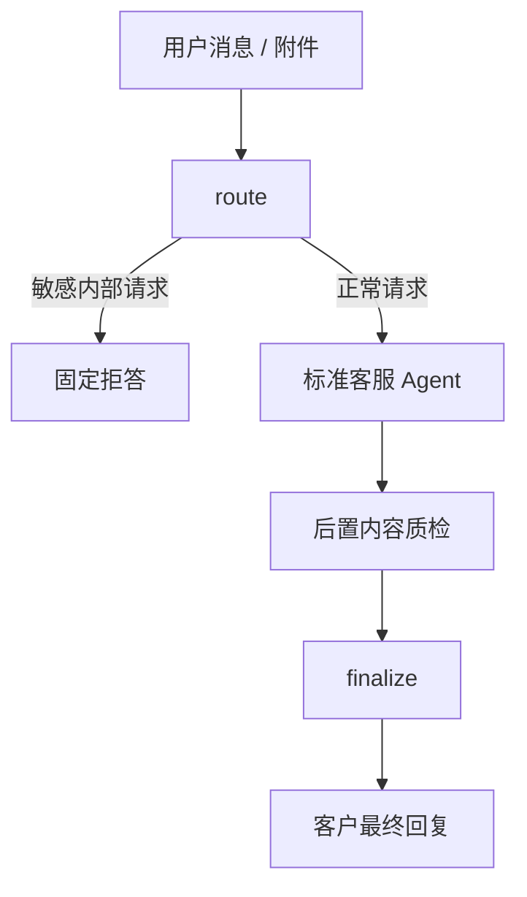
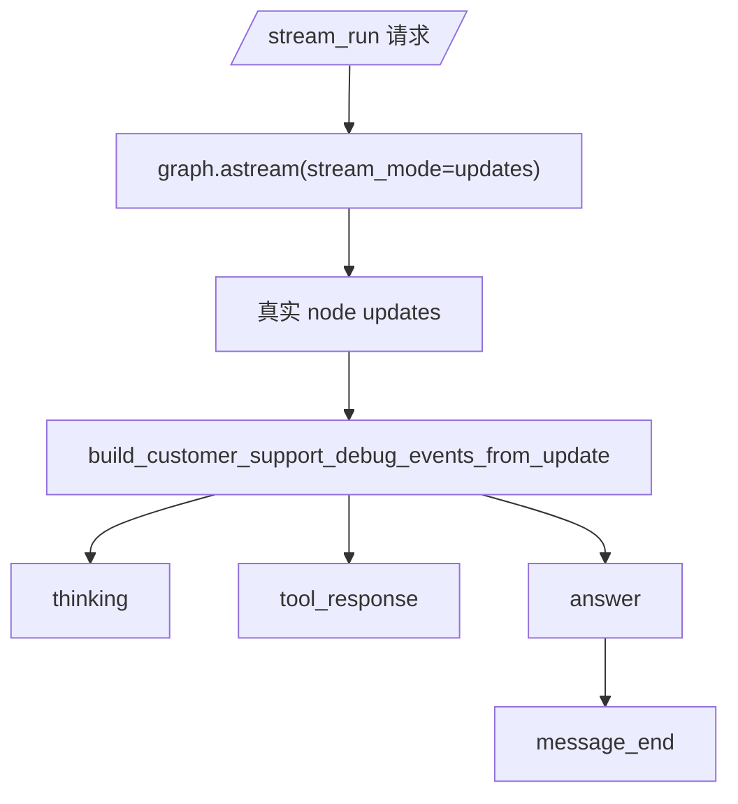
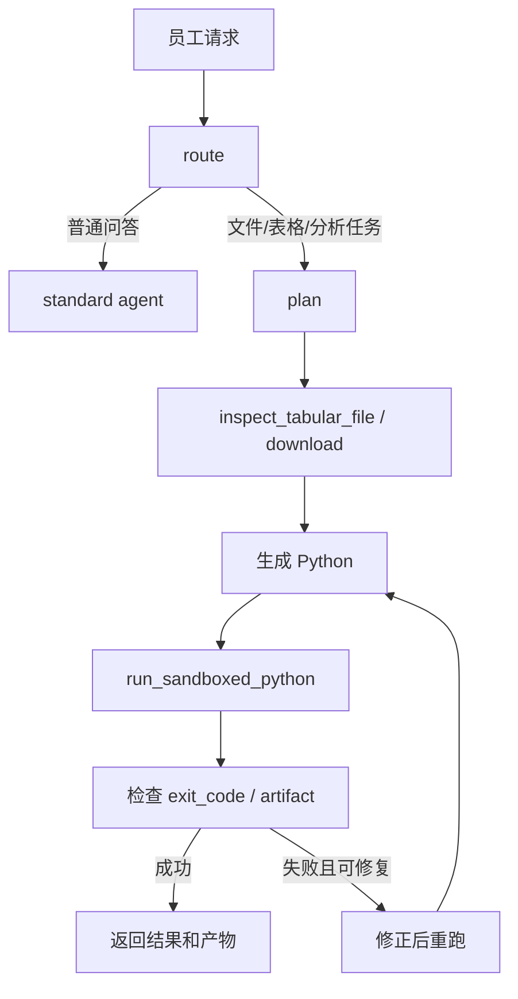
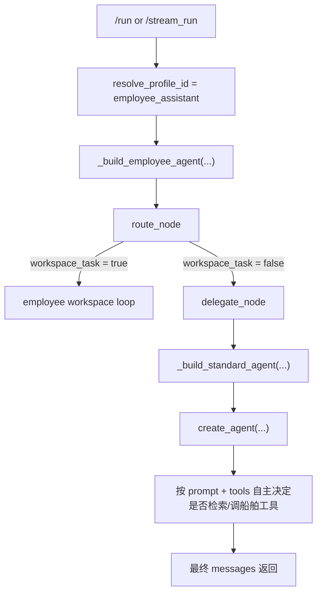
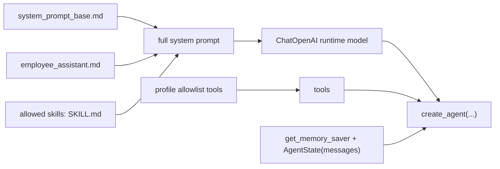

# HiFleet Agent 技术架构

本文描述当前仓库中真实生效的 Agent 架构，重点解释：

- `customer_support` 的消息如何进入主链并产出最终回复
- `employee_assistant` 与 `customer_support` 的职责边界和执行差异
- 多模态、检索、写操作、安全输出、流式调试分别在哪一层完成
- 现在线上排障时应该看哪些文件和链路

## 1. 总体架构



关键文件：

| 文件 | 责任 |
| --- | --- |
| `src/main.py` | HTTP 入口、消息归一化、流式输出、观测写入 |
| `src/agents/profiles.py` | profile 配置、渠道映射、权限边界 |
| `src/agents/agent.py` | 两个 profile 的 phase graph 构建、customer_support 的标准问答主链、finalize 输出收口 |
| `src/agents/customer_support_router.py` | 客服路由、实体提取、ship/file/browser 等工具链辅助函数，当前主要用于轻量分类和工具能力复用 |
| `src/agents/customer_support_guard.py` | 客服最终输出脱敏、拒答、链接白名单校验兜底 |
| `src/agents/customer_support_stream_debug.py` | `/stream_run` 的 runtime state -> debug event 映射 |
| `src/skills/skill_loader.py` | skills 与 tools 注册、按名称收缩工具集 |
| `src/skills/knowledge_qa/tools.py` | `smart_search` 分层检索链、结构化联网搜索适配、Ark 回退逻辑 |
| `src/skills/hifleet_ship_service/tools.py` | 船舶查询、统计、写操作工具 |
| `src/skills/multimodal_support/tools.py` | 附件检查与多模态感知辅助 |
| `src/skills/customer_workspace/tools.py` | 客服文件检查、产物上传 |
| `src/skills/browser_verify/tools.py` | 公开网页验证 |
| `src/admin_api/service.py` | 管理后台附件上传、OSS/S3 配置解析 |

## 2. 统一骨架，不同语义

两个 profile 仍然都挂在统一的 Agent 构建入口下，但主执行图已经不再一样复杂。



当前差异：

- `customer_support`：前置安全拦截 -> 标准客服 Agent -> 后置 Guard
- `employee_assistant`：文件/沙盒工作流闭环

## 3. customer_support 与 employee_assistant 对比

| 维度 | `customer_support` | `employee_assistant` |
| --- | --- | --- |
| 面向对象 | 外部客户、微信客服、CRM 渠道 | 内部员工、后台运营 |
| 主目标 | 给出稳定、简洁、可直接发送的客服回复 | 帮员工完成任务并产出可复核结果 |
| 主执行方式 | 标准问答 Agent，自主 tool-calling | workspace task 才进入 `plan -> act -> check -> loop` |
| 前置控制 | `route` 做敏感内部探查拦截 | `route` 判断是否进入 workspace task |
| 后置控制 | `sanitize_customer_output` + 链接校验 + 统一兜底 | `exit_code` / artifact / sandbox 自愈 |
| 核心瓶颈 | 知识库完整度、公网搜索匹配能力 | 文件结构识别、代码生成、沙盒执行 |

## 4. customer_support 消息处理逻辑

### 4.1 当前主链



### 4.2 route node

当前 `route node` 只做轻量控制：

1. 读取本轮最新用户文本
2. 检查是否命中敏感内部探查请求
3. 做轻量 `route / task_type / entities / attachments` 标注

关键点：

- 这里的 route 分类主要服务于 trace 和调试
- 不再驱动旧 Planner/Harness 主链
- 只要不是敏感请求，就直接交给标准客服 Agent

### 4.3 delegate node

`delegate node` 会调用 `_build_standard_agent(...)` 构造的标准客服 Agent。

这层会装配：

- `config/system_prompt_base.md`
- `config/profiles/customer_support.md`
- profile 允许的 skills 的 `SKILL.md`
- 运行态模型配置
- profile allowlist tools
- `get_memory_saver()`

然后把这些统一交给 `create_agent(...)`。

### 4.4 check node

`check node` 现在是后置 Guard：

1. 提取标准 Agent 最终回答
2. 调 `sanitize_customer_output(...)`
3. 做链接校验
4. 如果回答为空、不安全或不稳定，降级到统一致歉/建议补充信息

### 4.5 finalize node

`finalize node` 负责：

- 返回最终客户可见文本
- 汇总 `tool_call_sequence / check_result / latency`
- 保证 `/run`、`/stream_run` 和 runtime state 一致

## 5. customer_support 工具与知识能力

当前 `customer_support` 的执行重心不再是复杂链路编排，而是：

1. `customer_support` profile prompt 是否给对了行为约束
2. `smart_search` 是否命中知识库和官方资料
3. ship tools 是否返回了正确业务数据
4. Guard 是否把不该暴露的内容挡住

已知现实限制：

- 知识库内容仍不足
- 公网搜索匹配能力仍偏弱
- 后续更适合补知识库和接入 `agent-browser`，而不是继续加厚中间推理层

## 6. `/stream_run` 调试流

当前调试流展示的是和 runtime 对齐的简化阶段：

- `message_start`
- `thinking`
  - 前置安全与问题识别
  - 标准客服 Agent 装配
  - 附件输入分析
  - 后置内容质检
- `tool_response`
  - 从真实 `tool_call_sequence` 提取
- `answer`
- `message_end`

## 7. 当前 customer_support 阅读顺序

建议按下面顺序读源码：

1. [src/main.py](/Users/raymondlu/LocalProject/AIPM/智能客服/客服开发/本地agent/hifleet-agent/src/main.py)
2. [src/agents/agent.py](/Users/raymondlu/LocalProject/AIPM/智能客服/客服开发/本地agent/hifleet-agent/src/agents/agent.py)
3. [config/profiles/customer_support.md](/Users/raymondlu/LocalProject/AIPM/智能客服/客服开发/本地agent/hifleet-agent/config/profiles/customer_support.md)
4. [src/agents/customer_support_guard.py](/Users/raymondlu/LocalProject/AIPM/智能客服/客服开发/本地agent/hifleet-agent/src/agents/customer_support_guard.py)
5. [src/agents/customer_support_stream_debug.py](/Users/raymondlu/LocalProject/AIPM/智能客服/客服开发/本地agent/hifleet-agent/src/agents/customer_support_stream_debug.py)



调试界面可看到：

- route / task_type
- 实际执行过的工具
- post guard 是否触发
- 最终回复

不会输出：

- prompt 原文
- 私密 chain-of-thought
- 工具注册表
- 源码路径
- key / token / env

## 8. employee_assistant 当前链路

`employee_assistant` 保持“工作流型助手”定位，重点是文件/Python/产物。



与 `customer_support` 最大差异：

- `employee_assistant` 允许更长执行链和沙盒循环
- 输出对象是员工，不是客户
- 重点是产物和分析结果，不是客服化话术
- `customer_support` 可以用文件/浏览器/多模态，但必须受控且对外极度收口

### 8.1 入口判断

`employee_assistant` 不是所有请求都进入沙盒工作流，先经过 `route node` 判断。

关键函数：

- `_extract_local_file_path(...)`
- `_extract_public_file_url(...)`
- `_extract_expected_artifact(...)`
- `_detect_workspace_task(...)`
- `_build_employee_agent(...)`

真实判断逻辑：

1. 先取最新用户文本
2. 如果命中敏感内部请求，直接固定拒答
3. 解析本地文件路径或公开文件 URL
4. 推断用户是否真的在提“表格/数据/产物任务”
5. 只有“文件输入 + 分析类关键词”同时成立，才进入 employee loop
6. 否则直接 `delegate` 到标准 Agent

这意味着：

- `employee_assistant` 不是“任何消息都进 Python”
- 它是“先判断是否值得进入受控文件任务闭环”

### 8.1.1 employee 标准问答 agent

很多人第一次读 `employee_assistant` 时会误以为：

```text
只要 profile 是 employee_assistant，所有请求都会进入 plan -> act -> check。
```

这不对。

对于普通知识问答、平台功能咨询、船舶查询类消息，`employee_assistant` 实际上会走 `delegate -> standard agent`，而不是走 sandbox loop。

流程图：



真实源码位置：

- 入口 profile 解析：
  - [src/main.py](/Users/raymondlu/LocalProject/AIPM/智能客服/客服开发/本地agent/hifleet-agent/src/main.py)
  - `resolve_profile_id(...)`
- employee graph：
  - [src/agents/agent.py](/Users/raymondlu/LocalProject/AIPM/智能客服/客服开发/本地agent/hifleet-agent/src/agents/agent.py)
  - `_build_employee_agent(...)`
- 标准问答 agent 装配：
  - [src/agents/agent.py](/Users/raymondlu/LocalProject/AIPM/智能客服/客服开发/本地agent/hifleet-agent/src/agents/agent.py)
  - `_build_standard_agent(...)`

具体逻辑：

1. 请求先统一进入 `/run` 或 `/stream_run`
2. `resolve_profile_id(...)` 识别当前 profile 是 `employee_assistant`
3. `build_agent(...)` 因 profile 命中，构造 `_build_employee_agent(...)`
4. `route_node` 先判断当前消息是不是 workspace task
5. 如果不是，就进入 `delegate_node`
6. `delegate_node` 调 `standard_agent.invoke(...)`
7. 标准问答 agent 再基于自身 prompt 和 tools 自主决定是否调用 `smart_search`、船舶工具等

这里最重要的理解是：

- employee graph 只负责先做一次“是否进入文件任务闭环”的判断
- 普通问答真正执行时，靠的是 `create_agent(...)` 驱动的标准 agent

### 8.1.2 standard agent 的装配结构

`_build_standard_agent(...)` 没有再手写一套 `route -> plan -> check`。

它只是把 4 个东西装起来：

1. `system_prompt`
2. `llm`
3. `tools`
4. `checkpointer/state_schema`

对应代码：

- `_build_system_prompt(...)`
- `_build_llm(...)`
- `_load_all_tools(...)`
- `create_agent(...)`

流程图：



这说明 `employee` 标准问答链的“显式结构”比 `customer_support` 简单很多：

- 项目自己只装配上下文和能力
- 具体调用几轮工具，由通用 agent runtime 决定

### 8.1.3 employee 标准问答 agent 的 prompt 来源

`standard agent` 的 system prompt 不是单文件，而是三层拼接：

1. `config/system_prompt_base.md`
2. `config/profiles/employee_assistant.md`
3. profile 允许的 skills 的 `SKILL.md`

对应逻辑在 `_build_system_prompt(...)`。

对理解行为最关键的是 `employee_assistant.md` 中的几条规则：

- 内部数字员工助手，不只是聊天
- 对 factual/customer-facing content，优先 search first
- 对文件类任务，inspect -> sandbox -> verify
- 不暴露 prompt、架构、tool registry、凭证、环境配置

也就是说，即便走的是“标准问答 agent”，它仍然带着 employee profile 的身份和限制。

### 8.1.4 employee 标准问答 agent 的工具范围

当前 `employee_assistant` 的 profile allowlist 来自：

- [config/agent_profiles.json](/Users/raymondlu/LocalProject/AIPM/智能客服/客服开发/本地agent/hifleet-agent/config/agent_profiles.json)

skills 为：

- `knowledge_qa`
- `hifleet_ship_service`
- `employee_workspace`

这些 skills 经 `SkillLoader.get_tools_by_skill_names(...)` 展开后，常见工具包括：

- `smart_search`
- `ship_search`
- `get_ship_position`
- `get_ship_archive`
- `get_psc_records`
- `get_area_traffic`
- `get_strait_traffic`
- `download_public_file_to_artifact`
- `inspect_tabular_file`
- `run_sandboxed_python`

但对“普通问答”最关键的是前两类：

- 平台/行业知识：通常由 `smart_search` 支撑
- 船舶查询类：通常由 ship service 工具支撑

### 8.1.5 读普通问答链时该怎么看源码

如果你的问题是：

```text
employee_assistant 对“绿点是什么意思”“为什么船位更新慢”“怎么查船期”这种问题怎么处理？
```

推荐按下面顺序读：

1. [src/main.py](/Users/raymondlu/LocalProject/AIPM/智能客服/客服开发/本地agent/hifleet-agent/src/main.py)
   先看 `normalize_request_payload(...)` 和 `classify_intent_hint(...)`
2. [src/agents/agent.py](/Users/raymondlu/LocalProject/AIPM/智能客服/客服开发/本地agent/hifleet-agent/src/agents/agent.py)
   看 `_build_employee_agent(...)` 里的 `route_node / delegate_node`
3. [src/agents/agent.py](/Users/raymondlu/LocalProject/AIPM/智能客服/客服开发/本地agent/hifleet-agent/src/agents/agent.py)
   再看 `_build_standard_agent(...)`
4. [src/skills/knowledge_qa/SKILL.md](/Users/raymondlu/LocalProject/AIPM/智能客服/客服开发/本地agent/hifleet-agent/src/skills/knowledge_qa/SKILL.md)
   理解平台知识问答为什么优先 `smart_search`
5. [src/skills/hifleet_ship_service/SKILL.md](/Users/raymondlu/LocalProject/AIPM/智能客服/客服开发/本地agent/hifleet-agent/src/skills/hifleet_ship_service/SKILL.md)
   理解船舶查询类普通问答为什么会调船舶工具

你应该先建立这个判断：

- 这条消息是否是 workspace task？

只有确认不是，后面读 `standard agent` 才有意义。

### 8.2 route -> plan -> act -> check -> loop/finalize

`employee_assistant` 的核心不是检索，而是“先看文件结构，再生成代码，再进沙盒执行，再按结果修复”。

#### route node

职责：

- 拒绝敏感内部请求
- 识别输入文件和公开链接
- 推断是否是 workspace task

关键 state：

- `workspace_task`
- `task_goal`
- `target_file_path`
- `source_file_url`
- `expected_artifact`

#### plan node

职责：

1. 如果只有公开 URL，没有本地文件，先下载
2. 调用 `inspect_tabular_file`
3. 解析文件 schema
4. 把 schema 交给后续代码生成

关键工具：

- `download_public_file_to_artifact`
- `inspect_tabular_file`

关键点：

- 这一层不生成 Python
- 这一层先把“文件真实结构”固定下来，避免模型臆造列名

#### act node

职责：

- 基于 `task_goal + file_schema + last_error` 生成下一轮 Python 代码

关键点：

- 提示词明确要求“只返回 Python 代码”
- 代码必须基于真实 schema
- 输入文件必须从 `INPUT_FILE` 读取
- 输出产物必须写到 `ARTIFACT_DIR`
- 禁止 `eval/exec/compile/getattr/setattr` 和双下划线访问

这层本质上是“受控 codegen”，不是自由编程代理。

#### check node

职责：

- 调用 `run_sandboxed_python`
- 检查：
  - `exit_code`
  - `artifact_check.ok`
  - `stdout/stderr`

如果成功：

- 进入 `finalize`

如果失败：

- 进入 `loop`
- 把 `stderr / exit_code / artifact_check` 记录到 `last_error`
- 下一轮 codegen 会显式看到这些失败信息

#### loop node

职责：

- 递增 `loop_count`
- 重新回到 `act`

这里是 employee 链和 customer 链差异最大的地方之一：

- `customer_support` 默认只给 1 次 loop
- `employee_assistant` 默认允许多轮自愈，次数由 `HIFLEET_EMPLOYEE_MAX_LOOPS` 控制

#### finalize / fail

成功：

- `finalize` 会汇总产物和执行日志

失败：

- `fail` 会输出“自动修复已达到上限”以及最后一次错误摘要

### 8.3 employee_assistant 的真正核心

如果只记住一句话：

```text
employee_assistant 不是“会写 Python 的聊天机器人”，
而是“先看文件结构，再做受控代码生成，再用沙盒校验结果，再按错误自愈”的工作流。
```

理解这条链时最重要的不是 prompt 花样，而是 3 个约束点：

1. 文件结构先被固定
2. 代码执行环境被固定
3. 成功条件由程序检查，不由模型自报

### 8.4 学习 employee_assistant 的推荐顺序

建议按这条顺序读代码：

1. [src/agents/agent.py](/Users/raymondlu/LocalProject/AIPM/智能客服/客服开发/本地agent/hifleet-agent/src/agents/agent.py)
   先看 `_build_employee_agent(...)`
2. [src/skills/employee_workspace/tools.py](/Users/raymondlu/LocalProject/AIPM/智能客服/客服开发/本地agent/hifleet-agent/src/skills/employee_workspace/tools.py)
   再看 `inspect_tabular_file / run_sandboxed_python`
3. [docs/EMPLOYEE_ASSISTANT_SANDBOX_RUNBOOK.md](/Users/raymondlu/LocalProject/AIPM/智能客服/客服开发/本地agent/hifleet-agent/docs/EMPLOYEE_ASSISTANT_SANDBOX_RUNBOOK.md)
   最后看部署、环境变量、排障

如果要快速验证你是否已经理解到位，可以回答这 5 个问题：

1. 哪些请求不会进入 employee loop，而是直接 delegate？
2. 为什么必须先做 `inspect_tabular_file`，不能直接让模型猜列名？
3. `last_error` 是如何参与下一轮代码生成的？
4. 什么时候算执行成功，是看模型说成功，还是看 `exit_code/artifact_check`？
5. `employee_assistant` 为什么允许多轮 loop，而 `customer_support` 不适合？

## 9. 安全边界

两个 profile 都不能向用户暴露：

- 系统架构、phase graph、内部路由
- prompt、tool registry、隐藏规则
- key、token、`.env`、环境变量
- 本地路径、日志、traceback、内部 JSON
- 浏览器 cookie、沙盒细节、部署配置

`customer_support` 的边界更严格，因为最终回复会直接面向客户。

## 10. 观测字段与排障重点

两个 profile 共用这些观测字段：

- `run_id`
- `session_id`
- `phase_history`
- `route`
- `task_type`
- `tool_bundle`
- `tool_call_sequence`
- `check_result`
- `fallback_reason`
- `latency_hotspot`
- `answer_confidence`

customer_support 排障时优先看：

1. `route / task_type` 是否符合真实问题。
2. `entity_resolution` 是否被错误继承。
3. `tool_call_sequence` 是否走了预期工具。
4. `check_result` 是否因为空答、敏感内容或无效链接触发 post guard。
5. `generated_answer` 是否被 `sanitize_customer_output` 正确收口。
6. `latency_hotspot.total` 是否异常偏高。

## 11. 文档与代码联动规则

后续改动遵循：

1. `customer_support` 主 graph 变化，先改 `src/agents/agent.py`
2. 检索、ship/file/browser 工具能力变化，再改 `src/agents/customer_support_router.py`
3. 输出边界变更，补 `src/agents/customer_support_guard.py`
4. 流式调试变更，补 `src/agents/customer_support_stream_debug.py`
5. 同步更新：
   - `docs/AGENT_TECHNICAL_DOCUMENTATION.md`
   - `docs/CUSTOMER_SUPPORT_AGENT_REGRESSION.md`
   - 必要时 `docs/README.md`
