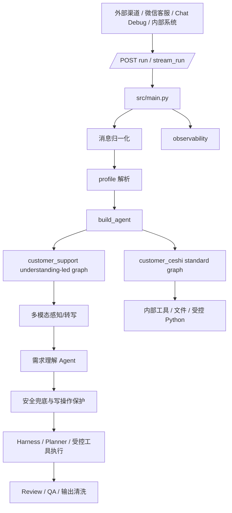
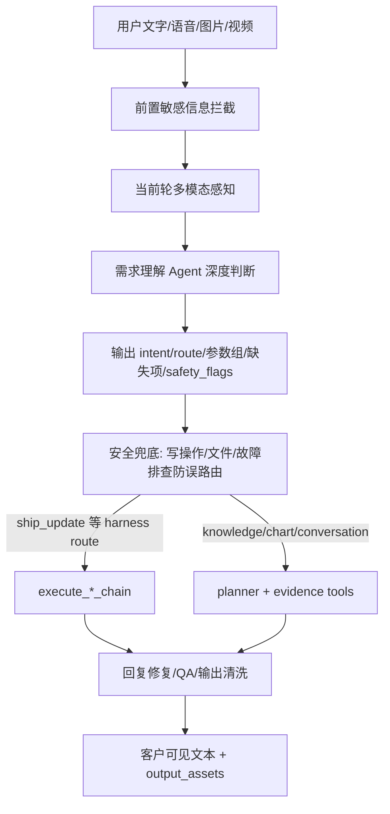

# HiFleet Agent 技术架构

本文描述当前仓库真实生效的 Agent 架构，重点说明 `customer_support` 的需求理解主导链路、`customer_ceshi` 的内部测试边界，以及工具调用和安全输出分别在哪一层完成。

## 1. 总体架构

关键文件：

| 文件 | 责任 |
| --- | --- |
| `src/main.py` | HTTP 入口、`/run`/`/stream_run`、微信旧格式归一化、观测写入 |
| `src/agents/agent.py` | `build_agent()`、`customer_support` 需求理解主导图、`customer_ceshi` 标准图 |
| `src/agents/customer_support_router.py` | 客服 harness、planner 辅助、船舶查询/更新链路、trace 结构 |
| `config/agent_profiles.json` | `customer_support` / `customer_ceshi` skills、工具权限和别名 |
| `config/profiles/customer_support.md` | 外部客服业务规则和安全边界 |
| `src/skills/hifleet_ship_service/tools.py` | 船舶查询、船位上传、静态信息更新与最终参数校验 |
| `src/agents/customer_support_guard.py` | 客服最终输出脱敏、拒答、链接清洗 |

Profile 解析只看请求体 `agent_profile` 或请求头 `x-agent-profile`；`employee_assistant` 是 `customer_support` 的兼容别名；`source_channel` 只用于日志和后台筛选。

## 2. Profile 边界

| 维度 | `customer_support` | `customer_ceshi` |
| --- | --- | --- |
| 面向对象 | 外部客户、微信客服、WebSDK、CRM | 内部测试、后台运营 |
| 主目标 | 客服化回复，必要时受控调用知识、browser、船舶工具 | 内部知识问答、文件检查、表格分析和产物任务 |
| 主执行方式 | 输入归一化 -> 需求理解 -> 安全校验 -> harness/planner -> 输出清洗 | 标准 tool-calling agent，保留 employee workspace 能力 |
| 船舶工具 | 允许读写，但写操作必须校验 | 允许读写 |
| 沙盒/Python | 禁用 | 启用，仅内部 profile |
| 文件/产物 | 禁用 employee workspace 和客服文件产物工具 | 启用受控 workspace / artifact 能力 |

`customer_support` 当前 skills：`knowledge_qa`、`knowledge_admin`、`hifleet_ship_service`、`multimodal_support`、`browser_verify`。明确不包含 `employee_workspace`、Python 沙盒、任意文件检查或产物生成工具。

## 3. customer_support 主链

需求理解 Agent 是客服链路的主决策节点，负责基于当前文字、语音转写、图片/OCR、附件 perception 和上下文输出：

- `intent`、`route`、`task_type`、`tool_bundle`、`needs_harness`、`confidence`
- `position_update_params`：`mmsi/imo/ship_name/lon/lat/updatetime/speed/heading/course/draft/navstatus/destination/eta/wechatgroup`
- `static_update_params`：`mmsi/imo/ship_name/ship_type/minotype/length/width/dwt/flag/callsign/built_year/destination/eta/draft/wechatgroup`
- `needs_clarification`、`clarification_question`、`missing_required_fields`、`low_confidence_fields`、`safety_flags`

固定规则不再作为主路由入口，只做安全兜底：

- 写操作必须是当前输入明确要求上传/更新/修改/补录。
- “船位更新慢/不刷新/失败/异常/报错”属于知识或排障，不得误入写操作。
- 船位更新必须有当前输入/附件中的身份标识、经纬度和更新时间。
- 静态更新必须有当前输入/附件中的身份标识和至少一个静态字段。
- 船名不能直接写入，必须搜索候选并要求用户确认 MMSI。

`_build_lightweight_customer_support_agent()` 仍保留为历史/回滚参考，但 `build_agent(customer_support)` 当前入口是 `_build_customer_support_agent()`。

## 4. 船舶写操作规则

船位更新最小必填：

- 船舶身份标识：`MMSI / IMO / 船名` 至少其一，且必须来自当前输入或当前附件。
- 船位：经度 + 纬度。
- 更新时间：必须来自用户输入或图片/OCR/perception，不允许用系统时间代替。

船位可选字段：航速、船首向、航迹向、吃水、航行状态、目的港、ETA、微信群。缺少可选字段不阻断更新，但成功后可提示用户继续补充。

静态信息更新最小必填：当前输入/附件中的船舶身份标识 + 至少一个静态字段。`ship_type` 与 `minotype` 是同一个“船舶类型”业务字段，写入 TTSE API 时必须同步为同一个目录值；目录外输入或冲突输入只阻断船型字段，其他合法静态字段可继续更新。

工具层仍是最终防线：

- `upload_ship_position` 保留 `checkFly="0"`、`bindCheck="0"` 作为后端接口控制参数，但不替代本地输入校验。
- `update_ship_static_info` 保留 `bindCheck="0"`，并负责船型目录校验和 `type/minotype` 双字段同步。
- 工具没有明确成功时，客服不得声明“已更新成功”。

## 5. 知识、Browser 与多模态

平台知识和操作问题优先走 `local_kb_search -> web_search -> web_search_agent_browser`。教程类问题必须覆盖入口、关键动作、完成/保存条件；问题反馈类回答要区分已确认事实、可能原因和建议检查项。

`browser_verify` 只用于公开网页核验，不处理登录态、Cookie、内部系统或带 token 的私有链接。最终回复不得暴露工具名、原始 JSON、内部路径、截图路径或 trace。

多模态输入只处理当前轮附件：图片/OCR、语音转写、视频摘要进入需求理解 Agent；历史多媒体 URL 只做安全脱敏，不重复发送。

## 6. 观测与排障

排障优先看：

- `llm_route`
- `phase_history`
- `route_trace.route`：当前客服主链应为需求理解输出后的业务 route，如 `knowledge`、`ship_update`、`chart_symbol`
- `route_trace.reasoning_trace.intent_agent_result`
- `route_trace.reasoning_trace.understanding_summary`
- `route_trace.reasoning_trace.update_params`
- `generated_tool_calls`
- `check_result`
- 最终 `messages[-1].content`

客户可见回复不得包含 prompt、tool registry、内部 route、`reasoning_trace`、原始 JSON、工具名、源码路径、`.env`、key/token。

## 7. 开发建议

- 改客服主入口和需求理解：看 `src/agents/agent.py`。
- 改 ship update / static update 执行和 trace：看 `src/agents/customer_support_router.py`。
- 改船舶工具硬校验：看 `src/skills/hifleet_ship_service/tools.py`。
- 改外部客服权限：看 `config/agent_profiles.json`。
- 改客服业务规则：看 `config/profiles/customer_support.md`。
- 改知识检索工具：看 `src/skills/knowledge_qa/tools.py`。
- 改授权写库：看 `src/skills/knowledge_admin/tools.py`。
