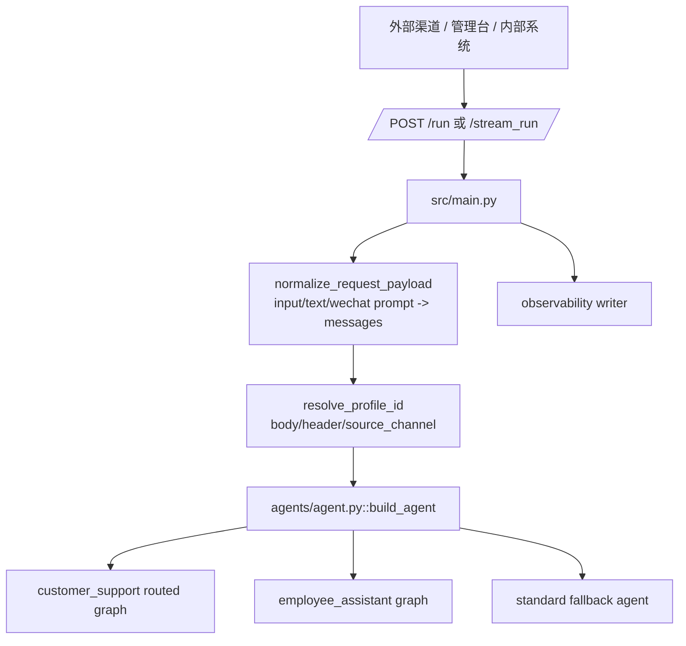
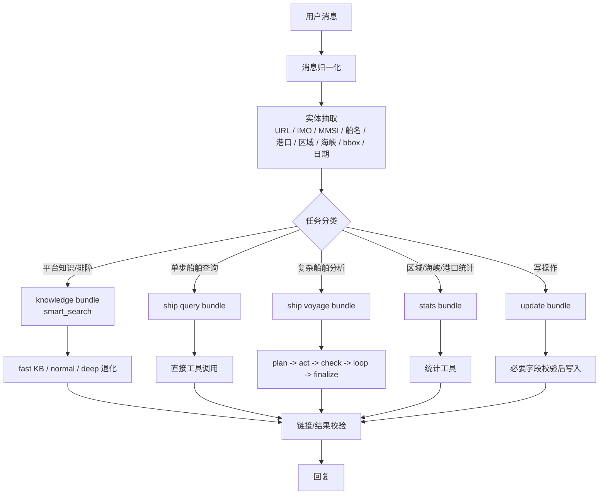
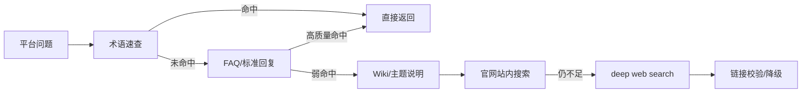
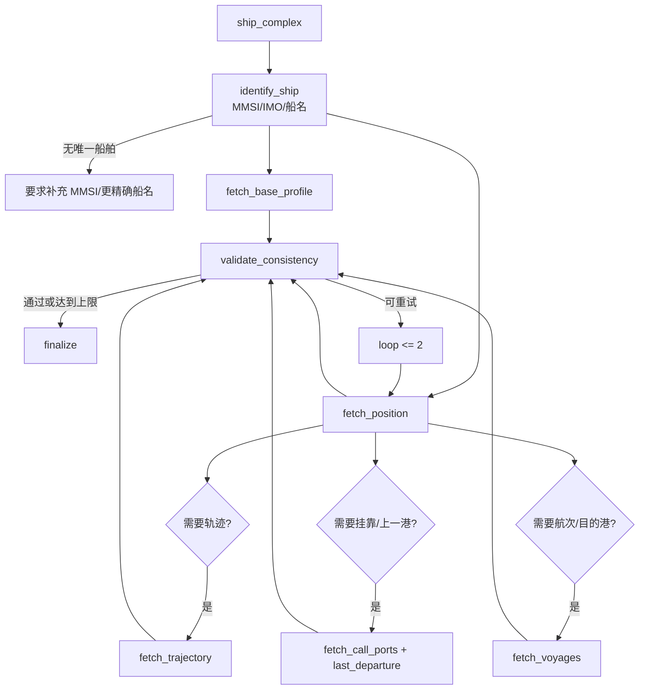

# HiFleet Agent 技术架构

本文描述当前代码里的真实 Agent 架构，重点覆盖 `customer_support` 客服 Agent 的消息处理链路、工具路由、复杂船舶问题执行链和观测字段。

## 1. 系统入口



关键文件：

| 文件 | 责任 |
| --- | --- |
| `src/main.py` | HTTP 入口、请求归一化、profile 解析、流式输出、API 观测 |
| `src/agents/profiles.py` | profile 配置读取、渠道映射、权限策略 |
| `src/agents/agent.py` | LangGraph 构建，区分客服 routed graph 与 employee loop |
| `src/agents/customer_support_router.py` | 客服消息分类、实体抽取、工具收缩、复杂船舶 harness |
| `src/skills/skill_loader.py` | skill/tool 注册与按名称精确取工具 |
| `src/skills/knowledge_qa/tools.py` | `smart_search` 分层知识检索 |
| `src/skills/hifleet_ship_service/tools.py` | 船舶查询、统计、航程、写操作工具 |

## 2. Profile 与权限边界

| Profile | 用途 | 默认渠道 | 高成本能力 |
| --- | --- | --- | --- |
| `customer_support` | 外部客服，平台问题与船舶服务 | `websdk`、`wechat_mp`、`wechat_kf`、`customer_api`、`crm` | 默认不开放 Python/Docker/文件；船舶写操作只在 `ship_update` 路由中收缩开放 |
| `employee_assistant` | 内部员工，知识问答、表格分析、受控 Python 产物 | `admin_panel`、`internal_web`、`employee_api` | 可使用文件下载、表格探测、Docker 沙盒 Python |

配置文件：`config/agent_profiles.json`。

## 2.1 船舶接口鉴权映射

船舶工具不能统一使用单一 token。当前实现按接口选择 key，代码入口：

- `src/skills/hifleet_ship_service/scripts/auth.py`
- `src/skills/hifleet_ship_service/tools.py`

| 能力 | 主要接口 | 首选环境变量 | 传参方式 |
| --- | --- | --- | --- |
| 船舶搜索 | `ttseapi /position/shipSearchText` | `hifleet_key2` | Query `usertoken` |
| 船位/档案 | `/position/position/get/token`、`/shiparchive/getShipArchiveWithEnginAndCompany` | `api_key` | Query `api_key` + `usertoken` |
| 航程 | `/position/trajectory/token`、`/position/getcallport/token`、`/position/getvoyagelist/token`、`/portofcall/getvoyages`、`/position/lastdeparture/token`、`/position/getstop/token` | `api_key` | Query `api_key` + `usertoken` |
| 区域/海峡/红海绕航 | `/position/gettraffic/token`、`/position/statisticzonetraffic`、`/routerisk/getAvoidRedSeaDetail/token` | `api_key` | Query `api_key` + `usertoken` |
| PSC | `/pscapi/get`、`/pscapi/openclaw/*` | `hifleet_key1` | Query `api_key` + `usertoken` |
| 港口指南 | `/portguide/getPort/token`、`/portguide/getPortDetail/token` | 待授权 | Query `api_key` |
| 内部写操作 | `ttseapi /updateShipAisInfo`、`/updateShipAisStaticInfo` | `hifleet_key2` | Query `usertoken` |

兼容别名：

- `HIFLEET_API_KEY` 应与 `api_key` 保持一致。
- `HIFLEET_TTSE_KEY` 应与 `hifleet_key2` 保持一致。
- 不要在日志、文档或回归报告中输出 key 值。

## 3. customer_support 消息处理链

`customer_support` 不再默认把全部工具交给模型自由选择，而是先走确定性路由。



### 3.1 消息分类

当前分类结果：

| task_type | route | 说明 |
| --- | --- | --- |
| `platform_knowledge` | `knowledge` | 平台功能、术语、使用说明 |
| `platform_troubleshooting` | `knowledge` | 平台故障、异常、加载失败、数据不刷新 |
| `ship_single_query` | `ship_single` | 船位、档案、PSC 等单步查询 |
| `ship_multi_step_analysis` | `ship_complex` | 轨迹、挂靠、航次、上一港、目的港一致性分析 |
| `ship_stats` | `ship_stats` | 区域、bbox、海峡、红海绕航、港口 |
| `ship_update` | `ship_update` | 更新船位或静态信息 |

路由规则的重点：

- 带 `HiFleet/平台` 且含故障词的消息优先进入平台排障，避免“轨迹加载失败”误入船舶轨迹。
- 带 MMSI/IMO/船名且含轨迹、挂靠、航次、目的港、停靠等词，优先进入复杂船舶分析。
- `港口` 只有在没有船舶实体和复杂船舶意图时才进入港口/统计类。
- 写操作必须出现明确更新/上传/修改/补录意图。

### 3.2 工具 bundle 收缩

| bundle | 工具 |
| --- | --- |
| `knowledge` | `smart_search` |
| `ship_query` | `ship_search`、`get_ship_position`、`get_ship_archive`、`get_psc_records` |
| `ship_stats` | `get_area_traffic`、`get_strait_traffic`、`get_avoid_redsea_traffic`、`search_ports`、`get_port_detail` |
| `ship_voyage` | `ship_search`、`get_ship_position`、`get_ship_archive`、`get_ship_trajectory`、`get_ship_call_ports`、`get_ship_voyages`、`get_last_departure`、`get_current_stop` |
| `ship_update` | `ship_search`、`upload_ship_position`、`update_ship_static_info` |

实现位置：`src/agents/customer_support_router.py` 与 `SkillLoader.get_tools_by_names()`。

## 4. 平台知识链路

平台问题由 `smart_search` 统一处理，按层级退化：



有效命中：

- 术语速查命中。
- FAQ 标准回复高分命中。
- 官网结果有可访问链接和可用摘要。

未命中或弱命中：

- 返回包含“未找到精确匹配”“未检索到足够可信”等信号。
- URL 校验失败。
- 搜索结果只有不可验证摘要。

降级规则：

- 简单平台知识默认 `quick`。
- 平台排障默认 `normal`。
- `quick` 弱命中后进入 `normal`。
- 排障问题 `normal` 仍空时进入 `deep`。
- 链接无效时移除无效链接，保留官方帮助中心：`https://www.hifleet.com/helpcenter/?i18n=zh`。

## 5. 复杂船舶分析链路

复杂船舶问题使用显式 harness，不依赖模型自由试错。



并行与串行原则：

- `identify_ship` 必须先完成，除非用户直接给 MMSI/IMO。
- `fetch_base_profile` 和 `fetch_position` 理论上可并行；当前实现串行，优先保持简单和可观测。
- 轨迹、挂靠、航次按需求调用，避免无关 API 成本。
- 校验项包括实体是否解析、实时船位是否有效、静态档案与实时数据是否矛盾。
- 当前已识别并提示船型字段不一致，例如实时船位返回“训练船”、档案返回“散货船/Training Ship”。

## 6. 高成本能力开放策略

| 能力 | customer_support | employee_assistant |
| --- | --- | --- |
| Python | 关闭 | 表格任务中按需启用 Docker 沙盒 |
| Docker | 关闭 | 仅 `run_sandboxed_python` |
| 浏览器网页操作 | 关闭 | 当前未默认开放 |
| 文件处理 | 关闭 | 内部任务按 profile 开放 |
| 船舶写操作 | 仅 `ship_update` route，必要字段校验后执行 | 可按 profile 使用 |

普通客服问题不会进入 Python/Docker/browser；复杂船舶问题也只调用船舶 API，不启用通用高成本能力。

## 7. 可观测性

客服 routed graph 会在日志和 state 中保留：

- `run_id`
- `session_id`
- `route`
- `task_type`
- `tool_bundle`
- `entity_resolution`
- `tool_call_sequence`
- `loop_count`
- `check_result`
- `fallback_reason`
- `latency_hotspot`
- `answer_confidence`

工具层通过 `emit_tool_metric()` 写入 tool invocation 指标；API 层通过 `observability.writer` 写入主调用和错误。

## 8. 回归验证

客服 Agent 真实 API 回归见：

- [CUSTOMER_SUPPORT_AGENT_REGRESSION.md](CUSTOMER_SUPPORT_AGENT_REGRESSION.md)
- `scripts/hifleet_agent_regression.py`

常用命令：

```bash
.venv/bin/python scripts/hifleet_agent_regression.py
```

显式写操作测试只允许对指定测试 MMSI 执行：

```bash
.venv/bin/python scripts/hifleet_agent_regression.py \
  --include-write \
  --write-lon 121.5 \
  --write-lat 31.2 \
  --write-speed 0 \
  --output artifacts/hifleet_agent_regression_report_with_write.json
```

## 9. 扩展新能力的流程

1. 在 `src/skills/.../tools.py` 增加工具，确保输入校验和错误话术明确。
2. 在 `SkillLoader` 注册工具。
3. 在 `customer_support_router.py` 增加或调整 bundle。
4. 为分类、bundle、harness 或 fallback 增加测试。
5. 将真实 API 场景加入 `scripts/hifleet_agent_regression.py`。
6. 更新本文档和回归文档。
