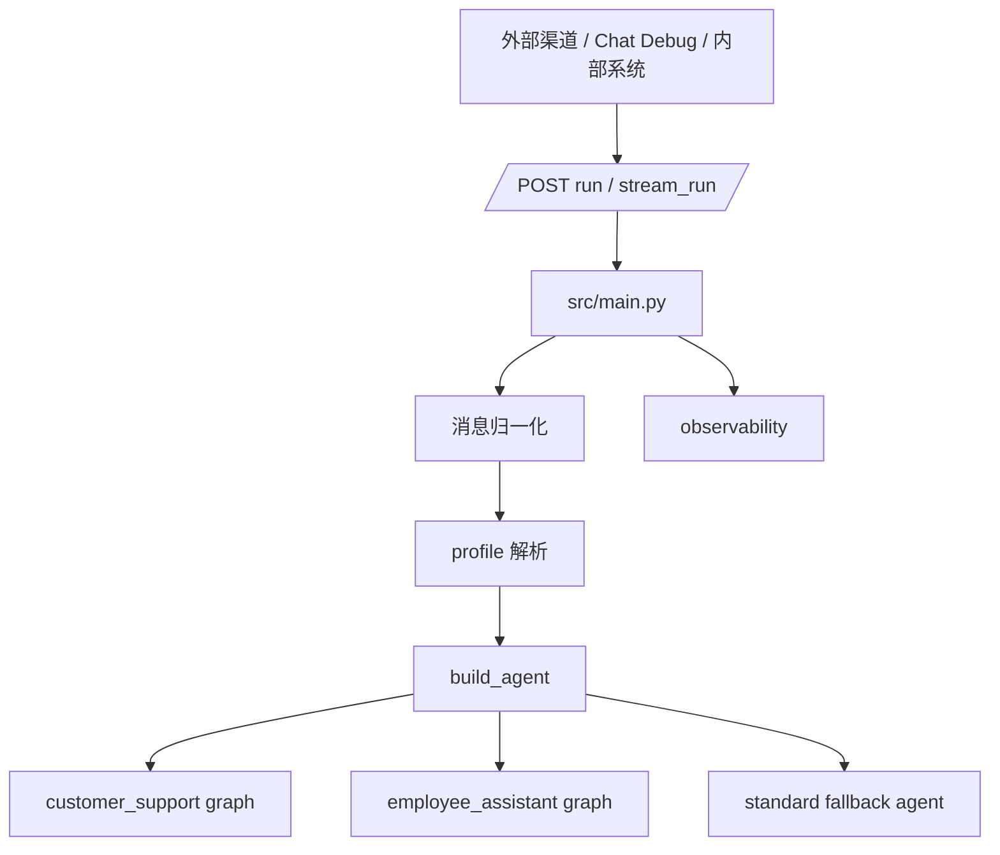
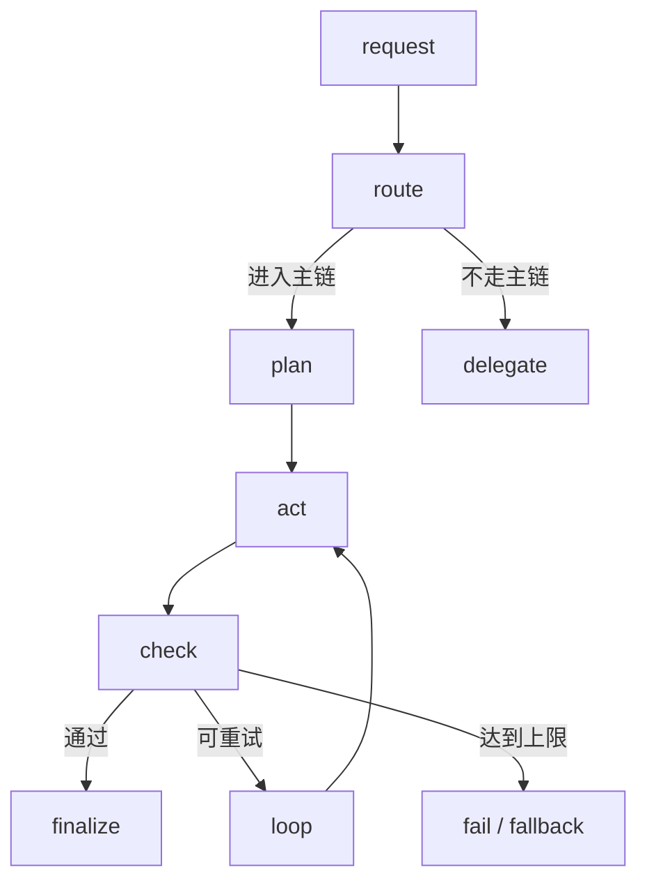
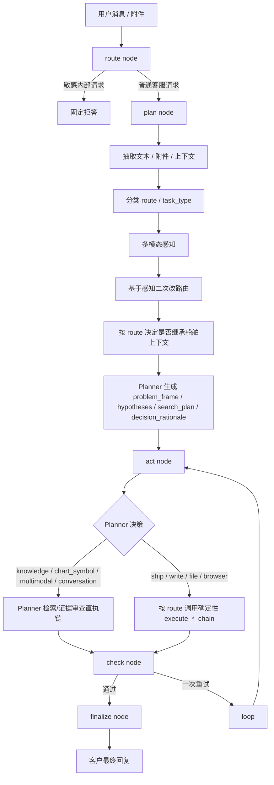
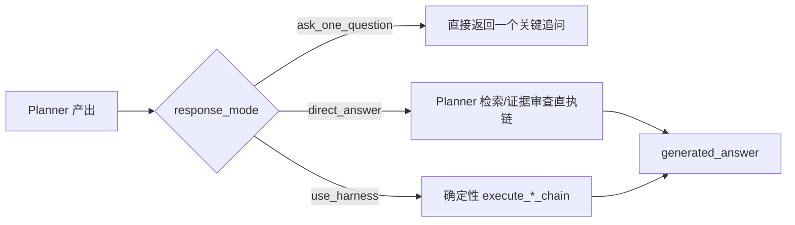
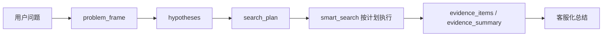
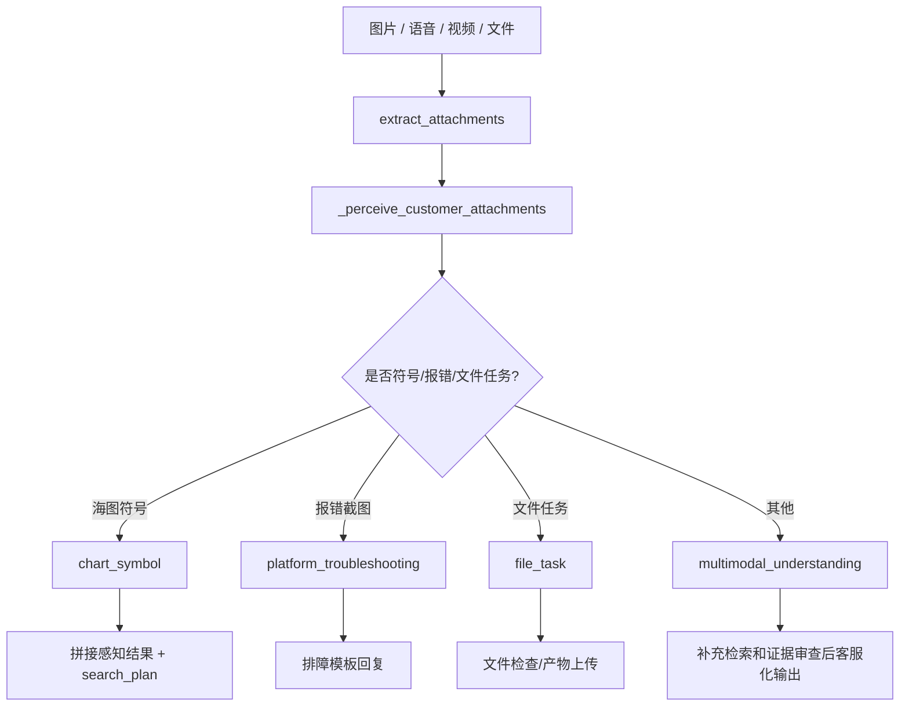
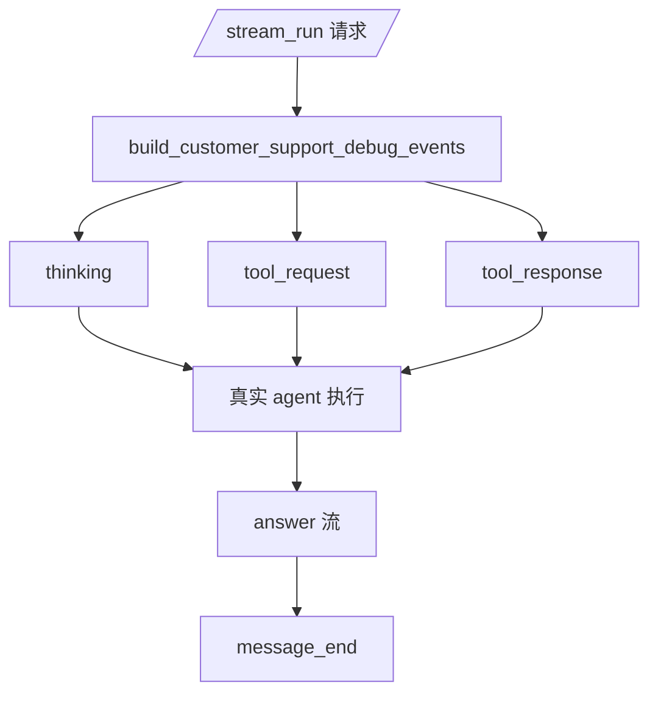
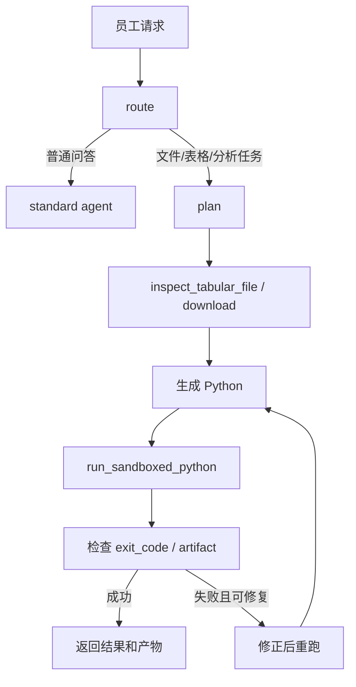

# HiFleet Agent 技术架构

本文描述当前仓库中真实生效的 Agent 架构，重点解释：

- `customer_support` 的消息如何进入主链并产出最终回复
- `employee_assistant` 与 `customer_support` 的职责边界和执行差异
- 多模态、检索、写操作、安全输出、流式调试分别在哪一层完成
- 现在线上排障时应该看哪些文件和链路

## 1. 总体架构

关键文件：

| 文件 | 责任 |
| --- | --- |
| `src/main.py` | HTTP 入口、消息归一化、流式输出、观测写入 |
| `src/agents/profiles.py` | profile 配置、渠道映射、权限边界 |
| `src/agents/agent.py` | 两个 profile 的 phase graph 构建、customer_support 的 Planner/Harness/Guard 主执行链、finalize 输出收口 |
| `src/agents/customer_support_router.py` | 客服路由、实体提取、Planner 计划构建、证据审查、确定性 harness、客服答复模板 |
| `src/agents/customer_support_guard.py` | 客服最终输出脱敏、拒答、链接白名单校验兜底 |
| `src/agents/customer_support_stream_debug.py` | `/stream_run` 的调试思考流事件 |
| `src/skills/skill_loader.py` | skills 与 tools 注册、按名称收缩工具集 |
| `src/skills/knowledge_qa/tools.py` | `smart_search` 分层检索链 |
| `src/skills/hifleet_ship_service/tools.py` | 船舶查询、统计、写操作工具 |
| `src/skills/multimodal_support/tools.py` | 附件检查与多模态感知辅助 |
| `src/skills/customer_workspace/tools.py` | 客服文件检查、产物上传 |
| `src/skills/browser_verify/tools.py` | 公开网页验证 |
| `src/admin_api/service.py` | 管理后台附件上传、OSS/S3 配置解析 |

## 2. 统一骨架，不同语义

两个 profile 共用同一类 phase graph，但 `plan / act / check / finalize` 的语义完全不同。

统一的是：

- phase graph 结构
- `run_id / session_id / route_trace / phase_history` 的观测格式
- `check -> loop/finalize/fail` 的收敛方式

不同的是：

- `customer_support` 以“客服答复准确性、工具收敛、安全输出”为主
- `employee_assistant` 以“任务完成、文件/Python 产物、可验证执行过程”为主

## 3. customer_support 与 employee_assistant 对比

| 维度 | `customer_support` | `employee_assistant` |
| --- | --- | --- |
| 面向对象 | 外部客户、微信客服、CRM 渠道 | 内部员工、后台运营 |
| 典型输入 | 平台问题、截图、船舶查询、写操作、公开网页核验 | 文件、表格、分析任务、报告生成、内部知识问答 |
| 主目标 | 快速给出准确、可直接发送给客户的答复 | 帮员工完成任务并产出可复核结果 |
| `plan` 阶段 | `Planner Agent` 负责理解、假设、检索规划、证据审查前置建模、决策 | 判断是否进入文件/沙盒工作流 |
| `act` 阶段 | 先按 Planner 决策执行：知识/多模态走 Planner 检索链，船舶/写操作/文件/核验走 Harness | inspect 文件、生成 Python、运行沙盒、迭代修复 |
| `check` 阶段 | 检查是否有答案、链接是否可用、证据数量、是否只问一个关键问题、是否存在写结果 | 检查 `exit_code`、artifact、数据完整性、自愈是否成功 |
| `finalize` 阶段 | `Guard` 脱敏、清理搜索展示模板、返回客服口吻回复 | 汇总结果、保留产物链接、按内部任务口吻输出 |
| 检索策略 | 本地知识库 -> 官网/帮助中心/官方社区 -> 公共网页 | 视任务而定，知识问答可复用 `smart_search` |
| 多模态 | 图片/语音/视频/文件先感知，再决定检索和推理 | 更关注文件结构和分析任务，不强调客服化表达 |
| 写操作 | 仅在用户明确要求且字段完整时直接执行 | 可按内部流程使用更广泛工具 |
| 安全边界 | 不能暴露工具名、路径、prompt、key、日志、内部执行细节 | 同样不能暴露内部信息，但允许更长任务过程 |

## 4. customer_support 消息处理逻辑

### 4.1 主链总览

`customer_support` 现在不是“把缩小工具包交给 LLM 自由调用”，而是“Planner Agent -> Harness -> Guard”的主链。

### 4.2 route node

`route node` 做两件事：

1. 读取本轮最新用户文本。
2. 如果命中敏感内部请求，直接固定拒答，不进入工具链。

拒答场景包括：

- agent 架构、代码、路径、配置、环境变量、`.env`
- prompt、tool registry、内部路由、日志、key、token

命中后直接返回安全回复，不触发搜索和任何内部工具。

### 4.3 plan node

`plan node` 是 customer_support 的 `Planner Agent` 入口，顺序如下：

1. `latest_customer_user_text(messages)` 取用户最新有效文本。
2. `build_conversation_context(messages)` 构造上下文。
   - 最近问题
   - 最近船名 / MMSI / IMO
   - 最近回答是否已经暴露船舶身份
3. `extract_entities(text)` 抽取 `MMSI / IMO / ship_name / port / area / strait / dates / urls`。
4. `extract_attachments(messages)` 抽取附件。
5. `_classify_customer_support(...)` 做基础路由分类。
6. `classify_multimodal_message(...)` 基于附件类型做第一次多模态路由修正。
7. `_perceive_customer_attachments(...)` 做多模态感知。
   - 优先本地多模态模型 `doubao-seed-2-0-lite-260428`
   - 模型不可用时走本地图像启发式兜底
8. `refine_multimodal_route_with_perception(...)` 根据感知结果二次改路由。
   - 截图符号 -> `chart_symbol`
   - 报错/异常截图 -> `knowledge / platform_troubleshooting`
9. `resolve_entities_with_context(...)` 决定是否继承上一轮船舶上下文。
   - 仅 `ship_single / ship_complex / ship_update / ship_stats` 允许补船舶实体
   - `knowledge / troubleshooting / multimodal_understanding` 不继承船舶实体，避免语义污染
10. `build_customer_support_plan(...)` 生成结构化规划结果：
   - `problem_frame`
   - `hypotheses`
   - `search_plan`
   - `missing_slot`
   - `decision_rationale`
   - `reasoning_public_trace`
11. 生成 `route_trace`，记录：
   - `run_id`
   - `session_id`
   - `route`
   - `task_type`
   - `tool_bundle`
   - `entity_resolution`
   - `latency_hotspot.perception`
   - `planner.problem_frame / hypotheses / search_plan / decision_rationale`
12. 如果存在附件，构造 `evidence_pack["augmented_text"]` 供后续检索使用。

`Planner Agent` 当前是“结构化规则 + 感知增强”的实现，不是开放式全自由工具 Agent。它负责先把问题建模清楚，再决定是直接回答、只追问一个关键问题，还是把执行交给 Harness。

### 4.4 act node

`act node` 不创建“客服小工具自由 Agent”，而是先看 Planner 的 `decision_rationale.response_mode`。

当前有两类执行：

1. Planner 直执链
   - `knowledge` -> `execute_planned_knowledge_chain`
   - `chart_symbol / multimodal_understanding` -> `execute_planned_multimodal_chain`
   - `conversation` -> `answer_conversation_memory`

2. Harness 高风险执行链
   - `ship_single`
   - `ship_complex`
   - `ship_stats`
   - `ship_update`
   - `file_task`
   - `browser_verify`

| route | 主执行链 | 说明 |
| --- | --- | --- |
| `knowledge` | `execute_planned_knowledge_chain` | Planner 负责检索规划、证据收敛和客服化回答 |
| `chart_symbol` | `execute_planned_multimodal_chain` | Planner 结合截图感知和检索计划回答海图符号 |
| `multimodal_understanding` | `execute_planned_multimodal_chain` | Planner 结合附件理解和检索计划补证据 |
| `ship_single` | `execute_simple_ship_chain` | 单步船位/档案/PSC |
| `ship_complex` | `execute_complex_ship_chain` | 轨迹、挂靠、航次、上一离港、停船 |
| `ship_stats` | `execute_stats_chain` | 港口/区域/海峡/红海绕航 |
| `ship_update` | `execute_update_chain` | 上传船位、更新静态信息 |
| `file_task` | `execute_file_chain` | 文件检查、产物上传 |
| `browser_verify` | `execute_browser_verify_chain` | 公开网页验证 |
| `conversation` | `answer_conversation_memory` | 总结上文、上下文追问 |

设计原则：

- 低风险知识和截图问题先由 Planner 规划检索和证据
- 高风险工具链仍由 Harness 托底，不把核心业务正确性交给 LLM 自由发挥
- 工具调用顺序和缺字段追问是可预测的
- 多模态只负责感知和补充证据，不直接越过证据审查

### 4.5 check node

`check node` 会验证：

- 是否生成了答案
- 链接是否可访问、是否在允许范围
- `evidence_count`
- 关键 check 结果是否存在
  - `entity_resolved`
  - `position_ok`
  - `consistency_ok`
  - `write_result`
  - `metadata_checked`
  - `verified`
  - `ask_one_question`
- 是否需要 loop

customer_support 默认只允许一次 loop；超过后走 fallback，避免客服渠道无限重试。

### 4.6 finalize node

`finalize node` 是对外输出的最后一道边界：

1. 汇总总耗时到 `route_trace.latency_hotspot.total`
2. 调用 `sanitize_customer_output(...)`
3. 过滤：
   - 工具名
   - 路径
   - `.env`
   - key / token / secret
   - `【互联网搜索结果（增强版）】`
   - `AI摘要`
   - `【回答指导】`
   - 原始来源标签和内部展示格式
4. 返回客户可直接阅读的最终回复

这一层就是 `Guard`。它不参与业务判断，只负责：

- 固定拒答敏感内部请求
- 抹平检索包装文本
- 替换内部工具名
- 屏蔽路径、`.env`、key、token、prompt、tool registry
- 把任何中间链路残留收口成客户安全可见文本

这意味着即使某条中间链路返回了搜索展示模板，最终也不会原样发给客户。

## 5. customer_support 路由与消息类型

当前主要 `route / task_type`：

| route | task_type | 典型输入 | 工具 bundle |
| --- | --- | --- | --- |
| `knowledge` | `platform_knowledge` | “绿点是什么意思” “如何看船期” | `smart_search` |
| `knowledge` | `platform_troubleshooting` | “页面报错怎么办” “上传不了航线” | `smart_search` |
| `chart_symbol` | `chart_symbol` | “这个在全球海图里是什么意思” + 截图 | `inspect_media_attachment`, `smart_search` |
| `multimodal_understanding` | `multimodal_understanding` | 附件理解但未命中特定符号/排障 | `inspect_media_attachment`, `smart_search` |
| `ship_single` | `ship_single_query` | “查询 MMSI 414726000 船位” | `ship_search`, `get_ship_position`, `get_ship_archive`, `get_psc_records` |
| `ship_complex` | `ship_multi_step_analysis` | “最近挂靠是否和航次一致” | 轨迹/挂靠/航次相关工具 |
| `ship_stats` | `ship_stats` | “查询曼德海峡统计” | 区域/海峡/港口统计工具 |
| `ship_update` | `ship_update` | “请更新船位 MMSI ...” | `ship_search`, `upload_ship_position`, `update_ship_static_info` |
| `file_task` | `file_task` | “分析这个 Excel 并生成报告” | `inspect_customer_file`, `upload_customer_artifact` |
| `browser_verify` | `browser_verify` | “核验这个官网信息” | `verify_public_page`, `smart_search` |
| `conversation` | `conversation_memory` | “上面我问了哪些问题” | 无工具 |

## 6. customer_support 各执行链

### 6.1 Planner 知识检索链

检索优先级：

1. 本地知识库
2. HiFleet 官网 / 帮助中心 / 官方社区
3. 公共网页

customer_support 不会把 `smart_search` 的原始展示模板直接返回给用户，而是通过 router 里的客服模板转成：

- 先结论
- 再解释
- 再建议
- 必要时只追问一个关键问题

Planner 直执链当前会产出：

- `search_plan`
- `evidence_items`
- `evidence_summary`
- `final_confidence`

### 6.2 Planner 多模态链

当前已落地：

- 图片截图理解
- 本地图像启发式兜底
- 报错截图自动改路由
- 海图符号检索 query 拼接
- 文件链入口
- 流式调试事件展示感知过程

### 6.3 简单船舶查询链

顺序：

1. 抽取 `MMSI / IMO / ship_name`
2. 缺唯一标识时只问一个问题
3. 只有船名时先 `ship_search`
4. 按问题调用 `get_ship_position / get_ship_archive / get_psc_records`
5. 组织客服答复

### 6.4 复杂船舶分析链

顺序：

1. 补齐 MMSI
2. 查询档案 + 当前船位
3. 按问题补调：
   - `get_ship_trajectory`
   - `get_ship_call_ports`
   - `get_ship_voyages`
   - `get_last_departure`
   - `get_current_stop`
4. 做一致性检查
5. 输出结论和校验提示

### 6.5 Harness 写操作链

规则：

- 用户明确要求更新/上传
- 字段完整才执行
- 缺字段只问一个关键问题
- 不二次确认
- 最终成功/失败只能基于真实工具结果

### 6.6 文件与浏览器链

`customer_support` 开放的是受控能力，不是 `employee_assistant` 的全自由链。

文件链和浏览器链仍属于 Harness 范围，不让 Planner 直接自由调用内部执行能力。

文件链只做：

- 文件检查
- 只读解析
- 产物上传
- 返回客户安全摘要和 OSS/S3 可访问链接

浏览器链只做：

- 公开 URL 验证
- 官网/官方社区核验
- 不暴露浏览器日志、cookie、内部截图

### 6.7 Planner 与 Harness 分工

| 能力 | Planner Agent | Harness | Guard |
| --- | --- | --- | --- |
| 问题理解 | 是 | 否 | 否 |
| 候选假设 | 是 | 否 | 否 |
| 检索计划 | 是 | 否 | 否 |
| 证据审查 | 是 | 部分，主要是工具结果 check | 否 |
| 船舶查询 | 决策是否进入 | 是 | 否 |
| 写操作 | 决策是否进入 | 是 | 否 |
| 文件/网页核验 | 决策是否进入 | 是 | 否 |
| 敏感拒答 | 否 | 否 | 是 |
| 输出脱敏 | 否 | 否 | 是 |

## 7. `/stream_run` 调试流

`/stream_run` 不是输出隐藏的 chain-of-thought，而是输出安全、可审计的调试说明。

调试界面可看到：

- 问题理解
- 附件感知
- 检索词改写
- 来源优先级
- 审查逻辑
- 输出策略

不会输出：

- prompt 原文
- 私密 chain-of-thought
- 工具注册表
- 源码路径
- key / token / env

## 8. employee_assistant 当前链路

`employee_assistant` 保持“工作流型助手”定位，重点是文件/Python/产物。

与 `customer_support` 最大差异：

- `employee_assistant` 允许更长执行链和沙盒循环
- 输出对象是员工，不是客户
- 重点是产物和分析结果，不是客服化话术
- `customer_support` 可以用文件/浏览器/多模态，但必须受控且对外极度收口

## 9. 安全边界

两个 profile 都不能向用户暴露：

- 系统架构、phase graph、内部路由
- prompt、tool registry、隐藏规则
- key、token、`.env`、环境变量
- 本地路径、日志、traceback、内部 JSON
- 浏览器 cookie、沙盒细节、部署配置

`customer_support` 的边界更严格，因为最终回复会直接面向客户。

## 10. 观测字段与排障重点

两个 profile 共用这些观测字段：

- `run_id`
- `session_id`
- `phase_history`
- `route`
- `task_type`
- `tool_bundle`
- `tool_call_sequence`
- `check_result`
- `fallback_reason`
- `latency_hotspot`
- `answer_confidence`

customer_support 排障时优先看：

1. `route / task_type` 是否符合真实问题。
2. `route_trace.planner.problem_frame` 是否正确建模问题。
3. `route_trace.planner.search_plan` 是否合理改写了检索方向。
4. `decision_rationale.response_mode` 是否应该直答、追问还是进入 harness。
5. `entity_resolution` 是否被错误继承。
6. `tool_call_sequence` 是否走了预期 Planner 链或 Harness。
7. `evidence_summary` 是否支持当前结论。
8. `latency_hotspot.perception` 是否异常偏高。
9. `generated_answer` 是否被 `sanitize_customer_output` 正确收口。

## 11. 文档与代码联动规则

后续改动遵循：

1. Planner 建模、检索规划、证据审查变更，先改 `src/agents/customer_support_router.py`
2. 主 graph 和 Planner/Harness 编排变化，改 `src/agents/agent.py`
3. 输出边界变更，补 `src/agents/customer_support_guard.py`
4. 流式调试变更，补 `src/agents/customer_support_stream_debug.py`
5. 同步更新：
   - `docs/AGENT_TECHNICAL_DOCUMENTATION.md`
   - `docs/CUSTOMER_SUPPORT_AGENT_REGRESSION.md`
   - 必要时 `docs/README.md`
