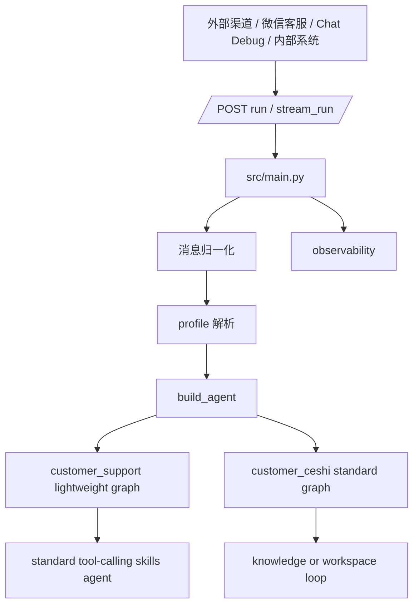
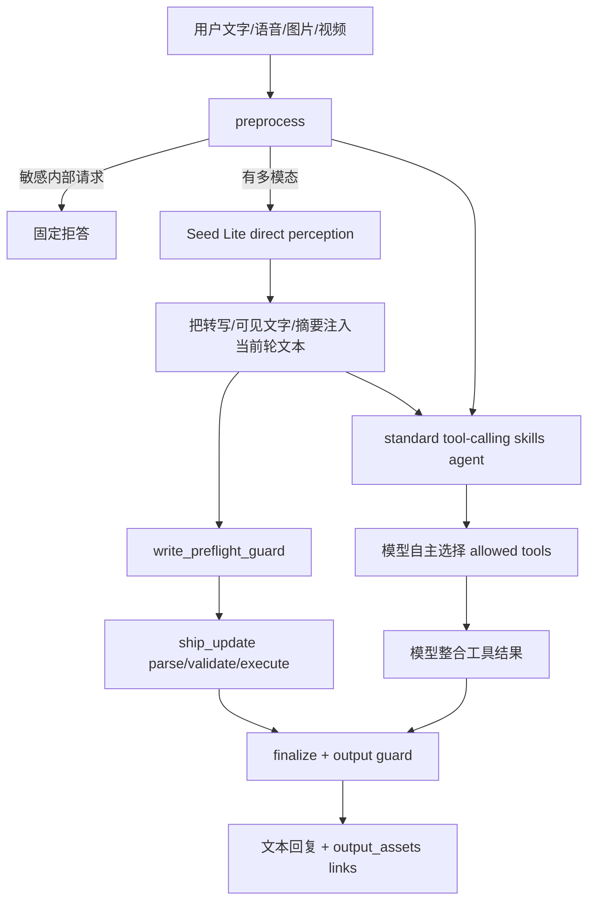
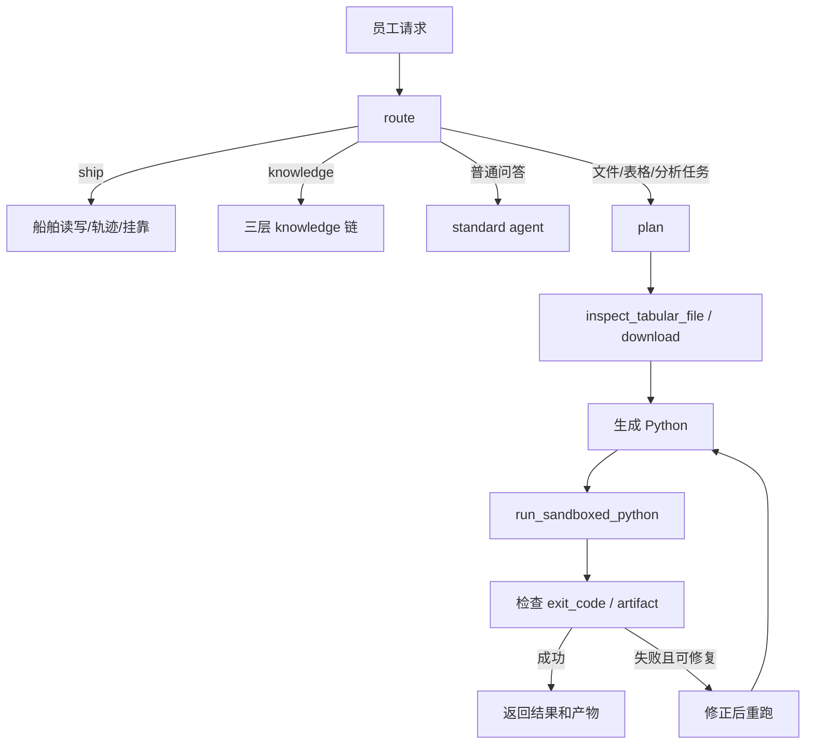

# HiFleet Agent 技术架构

本文描述当前仓库中真实生效的 Agent 架构，重点解释：

- `customer_support` 现在如何以轻量全模态 skills agent 方式工作
- `customer_ceshi` 与 `customer_support` 的职责边界，以及 `employee_assistant` 兼容别名的落点
- 外部 `/run`、微信客服旧格式、多模态输入、工具调用和安全输出分别在哪一层完成
- 线上排障时应该看哪些文件和字段

## 1. 总体架构



关键文件：

| 文件 | 责任 |
| --- | --- |
| `src/main.py` | HTTP 入口、`/run`/`/stream_run`、微信旧格式归一化、模型路由、观测写入 |
| `src/agents/profiles.py` | profile 配置、请求体/header 解析、权限边界 |
| `src/agents/agent.py` | `build_agent()`、`customer_support` 轻量 graph、`customer_ceshi` 标准 graph |
| `config/agent_profiles.json` | `customer_support` / `customer_ceshi` skills、工具权限和别名 |
| `config/profiles/customer_support.md` | 外部客服轻量 skills agent 的业务规则和安全边界 |
| `config/agent_llm_config.json` | 默认模型、thinking、工具配置 |
| `src/agents/customer_support_guard.py` | 客服最终输出脱敏、拒答、链接清洗 |
| `src/skills/knowledge_qa/tools.py` | `local_kb_search / web_search / web_search_agent_browser` |
| `src/skills/knowledge_admin/tools.py` | 授权写入本地结构化客服知识库 |
| `src/skills/hifleet_ship_service/tools.py` | 船舶查询、统计、轨迹、挂靠、船位上传、静态信息更新 |
| `src/skills/multimodal_support/tools.py` | 附件 metadata 辅助 |
| `src/skills/browser_verify/tools.py` | 公开网页核验、`agent_browser_deep_search` |

`src/agents/customer_support_router.py` 和旧 `_build_customer_support_agent()` 不再承担当前 `customer_support` 的通用知识主链，但 ship_update 这类确定性写请求仍会在轻量 graph 的 `write_preflight_guard` 分支中进入 `execute_update_chain(...)` 做解析、校验和执行。它们既是回滚与旧测试参考，也是当前船舶写操作的受控执行模块。

Profile 解析规则：

- 接受请求体 `agent_profile` 或请求头 `x-agent-profile` 中合法的 `customer_support` / `customer_ceshi`，并兼容把 `employee_assistant` 解析为 `customer_support`。
- 未提供合法 Profile 时，默认使用 `customer_support`。
- `source_channel` 只用于日志、观测、后台筛选和调用来源记录，不参与 Profile 判断。

## 2. Profile 边界

| 维度 | `customer_support` | `customer_ceshi` |
| --- | --- | --- |
| 面向对象 | 外部客户、微信客服、WebSDK、CRM；兼容旧 `employee_assistant` 调用 | 内部测试、后台运营 |
| 主目标 | 直接回复客户，并在需要时调用 allowed skills | 帮员工完成知识问答、文件检查、表格分析和产物任务 |
| 主执行方式 | 轻量 graph；默认 `preprocess -> delegate -> finalize`，ship_update 为 `write_preflight_guard -> ship_update` 特殊分支 | 标准 tool-calling agent，保留 employee workspace 能力 |
| 模型 | 默认 `doubao-seed-2-0-lite-260428` | 同后台配置，默认也可使用 Seed Lite |
| 多模态 | 支持文本、图片、语音、视频当前轮理解 | 支持多模态转写/理解后进入内部流程 |
| 船舶工具 | 允许读写 ship service 工具 | 允许读写 ship service 工具 |
| 沙盒/Python | 禁用 | 启用，仅测试/内部 profile |
| 文件/产物 | 禁用 employee workspace 和客服文件产物工具 | 启用受控 workspace / artifact 能力 |
| 输出安全 | `sanitize_customer_output` + 敏感请求拦截 | 内部输出，但仍禁止泄露密钥和危险路径 |

`customer_support` 当前 skills：

- `knowledge_qa`
- `knowledge_admin`
- `hifleet_ship_service`
- `multimodal_support`
- `browser_verify`

明确不包含：

- `employee_workspace`
- `customer_workspace`
- `run_sandboxed_python`
- `download_public_file_to_artifact`
- `inspect_tabular_file`
- `inspect_customer_file`
- `upload_customer_artifact`

## 3. customer_support 当前主链



### 3.1 preprocess

`preprocess` 做轻量、确定性的入口处理：

- 检查是否请求 prompt、工具注册表、key、路径、日志等内部信息；命中则直接拒答。
- 检测当前轮是否包含 `image_url`、`input_audio`、`video_url`。
- 对多模态输入调用 `doubao-seed-2-0-lite-260428` 做当前轮 direct perception。
- 如果识别到音频转写、截图文字、图像/视频摘要、疑似符号或疑似问题，则替换当前轮用户文本，让后续 tool-calling agent 基于“文字 + 感知摘要”继续处理。
- 如果当前轮命中明确写请求，轻量 graph 会先经过 `write_preflight_guard` 判断是否应直接进入 ship_update 受控链路，而不是先委托标准 skills agent。
- 写入 `route_trace.reasoning_trace.pipeline` 和 `perception_summary`，仅用于后台观测。

### 3.2 write_preflight_guard 与 ship_update 特殊分支

`customer_support` 的大多数请求会进入标准 skills agent，但船舶写操作是一个例外：

- 只有用户当前轮明确表达“更新 / 上传 / 修改 / 补录船位或静态信息”时，才会从轻量 graph 命中 `write_preflight_guard`。
- 命中后进入 `src/agents/customer_support_router.py` 的 ship_update 受控执行链，而不是完全交给标准 skills agent 自主规划。
- 这条链路当前执行方式是：
  `preprocess -> multimodal perception -> write_preflight_guard -> ship_update parse/validate/execute -> finalize`

ship_update 当前规则：

- 动态/静态写模式只由当前轮指令文本决定；图片里出现 `呼号 / AIS船名 / 船型` 不会自动把“更新船位”切成静态更新。
- 参数解析只用当前轮文本和当前轮 perception，不复用历史船舶标识。
- 动态更新缺 `mmsi / lon / lat / updatetime` 任一项时，直接在解析层返回缺字段提示，不调用写工具。
- 当前轮仅提供 `IMO` 或 `船名` 时，最多触发一次 `ship_search`：
  - `IMO` 唯一命中可直接补全 MMSI。
  - `船名` 唯一命中仍要求用户确认 MMSI，避免写错船。
- `execute_update_chain(...)` 当前是薄执行器，真正的字段抽取、缺字段提示和工具入参组装都来自单次解析结果对象。

### 3.3 delegate

`delegate` 调用 `_build_standard_agent(...)` 构造的标准 tool-calling agent。

这层会装配：

- `config/system_prompt_base.md`
- `config/profiles/customer_support.md`
- profile 允许的 skills 的 `SKILL.md`
- `config/agent_llm_config.json` 中的模型和 thinking 配置
- `config/agent_profiles.json` 中允许的工具
- `get_memory_saver()` 作为会话 checkpointer

模型在此层自主选择工具，例如：

- 平台知识：`local_kb_search -> web_search -> web_search_agent_browser`
- 授权知识库维护：`upsert_local_kb_entry`
- 公开网页核验：`verify_public_page` / `agent_browser_deep_search`
- 船舶读写：`ship_search`、`get_ship_position`、`get_ship_archive`、`get_ship_trajectory`、`upload_ship_position`、`update_ship_static_info` 等
- 多模态辅助：`inspect_media_attachment`

### 3.4 finalize

`finalize` 做客户可见输出收口：

- 提取最终 AI 回复。
- 调 `sanitize_customer_output(...)` 清除内部痕迹、工具名、搜索模板残片、路径、`.env`、key/token。
- 从最终文本中提取 http/https 链接，写入 `output_assets`。
- 返回 `response_modalities`：v1 仅支持 `text` 和 `link`，不生成语音。
- 写入 `route_trace.tool_call_sequence`、`check_result`、`answer_confidence`。

## 4. 外部接口与微信旧格式

主要接口仍是：

- `POST /run`：同步回复，微信客服当前仍可继续使用。
- `POST /stream_run`：SSE 流式回复，适合调试和前端。

`src/main.py` 会把这些输入归一化为 OpenAI 风格 `messages`：

- `messages`
- `input`
- `text`
- 微信旧格式 `content.query.prompt`

微信旧格式示例：

```json
{
  "content": {
    "query": {
      "prompt": [
        {"type": "voice", "content": {"url": "https://example.com/a.amr", "format": "amr"}},
        {"type": "text", "content": {"text": "帮我看一下这段语音里要查什么"}}
      ]
    }
  },
  "session_id": "wechat_kf:hifleet:openid_xxx:c_default",
  "user_id": "openid_xxx",
  "source_channel": "wechat_kf",
  "agent_profile": "customer_support"
}
```

映射规则：

- `type=text` -> `{"type":"text","text":"..."}`
- `type=image` -> `{"type":"image_url","image_url":{"url":"..."}}`
- `type=voice` -> `{"type":"input_audio","input_audio":{"url":"...","format":"..."}}`
- `type=video` -> `{"type":"video_url","video_url":{"url":"..."}}`
- `location/link/event` -> 降级为文本 JSON

## 5. 模型与 thinking 配置

当前推荐默认：

```json
{
  "text_model": "doubao-seed-2-0-lite-260428",
  "multimodal_model": "doubao-seed-2-0-lite-260428",
  "thinking_type": "enabled",
  "reasoning_effort": "medium"
}
```

运行时选择：

- 请求包含图片、语音或视频时，`llm_route.modality=multimodal`。
- 请求体 `model` 可覆盖本轮模型。
- 请求体 `thinking=enabled|disabled` 可覆盖本轮 thinking；旧调用传 `auto` 时服务端会归一化为 `enabled + medium`，不会透传给 Seed Lite。
- 请求体 `reasoning_effort=minimal|low|medium|high` 可覆盖推理深度；当 `thinking=disabled` 时服务端强制使用 `minimal`。
- 后台 `/admin-ui` 模型配置页支持 thinking 开启/关闭和 reasoning effort 档位配置。

`thinking_content` 或模型内部推理不得出现在客户回复中；后台仅展示安全 trace 摘要和工具链信息。

## 6. 船舶读写规则

`customer_support` 允许船舶数据读写，但必须遵守 profile prompt：

- 只有用户明确要求“上传 / 更新 / 修改 / 补录”船位或静态信息时，才调用写工具。
- 问“为什么不更新 / 更新慢 / 看不到最新船位”属于知识或排障问题，不是写操作。
- 船位写操作至少需要 MMSI 和一个实际更新字段，例如经纬度、航速、航向、目的港、ETA、吃水、航行状态或更新时间。
- 静态信息写操作至少需要 MMSI 和一个静态字段，例如船名、IMO、船型、尺寸、船旗、呼号、建造年份、目的港、ETA 或吃水。
- 缺字段时只追问一个最关键字段。
- 工具没有明确成功时，不能对外宣称已更新成功。

当前 ship_update 的解析与风控补充：

- 动态写入的必填最小集合是 `mmsi / lon / lat / updatetime`，而不是“任意动态字段即可写”。
- `route_trace.reasoning_trace` 中当前会记录 `instruction_text`、`parsed_dynamic_fields`、`field_sources`、`resolved_identifier`、`write_args`、`missing_required_fields`，便于解释为何没有调用工具。
- 若 OCR 文本里出现 `更新于`、`暂未收到更新船位`、`船位报告` 等词，而用户真实意图是在咨询异常原因，当前仍存在误触发 ship_update 的风险；排查时不要只看 `route=ship_update`，还要结合 `instruction_text` 与 `missing_required_fields` 判断是否误路由。

## 7. 知识检索与授权写库

平台操作和问题反馈类问题的准确性优先于流畅完整。`customer_support` prompt 要求模型围绕入口、步骤、保存/完成、管理/报警、异常原因等证据面生成 3 到 5 组关键词，并在 `local_kb_search -> web_search -> web_search_agent_browser` 之间多轮检索。

收口规则：

- 本地 FAQ 强命中时可直接回答。
- 只有 wiki 概览、帮助中心首页、社区目录、视频标题页或泛功能介绍时，不能输出完整教程。
- 教程类答案至少需要入口位置、关键操作动作、完成/保存条件。
- 问题反馈类答案要区分已确认事实、可能原因、建议检查项和需补充信息。

授权写库由 `knowledge_admin.upsert_local_kb_entry` 处理，不新增外部 API。必须显式输入 `添加知识库：`、`纠正知识库：` 或 `更新知识库：`，并在正文中通过 `key: ...` 提供与 `HIFLEET_KB_UPDATE_KEY` 匹配的授权 key；`x-kb-update-key` header 不再支持。Agent 调用工具时必须保留完整 `raw_text`，不要把 key 单独拆成参数。工具负责 profile 校验、key 校验、批量映射拆条、去重、JSONL 写入和本地 KB 缓存刷新。

更多运维规则见 [CUSTOMER_SUPPORT_KB_OPERATIONS.md](CUSTOMER_SUPPORT_KB_OPERATIONS.md)。

## 8. 记忆和会话

多轮记忆依赖：

- `session_id`
- `get_memory_saver()`
- `COZE_CHECKPOINTER_MODE=postgres` 时的 Postgres checkpointer

要求：

- 同一客户同一业务会话复用同一个 `session_id`。
- 不同用户或不同会话不要共用 `session_id`。
- 多 worker 生产环境建议启用 Postgres checkpointer。
- 当前不再插入自定义“历史上下文摘要”系统消息；完整文本历史交给 LangGraph/checkpointer 和底层 agent 处理。
- 历史多模态 `HumanMessage` 只做安全脱敏，避免旧音频、图片、视频 URL 在后续轮次重复发送；最新一轮多模态内容保持原样进入 perception。

清理策略：

- 如果只是想让下一轮不继承旧上下文，最简单的方式是直接更换新的 `session_id`。
- 如果需要按 `session_id` 硬删除持久化上下文，可使用 `scripts/clear_session_context.py`；脚本会同时清理主会话和内部 `:standard_agent` 子线程。
- 当前脚本会删除 `memory.checkpoints`、`memory.checkpoint_blobs`、`memory.checkpoint_writes`，以及对应 `observability` 会话记录。

推荐命令：

```bash
cd /home/ecs-user/coze_ai
.venv/bin/python scripts/clear_session_context.py --dry-run \
  'wechat_kf:hifleet:openid_xxx:c_default'

.venv/bin/python scripts/clear_session_context.py \
  'wechat_kf:hifleet:openid_xxx:c_default'
```

如果只想清理 LangGraph 记忆、不删除观测日志：

```bash
cd /home/ecs-user/coze_ai
.venv/bin/python scripts/clear_session_context.py --memory-only \
  'wechat_kf:hifleet:openid_xxx:c_default'
```

## 9. 观测字段

排障时优先看：

- `/run` 返回体中的 `llm_route`
- `phase_history`
- `route_trace.route`，当前 customer 应为 `lightweight_skills_agent`
- `route_trace.task_type`
- `route_trace.reasoning_trace.pipeline`
- `route_trace.reasoning_trace.perception_summary`
- `generated_tool_calls`
- `question_class`、`web_answerability_reason`、`risk_flags`、`recommended_next_action`，通常出现在知识工具结果或检索 trace 中
- `response_modalities`
- `output_assets`
- `check_result`

不应在最终客户回复中看到：

- prompt / tool registry / internal route
- `reasoning_trace`
- raw JSON
- 工具名
- 源码路径
- `.env`
- key / token

## 10. customer_ceshi 当前链路

`customer_ceshi` 仍保留测试/内部执行能力：



不要把 `customer_ceshi` 暴露给未鉴权外部用户。

## 11. 开发建议

- 改 `customer_support` 主入口：优先看 `src/agents/agent.py` 的 `_build_lightweight_customer_support_agent()` 和 `build_agent()`。
- 改外部客服权限：改 `config/agent_profiles.json`。
- 改客服行为：改 `config/profiles/customer_support.md`。
- 改输出脱敏：改 `src/agents/customer_support_guard.py`。
- 改 `/run` 和微信旧格式兼容：改 `src/main.py`。
- 改知识检索工具：改 `src/skills/knowledge_qa/tools.py` 及 runtime 文件。
- 改授权写库：改 `src/skills/knowledge_admin/tools.py`。
- 改船舶读写：改 `src/skills/hifleet_ship_service/tools.py`。
- 旧 `customer_support_router.py` 不再承载当前 customer 的通用知识主链，但仍承载 ship_update 的确定性写请求解析与执行。
