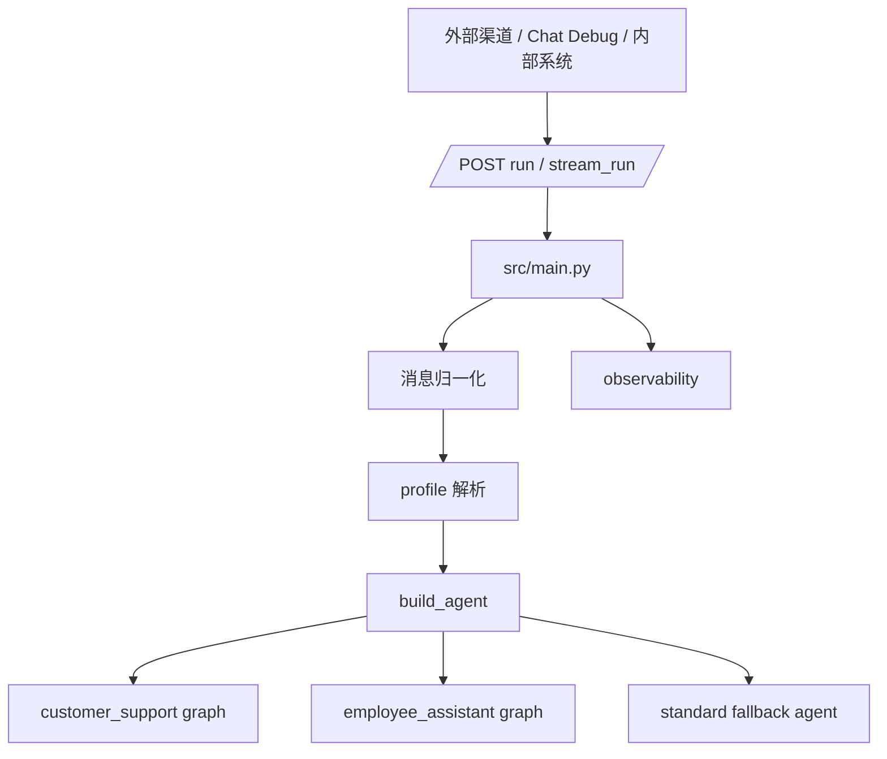
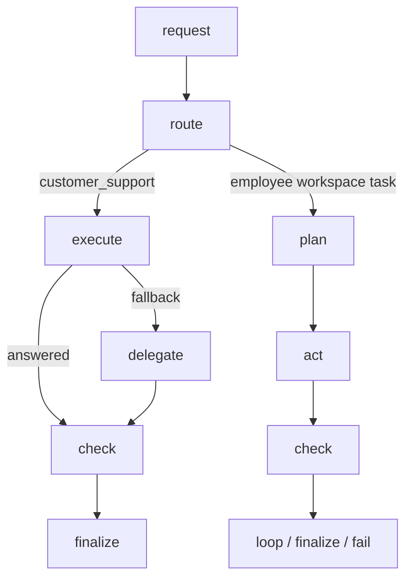
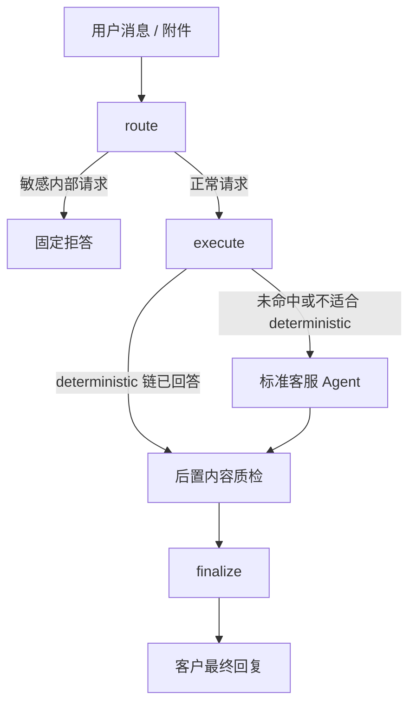
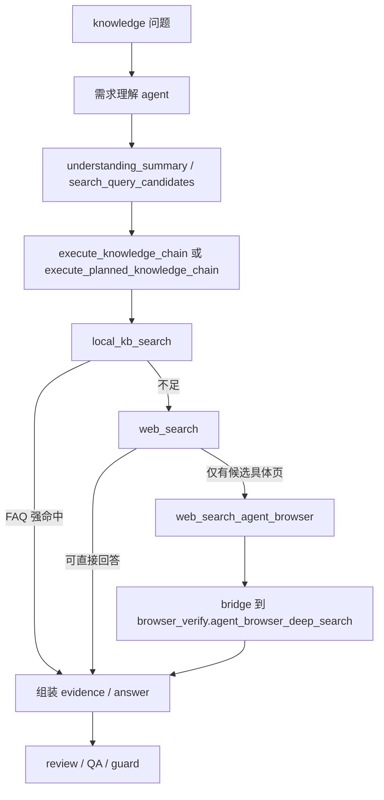
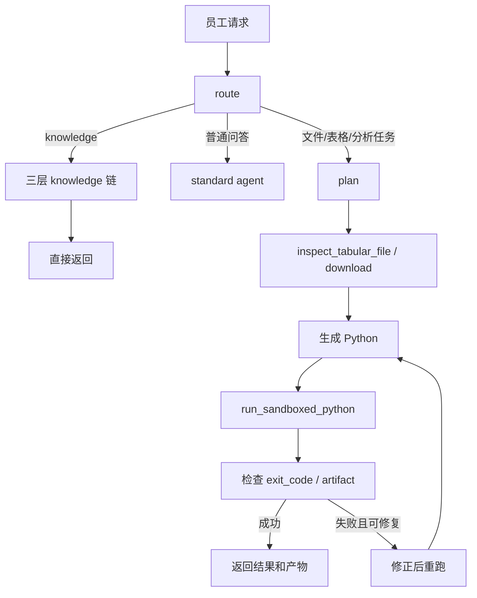

# HiFleet Agent 技术架构

本文描述当前仓库中真实生效的 Agent 架构，重点解释：

- `customer_support` 的消息如何进入主链并产出最终回复
- `employee_assistant` 与 `customer_support` 的职责边界和执行差异
- 多轮上下文、需求理解、知识检索、`agent-browser`、安全输出分别在哪一层完成
- 现在线上排障时应该看哪些文件和链路

## 1. 总体架构

关键文件：

| 文件 | 责任 |
| --- | --- |
| `src/main.py` | HTTP 入口、消息归一化、流式输出、观测写入 |
| `src/agents/profiles.py` | profile 配置、渠道映射、权限边界 |
| `src/agents/agent.py` | 两个 profile 的 phase graph 构建、`customer_support` 的 `route -> execute/delegate -> check -> finalize` 主链 |
| `src/agents/customer_support_router.py` | 客服路由、需求理解摘要落 trace、上下文压缩、knowledge/ship/file/browser 等执行函数 |
| `src/agents/customer_support_guard.py` | 客服最终输出脱敏、拒答、链接白名单校验兜底 |
| `src/agents/customer_support_stream_debug.py` | `/stream_run` 的 runtime state -> debug event 映射 |
| `src/skills/skill_loader.py` | skills 与 tools 注册、按名称收缩工具集 |
| `src/skills/knowledge_qa/tools.py` | `knowledge_qa` 对外工具导出层，暴露 `local_kb_search / web_search / web_search_agent_browser / smart_search` |
| `src/skills/knowledge_qa/local_kb_runtime.py` | 本地 `docs/RAG` 检索、FAQ/wiki/product_doc 轻量打分 |
| `src/skills/knowledge_qa/web_search_runtime.py` | query 归一化、请求画像、站点过滤、结果分析 |
| `src/skills/knowledge_qa/browser_bridge.py` | knowledge 场景下对 `browser_verify.agent_browser_deep_search` 的桥接包装 |
| `src/skills/browser_verify/tools.py` | 公开网页核验、`agent_browser_deep_search` 兜底检索 |
| `src/skills/hifleet_ship_service/tools.py` | 船舶查询、统计、写操作工具 |
| `src/skills/multimodal_support/tools.py` | 附件检查与多模态感知辅助 |
| `src/skills/customer_workspace/tools.py` | 客服文件检查、产物上传 |

## 2. 统一骨架，不同语义

两个 profile 都挂在统一的 Agent 构建入口下，但执行图不同。

当前差异：

- `customer_support`：前置安全拦截 -> execute(需求理解 agent / planner / harness) 或 delegate -> 后置 Guard
- `employee_assistant`：知识问答可走三层 knowledge 快捷链；文件/沙盒任务进入 `plan -> act -> check -> loop`

## 3. customer_support 与 employee_assistant 对比

| 维度 | `customer_support` | `employee_assistant` |
| --- | --- | --- |
| 面向对象 | 外部客户、微信客服、CRM 渠道 | 内部员工、后台运营 |
| 主目标 | 给出稳定、简洁、可直接发送的客服回复 | 帮员工完成任务并产出可复核结果 |
| 主执行方式 | 受控路由 + planner/harness + 标准 Agent 兜底 | knowledge 可直接走三层检索；workspace task 进入 `plan -> act -> check -> loop` |
| 前置控制 | `route` 做敏感内部探查拦截、分类、上下文提取 | `route` 判断是否进入 knowledge 快捷链、workspace task 或标准 delegate |
| 后置控制 | `sanitize_customer_output` + 链接校验 + 统一兜底 | `exit_code` / artifact / sandbox 自愈 |
| 核心瓶颈 | 知识库完整度、官网检索命中率、上下文误继承 | 文件结构识别、代码生成、沙盒执行 |

## 4. customer_support 消息处理逻辑

### 4.1 当前主链

### 4.2 route node

当前 `route node` 负责前置理解和安全收口：

1. 读取本轮最新用户文本
2. 检查是否命中敏感内部探查请求
3. 提取 `entities / attachments / perception`
4. 构建会话上下文：
   - `compressed_recent_user_questions`
   - `relevant_recent_user_questions`
   - `context_summary`
5. 做首轮 `route / task_type` 判定

关键点：

- route 分类会直接影响是否进入 `execute`
- 多轮上下文不会把全部原始历史直接丢给后续节点
- 只有敏感请求会在 route 直接拒答

### 4.3 首步需求理解 agent

当前 `customer_support` 的首步不再只是做简单 `intent` 分类，而是固定调用 `doubao-seed-2-0-lite-260428` 生成一份结构化 understanding 契约。

核心输出字段：

- `rewritten_user_need`
- `query_type`
- `search_keywords`
- `search_query_candidates`
- `should_prefer_local_kb`
- `should_limit_to_hifleet_sites`

这份结果会写入两处 trace：

- `route_trace.reasoning_trace.understanding_summary`
- 后续 knowledge 执行链的 `retrieval_trace`

它的作用不是直接回答用户，而是给后续知识检索提供稳定输入，避免旧版模板化 query rewrite 把“行业数据问题”误改成 HiFleet 产品问题。

### 4.4 execute node

`execute node` 是当前 `customer_support` 主链的核心。

它会按以下顺序工作：

1. 基于 `build_conversation_context(...)` 和 `build_llm_context_window(...)` 准备压缩后的上下文
2. 调 `_run_customer_support_intent_agent(...)` 产出需求理解摘要与检索偏好
3. 调 `build_customer_support_plan(...)` 生成 fallback plan
4. 对 `knowledge / chart_symbol / multimodal_understanding / conversation` 尝试 planner 直答链
5. 对 `ship_* / file_task / browser_verify` 优先走 deterministic harness
6. 如果 planner/harness 未给出可用答案，再回退 `delegate`

### 4.5 knowledge 分支的真实调用图

关键点：

- knowledge route 现在优先使用 `search_query_candidates[0]` 作为主查询
- 不再默认走旧的 `_rewrite_hifleet_knowledge_query()` 模板化改写
- `site_hint` 优先由 `should_limit_to_hifleet_sites` 决定
- `knowledge_qa` 保持为一个 skill，但 tool 层已拆成三工具
- `agent-browser` 已接入主链，但仅作为知识链路的受控升级层
- 不支持登录态、Cookie、内网、localhost
- 优先抓取 HiFleet 官网、社区、帮助中心、数据服务、账号页等公开页面

### 4.6 多轮上下文的真实使用方式

当前不会把全部历史原封不动丢给后续 Agent，而是：

1. 保留 `latest_user_text`
2. 压缩历史问题文本
3. 筛出 `relevant_recent_user_questions`
4. 生成 `context_summary`
5. 给 intent/planner 只传 `build_llm_context_window(...)` 的小窗口

这样做的目的，是避免无关旧问题误导当前判断，同时保留“上面 / 这艘船 / 上一条 / 总结”这类追问所需的最小相关上下文。

### 4.7 delegate node

`delegate node` 会调用 `_build_standard_agent(...)` 构造标准客服 Agent。

这层会装配：

- `config/system_prompt_base.md`
- `config/profiles/customer_support.md`
- profile 允许的 skills 的 `SKILL.md`
- 运行态模型配置
- profile allowlist tools
- `get_memory_saver()`

它的职责是兜住 planner/harness 不适合处理、或需要更自然语言组织能力的场景。

### 4.8 check node

`check node` 现在是后置 Guard：

1. 提取最终回答
2. 调 `sanitize_customer_output(...)`
3. 做链接校验
4. 如果回答为空、不安全或不稳定，降级到统一致歉/建议补充信息

### 4.9 finalize node

`finalize node` 负责：

- 返回最终客户可见文本
- 汇总 `generated_tool_calls / check_result / latency`
- 保证 `/run`、`/stream_run` 和 runtime state 一致

## 5. customer_support 工具与知识能力

当前 `customer_support` 的执行重心是“路由可控 + 检索可信 + 输出安全”：

1. 需求理解 agent 是否正确产出 `query_type / search_query_candidates / should_limit_to_hifleet_sites`
2. `knowledge_qa` 三工具是否按 `local_kb_search -> web_search -> web_search_agent_browser` 顺序受控升级
3. `smart_search` 兼容层是否仍能服务旧 route 和旧测试
4. ship/file/browser/multimodal harness 是否走对了链路
5. Guard 是否把不该暴露的内容挡住

当前现实：

- 本地知识库第一版已直接读 `docs/RAG`，后续仍可切向向量库
- 产品问题会优先 HiFleet 官方站点，公共权威数据问题不应携带 HiFleet `Sites` 过滤
- `agent-browser` 已接入，但定位仍是公开网页正文核验，不是通用浏览器执行器

## 6. `/stream_run` 调试流

当前调试流展示的是和 runtime 对齐的阶段：

- `message_start`
- `thinking`
  - 前置安全与问题识别
  - execute / delegate 分支
  - 附件输入分析
  - 后置内容质检
- `tool_response`
- `answer`
- `message_end`

调试界面可看到：

- route / task_type
- execute 还是 delegate
- 实际执行过的工具
- post guard 是否触发
- 最终回复

不会输出：

- prompt 原文
- 私密 chain-of-thought
- 工具注册表
- 源码路径
- key / token / env

## 7. 当前 customer_support 阅读顺序

建议按下面顺序读源码：

1. [src/main.py](/Users/raymondlu/LocalProject/AIPM/智能客服/客服开发/本地agent/hifleet-agent/src/main.py)
2. [src/agents/agent.py](/Users/raymondlu/LocalProject/AIPM/智能客服/客服开发/本地agent/hifleet-agent/src/agents/agent.py)
3. [src/agents/customer_support_router.py](/Users/raymondlu/LocalProject/AIPM/智能客服/客服开发/本地agent/hifleet-agent/src/agents/customer_support_router.py)
4. [config/profiles/customer_support.md](/Users/raymondlu/LocalProject/AIPM/智能客服/客服开发/本地agent/hifleet-agent/config/profiles/customer_support.md)
5. [src/skills/knowledge_qa/SKILL.md](/Users/raymondlu/LocalProject/AIPM/智能客服/客服开发/本地agent/hifleet-agent/src/skills/knowledge_qa/SKILL.md)
6. [src/skills/knowledge_qa/tools.py](/Users/raymondlu/LocalProject/AIPM/智能客服/客服开发/本地agent/hifleet-agent/src/skills/knowledge_qa/tools.py)
7. [src/skills/browser_verify/tools.py](/Users/raymondlu/LocalProject/AIPM/智能客服/客服开发/本地agent/hifleet-agent/src/skills/browser_verify/tools.py)
8. [src/agents/customer_support_guard.py](/Users/raymondlu/LocalProject/AIPM/智能客服/客服开发/本地agent/hifleet-agent/src/agents/customer_support_guard.py)

## 8. employee_assistant 当前链路

`employee_assistant` 当前已经不只是“工作流型助手”，而是同时承担两类职责：

1. `intent_hint=knowledge` 且不是 workspace 文件任务时，直接复用三层知识链
2. 文件/表格/分析任务进入 `plan -> act -> check -> loop`

最近一轮修复后需要特别注意：

- `employee_assistant` 的纯文本知识问答不再直接依赖标准 delegate，而是优先走三层知识链
- 这样可以绕开标准 agent 在某些纯文本 knowledge 场景下的 `last_ai_index` 内部异常

与 `customer_support` 当前最大差异：

- `employee_assistant` 允许更长执行链和沙盒循环
- 输出对象是员工，不是客户
- 重点是产物和分析结果，不是客服化话术
- `customer_support` 可以用文件/浏览器/多模态，但必须受控且对外极度收口

这也意味着，下一阶段如果要继续简化架构，`employee_assistant` 已具备成为统一执行骨架的条件；`customer_support` 更可能收敛为客户输出策略层。相关背景见 [EMPLOYEE_ASSISTANT_MAINLINE_PREP.md](EMPLOYEE_ASSISTANT_MAINLINE_PREP.md)。

## 9. 开发建议

如果要改 `customer_support`，优先按下面顺序判断改哪里：

1. 主 graph 变化：先改 `src/agents/agent.py`
2. 路由、上下文、planner、knowledge/ship/file/browser 执行逻辑：改 `src/agents/customer_support_router.py`
3. 浏览器兜底策略：改 `src/skills/browser_verify/tools.py`
4. 输出边界：改 `src/agents/customer_support_guard.py`
5. 流式调试：补 `src/agents/customer_support_stream_debug.py`
6. 回归：补 `tests/test_customer_support_router.py` 和 `tests/test_customer_support_intent_agent.py`
