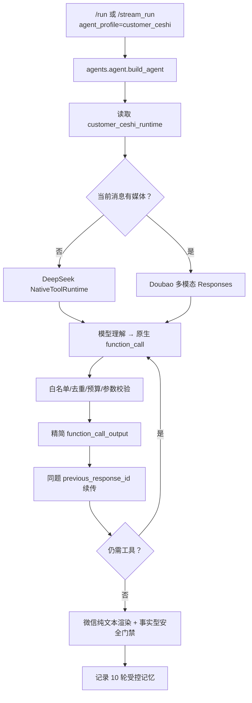

# customer_ceshi 开发与运行指南

> 适用范围：仅 `customer_ceshi` 测试客服链。它与生产 `customer_support` 使用不同 Builder、运行时和 checkpoint namespace；修改本链路不得改变生产客服行为。

## 1. 一页总览

`customer_ceshi` 是 HiFleet 企业客服的实验链，用于验证 Responses API、原生函数调用、受控上下文、媒体理解和船舶更新能力。

| 用户输入 | 决策模型 | API 与运行方式 | 可用能力 |
| --- | --- | --- | --- |
| 纯文本 | `deepseek-v4-flash-260425` | Responses API 优先；不可用时同模型 Chat Function Calling | HiFleet 知识检索、网页核验、船舶只读查询、受控更新候选 |
| 图片、视频、音频 | Doubao 图片/视频模型或音频模型 | Responses API；公网 URL 直接进入 `input[].content[]` | 媒体理解、只读检索、船舶只读查询、受控 AIS 证据记录 |

“单模型”按单个用户问题计算：纯文本问题不调用 Doubao；媒体问题不切换到 DeepSeek。一个问题可由同一模型多次 Responses 调用完成工具循环。

## 2. 开发路线与关键决策

1. **隔离入口**：`customer_ceshi` 从生产客服链分离，使用 `customer_ceshi_responses` namespace；失败时不自动回退到 `customer_support`。
2. **Responses 优先**：弃用自定义 `AgentDecision JSON` 作为默认工具协议，改为 Provider `function_call` → 本地执行 → `function_call_output` → `previous_response_id` 续传。
3. **模型主导、运行时治理**：模型理解问题、选择最少工具、读取证据并生成客户答复；代码仅负责白名单、预算、参数校验、证据压缩、会话隔离和写入安全。
4. **受控记忆替代跨题 Provider 链**：跨用户问题不复用 `previous_response_id`。本地账本最多保存 10 轮问答，最近 3 轮保留完整文本，其余轮次压缩；原始工具日志、异常、媒体 URL 和推理不进入下一题。
5. **媒体与业务问题统一处理**：媒体问题由 Doubao 直接接收公网 URL，同时可使用同一 Doubao Responses 工具循环核验 HiFleet 规则，避免“读到截图却无法回答时间范围/数量限制”。
6. **写入永远受控**：模型不直接调用底层写工具。仅当前轮明确更新、字段来自当前文字或有效媒体证据且校验通过时，运行时调用 `upload_ship_position` 或 `update_ship_static_info`。

## 3. 思考与执行链路



### 3.1 工具循环

- 只读工具来自 `CapabilityRegistry`，包含本地知识库、网页检索/核验和船舶/港口查询。
- 搜索按“工具名 + 归一化 query”去重；默认本地知识库最多 2 次、联网搜索最多 2 次。
- 工具返回不直接拼接原始 JSON。运行时只回传查询、状态、摘要、最多 3 条事实、最多 2 个来源、置信度和下一步建议。
- 当工具明确 `can_answer=true` 时，下一次模型请求强制总结，不允许再做同义检索。
- 普通产品、故障排查和数据时效解释由模型基于证据总结；安全门禁只校验“写入成功”和“查询无结果”等可由工具事实确认的结论。

### 3.2 多媒体请求格式

外部服务传入的公网 URL 按接收顺序保留在同一 `content` 数组，仅当前轮进入模型：

| 媒体 | Responses 内容项 | 额外参数 |
| --- | --- | --- |
| 图片 | `{"type":"input_image","image_url":"..."}` | 默认 `detail: "high"`；可配置像素范围 |
| 视频 | `{"type":"input_video","video_url":"..."}` | `fps` 必须在 0.2–5，默认 1 |
| 音频 | `{"type":"input_audio","audio_url":"..."}` | 无额外必填参数 |
| 用户文字/历史摘要 | `{"type":"input_text","text":"..."}` | 与本轮媒体并列 |

普通产品截图不再强制输出 AIS JSON。若 Doubao 从当前附件清晰识别出完整 AIS 更新字段，才调用内部 `record_media_update_candidate`；该调用只进入短期证据账本，不会显示给客户。

### 3.3 直接更新流程

1. 用户上传媒体：旧媒体证据立即失效；Doubao 可记录一份通过校验的 AIS 候选，默认有效 10 分钟。
2. 用户当前轮明确说“更新船位”“执行更新”“根据上图/AIS 数据更新”，或在有效候选存在时只说“确认”。
3. 运行时仅合并当前文字与同用户、同会话、未过期媒体证据：
   - 船位更新必须有 9 位 MMSI、经度、纬度、更新时间。
   - 静态更新必须有 MMSI 和至少一个可更新静态字段。
4. 校验通过才调用底层写入；写入后候选立即清除。成功话术必须由真实写工具成功结果支撑。

普通 10 轮记忆、历史查询结果、旧媒体、签名 URL 和模型猜测均不能补写更新字段。

## 4. 关键文件与配置

| 位置 | 职责 |
| --- | --- |
| `src/agents/agent.py` | 根据 `agent_profile=customer_ceshi` 选择 isolated Responses Builder；生产 `customer_support` 走原有路径 |
| `src/agents/customer_ceshi_responses/builder.py` | 主实现：Responses/Chat 工具循环、上下文账本、多模态 payload、AIS 证据账本、更新校验、微信渲染和 trace |
| `config/agent_llm_config.json` | `customer_ceshi_runtime` 模型、Responses 参数、上下文、检索预算和直接更新开关 |
| `config/profiles/customer_ceshi_v2.md` | HiFleet 客服身份、微信纯文本、检索与更新行为约束 |
| `config/agent_profiles.json` | `customer_ceshi` profile、技能和 prompt 文件绑定 |
| `scripts/probe_customer_ceshi_responses.py` | 显式启用的真实端点能力探测；不打印密钥、媒体 URL、模型正文或推理 |
| `tests/customer_ceshi_v2/test_responses_runtime.py` | Responses 工具续传、多媒体 payload、AIS 证据、微信渲染和模型隔离回归 |

`customer_ceshi_runtime` 的常用字段：

| 配置 | 默认意图 |
| --- | --- |
| `mode` | `responses`；可临时设为 `chat_function_calling`、`legacy_v2` 或 `disabled` |
| `fallback_mode` / `chat_fallback_enabled` | Responses 不可用时仅允许同一文本模型的 Chat Function Calling 降级 |
| `responses.deepseek` | DeepSeek 模型、思考、采样、token 和原生工具参数 |
| `responses.doubao` | Doubao 模型、图片 detail、视频 fps、思考、采样和 `tool_choice` |
| `context` | 10 轮记忆、最近完整轮数、摘要长度和 session TTL |
| `search` | 本地/网页检索次数及证据包大小 |
| `direct_updates` | 直接更新开关、媒体证据 TTL 和最低置信度 |

新配置优先于旧 `customer_ceshi_*` / `customer_ceshi_v2_*` 兼容字段；新开发只应写入 `customer_ceshi_runtime`。

## 5. 可观测性、测试与排障

每次运行返回并脱敏记录：运行模式、实际模型、模型/工具/媒体调用数、工具耗时、上下文轮数与 token、输出/推理 token、Provider 状态、降级原因、guard 结果和响应 ID 尾部。不得记录 API key、完整签名 URL、原始工具日志、媒体内容或隐藏推理。

常用验证：

```bash
PYTHONPATH=src .venv/bin/pytest -q tests/customer_ceshi_v2/test_responses_runtime.py
PYTHONPATH=src .venv/bin/pytest -q tests/customer_ceshi_v2/test_trace_redaction.py

# 默认 SKIPPED；仅在测试凭据、测试会话和测试图片均明确准备后启用。
PYTHONPATH=src CUSTOMER_CESHI_REAL_MODEL_TEST=1 \
  CUSTOMER_CESHI_MULTIMODAL_PROBE_URL=https://example.test/probe.png \
  .venv/bin/python scripts/probe_customer_ceshi_responses.py
```

排障优先级：先看 `runtime_mode`、`provider_error`、`fallback_reason` 与 `finish_reason`；再检查 `tool_calls`、证据 `can_answer` 和去重/预算；最后检查媒体 `media_response_text` 与 `media_candidate_status`。只有 Provider 明确失败、媒体无法读取或没有任何安全可见回答时，才应回复附件读取失败。

## 6. 官方接口参考

- [Responses API 创建模型响应](https://docs.volcengine.com/docs/82379/1569618?lang=zh)
- [图片理解](https://docs.volcengine.com/docs/82379/1362931?lang=zh)
- [视频理解](https://docs.volcengine.com/docs/82379/1895586?lang=zh)
- [音频理解](https://docs.volcengine.com/docs/82379/2377589?lang=zh)

以实际 Provider 探测结果为准；不要假设 OpenAI-compatible SDK 的所有字段都与官方端点完全等价。
