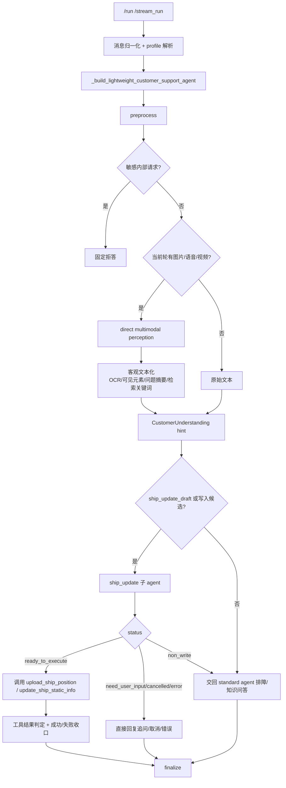

# customer_ceshi 当前架构与 ship_update 链路

本文描述当前真实生效的 `customer_ceshi` 链路。`customer_ceshi` 不再是独立沙盒 profile，而是与 `customer_support` 共用 lightweight 客服 graph 的回归/调试 profile。差异主要在 profile prompt、trace 可读性和回归覆盖。

## 1. 当前定位

| 维度 | 当前行为 |
| --- | --- |
| 入口 | `/run` / `/stream_run`，请求体或 header 指定 `agent_profile=customer_ceshi` |
| 主 graph | `preprocess -> delegate -> finalize` |
| 多模态 | direct perception 只整理 OCR、可见元素、附件问题摘要和检索关键词，不直接判断图标含义 |
| 写入链路 | `ship_update` 子 agent 生成结构化计划；主链路只校验工具白名单、调用真实工具并记录结果 |
| 跨轮状态 | 内部使用 `ship_update_draft`；`pending_update_state` 仅作为旧接口兼容视图 |
| 成功话术 | 只有真实写入工具明确成功时才允许回复成功 |

关键文件：

- `src/agents/agent.py`：lightweight graph、多模态 perception、ship_update 子 agent 调度、finalize guard。
- `src/agents/ship_update_subagent.py`：船位/静态信息更新的 prompt-driven 子 agent contract、draft 兼容与 fallback。
- `src/skills/hifleet_ship_service/tools.py`：船位上传、静态信息更新和成功回复格式。
- `config/profiles/customer_ceshi.md` / `config/profiles/customer_support.md`：客服可见行为边界。

## 2. 主链路



## 3. ship_update 子 agent

子 agent 是船舶写入业务判断中心。主链路不再用固定规则解释“确认更新 / 只补 MMSI / 目的港 follow-up / 取消”等业务语义。

子 agent 输出固定结构：

| 字段 | 含义 |
| --- | --- |
| `status` | `ready_to_execute`、`need_user_input`、`non_write`、`cancelled`、`error` |
| `operation_type` | `position_update`、`static_update`、`mixed_update`、`none` |
| `tool_name` / `tool_args` | 候选写入工具与工具参数 |
| `draft_action` | `create`、`update`、`resume`、`clear`、`none` |
| `ship_update_draft` | 当前写入草稿，保存目标船、候选工具参数、缺失字段和证据来源 |
| `reply_to_user` | 需要追问、取消或错误时的客服话术 |

主链路只做硬边界：

- JSON schema / enum 校验。
- 写入工具白名单：`upload_ship_position`、`update_ship_static_info`。
- 工具参数字段别名和空值清理。
- 真实工具调用、工具结果成功/失败判定、trace 记录。
- LLM 子 agent 不可用或返回非法 JSON 时，才使用 deterministic fallback。

## 4. ship_update_draft

`ship_update_draft` 取代旧业务型 pending，用于跨轮补字段。典型场景：

- 首轮图片识别出经纬度、更新时间、状态，但缺 MMSI。
- 次轮用户只补 9 位 MMSI。
- 子 agent 从当前 draft 合并 MMSI，生成 `ready_to_execute` 工具计划。

状态规则：

- 无 draft 时，单独 MMSI 或“确认更新”不得写入。
- draft 默认 5 轮过期。
- 用户明确取消时清理 draft。
- 工具明确成功后清理 draft，并将兼容 `pending_update_state.status` 标记为 `executed_success`。
- `pending_update_state` 仍在响应和 trace 中保留一版，供旧调用方和旧测试兼容；内部主状态使用 `ship_update_draft`。

字段来源只允许：

- 当前轮用户文本。
- 当前轮附件 perception。
- 当前 `ship_update_draft`。

不得从历史其他船舶成功回复、历史截图或历史 MMSI 中补写经纬度、ETA、吃水、状态或更新时间。

## 5. 字段规则

### 5.1 船位更新

工具：`upload_ship_position`

必填：

- `mmsi`
- `lon`
- `lat`
- `updatetime`

可选：

- `speed`
- `heading`
- `course`
- `draft`
- `navstatus`
- `destination`
- `eta`

组合字段规则：

- `船艏/航迹向: A / B` 必须解析为 `heading=A`、`course=B`。

目的港/ETA 占位符清洗：

- `--`
- `-`
- `—`
- `N/A`
- `未知`
- `-- / --`
- `/ETA`
- `ETA`
- `目的港/ETA`
- `destination/eta`

这些值表示未提供，不进入 draft 或 tool args，也不作为缺失字段追问。

### 5.2 静态信息更新

工具：`update_ship_static_info`

必填：

- `mmsi`
- 至少一个静态字段，例如 `ship_name`、`imo`、`callsign`、`ship_type`、`length`、`width`、`dwt`、`built_year`、`destination`、`eta`、`draft`

成功回复格式与船位更新保持一致，包含：

- 成功标题。
- MMSI。
- HiFleet 微信验证链接。
- 本次更新参数明细。
- `数据同步：预计 5 分钟内生效`。

静态信息没有 `updatetime` 字段，因此成功回复不伪造更新时间。

## 6. 非写入咨询

以下场景不调用后台写入工具：

- `为什么船位更新这么慢`
- `目的港 ETA 为什么显示旧值`
- `怎么在平台手动更新目的港 ETA`
- `能不能发邮件到 reports@hifleet.com 更新 ETA`
- `两艘船连续 1-2 天没有船位跟踪，AIS 正常，请后台看看`
- 海图符号、平台按钮、颜色标识含义咨询

如果 ship_update 子 agent 返回 `non_write`，lightweight graph 会把请求交回 standard agent 继续知识库/网页检索和排障回答，而不是把内部分类话术直接发给客户。

## 7. Trace 重点字段

排障时优先看：

| 字段 | 用途 |
| --- | --- |
| `route_trace.reasoning_trace.perception_summary` | 当前轮附件 OCR、可见元素、问题摘要和检索关键词 |
| `route_trace.reasoning_trace.understanding_result` | 需求理解 hint |
| `route_trace.ship_update_subagent_gate` | 是否进入 ship_update 子 agent 及原因 |
| `route_trace.reasoning_trace.ship_update_subagent` | 子 agent 原始结构化结果 |
| `route_trace.reasoning_trace.ship_update_draft` | 当前写入草稿 |
| `route_trace.reasoning_trace.write_args` | 最终候选工具参数 |
| `route_trace.check_result.current_run_tool_success` | 本轮真实工具是否明确成功 |
| `route_trace.readable_trace.agent_process_summary` | 可读排障摘要 |

重点判断：

- 当前轮没有真实工具调用时，`generated_tool_calls` 和 `tool_call_sequence` 不应继承历史工具。
- 工具失败或结果不确定时，`allowed_success_claim` 必须为 false。
- 有 active draft 时，补 MMSI/确认更新只能使用 draft 字段，不能从历史其他船舶回复取参数。

## 8. 回归测试

核心测试：

```bash
.venv/bin/python -m pytest tests/test_customer_ceshi_prompt_contract.py tests/test_customer_ceshi_pending_state.py tests/test_customer_support_router.py tests/test_customer_ceshi_write_robustness.py -q
.venv/bin/python -m pytest tests/test_customer_support_intent_agent.py tests/test_customer_support_p0_optimization.py -q
.venv/bin/python -m pytest tests/test_hifleet_ship_upload_position.py -q
```

重点覆盖：

- `/ETA`、`目的港/ETA: -- / --` 不进入写入参数。
- 合法 `目的港/ETA:VNSGN/2026-07-03 09:00` 保留。
- 旧扁平 `pending_update_state` 可迁移为 `ship_update_draft`。
- active draft + MMSI follow-up 使用当前 draft 字段写入。
- `non_write` 交回 standard agent 排障，不直接返回内部分类话术。
- 静态信息更新成功回复包含验证链接和参数明细。
