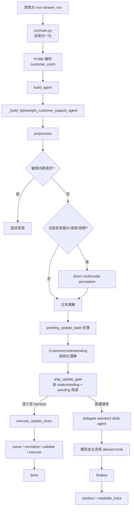
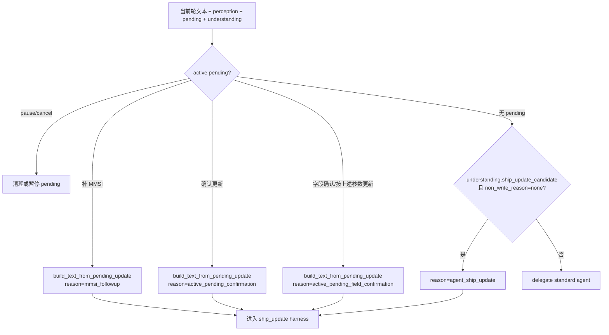
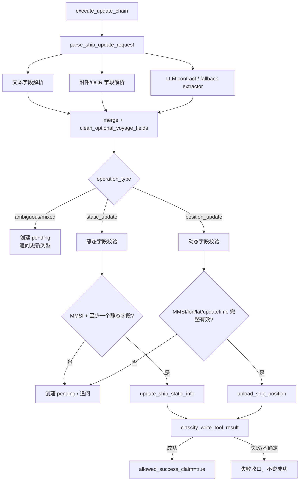
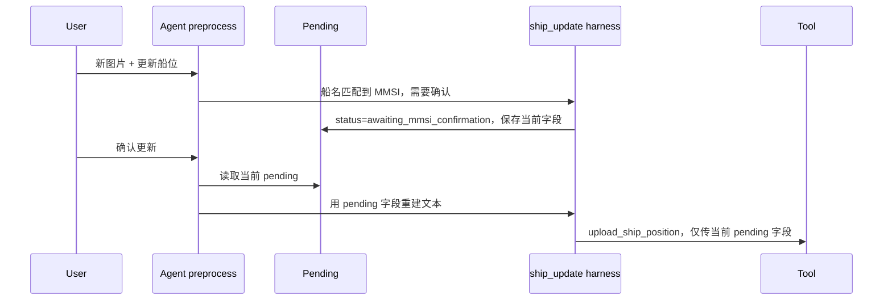

# customer_ceshi 架构与消息处理链路

本文描述当前真实生效的 `customer_ceshi` 链路。它不是历史上的沙盒执行 profile，而是客服试验链路：用模型做多模态理解和工具选择，用确定性 harness 放行船舶写操作，用 readable trace 支撑排障和回归。

## 1. 当前定位

`customer_ceshi` 与 `customer_support` 当前都进入 `src/agents/agent.py::_build_lightweight_customer_support_agent()`。区别主要在 profile prompt 和测试回归目标：

| 维度 | customer_ceshi |
| --- | --- |
| 入口 | `/run` / `/stream_run`，请求体 `agent_profile=customer_ceshi` |
| 主 graph | `preprocess -> delegate -> finalize`；写操作可在 preprocess 内提前完成 |
| 核心目标 | 验证客服问答、多模态理解、船舶查询、船位/静态信息更新、证据 guard、pending 和 trace |
| 写操作原则 | 模型识别意图和候选字段；harness 校验字段、目标船、工具结果 |
| 沙盒/Python | 当前禁用；历史沙盒 runbook 仅作旧资料参考 |
| 文件产物 | 当前禁用 |

关键配置：

- `config/agent_profiles.json`：profile、skills、工具策略。
- `config/profiles/customer_ceshi.md`：客服试验 prompt 和写操作契约。
- `src/agents/agent.py`：轻量 graph、direct perception、`CustomerUnderstanding` 写入识别、readable trace。
- `src/agents/customer_support_understanding.py`：需求处理 agent 的结构化 contract，输出 `operation_type`、`pending_action`、候选字段和非写入原因。
- `src/agents/customer_support_router.py`：船舶读写 harness，尤其 `parse_ship_update_request()` 和 `execute_update_chain()`。
- `src/agents/ship_update_extractor.py` / `ship_update_normalizer.py`：字段抽取、归一化、占位符清洗。

## 2. 总体链路



### 2.1 preprocess 做什么

`preprocess` 是这条链的第一道闸：

- 读取最新用户消息。
- 拦截请求 prompt、工具列表、源码路径、key、日志等内部信息。
- 对当前轮多模态输入做 direct perception，并把 OCR、语音转写、视频摘要拼回当前轮文本。
- 处理 `pending_update_state`，例如用户补 MMSI 或回复“确认更新”。
- 生成 `CustomerUnderstanding`，输出船舶写入候选、`operation_type`、`pending_action`、候选字段和非写入原因。
- 基于 `CustomerUnderstanding` 与 active pending 构造 `ship_update_gate`，决定是否必须进入 `ship_update` harness。
- 不再使用基于 `目的港/ETA` 关键词的前置固定回复；目的港/ETA 只作为字段、知识问题或最终 evidence guard 的风险点处理。

### 2.2 delegate 做什么

未被敏感信息 guard 或写 harness 接管的请求，会进入标准 tool-calling skills agent。此时模型可按 profile 调用：

- `knowledge_qa`：本地知识库、web、browser 证据链。
- `knowledge_admin`：授权知识库维护。
- `hifleet_ship_service`：船舶查询、档案、轨迹、挂靠、统计、写入工具。
- `multimodal_support`：附件 metadata 辅助。
- `browser_verify`：公开页面核验。

写操作应尽量在 `preprocess` 被 `CustomerUnderstanding -> ship_update_gate` 提前接管，避免通用 agent 从历史消息中拼装错误写入参数。目的港/ETA 前台能力咨询、邮件能力咨询和船位跟踪异常排障不是写操作，应继续走普通知识/排障链路。

### 2.3 finalize 做什么

`finalize` 对客户可见输出收口：

- 取最终 AI 回复。
- 调 `sanitize_customer_output()` 清理 prompt、工具名、内部路径、token、原始 JSON 等内容。
- 调 high-risk evidence guard，拦截无证据的平台功能声明。
- 抽取可见链接到 `output_assets`。
- 生成 `route_trace.readable_trace`，供后台排查。

## 3. CustomerUnderstanding 与 ship_update_gate

`CustomerUnderstanding` 是当前 `customer_ceshi` 避免误路由和历史参数污染的入口 contract。它负责结构化识别当前轮是否是船舶写入候选、非写入咨询、pending 继续或取消；`ship_update_gate` 只采纳该结构化结果和 active pending 状态。gate 只决定“是否进入 harness”，不决定“是否执行写入”。

关键字段：

| 字段 | 含义 |
| --- | --- |
| `operation_type` | `position_update`、`static_update`、`mixed_update`、`ambiguous_update`、`frontend_capability_question`、`data_delay_troubleshooting` 等 |
| `ship_update_candidate` | 当前轮是否是后台写入候选 |
| `pending_action` | `resume`、`hold`、`cancel`、`pause`、`none` |
| `non_write_reason` | `frontend_capability_question`、`data_delay_troubleshooting` 或 `none` |
| `ship_identity` / `ship_update_fields` | 当前轮候选船舶标识与候选字段，最终仍由 harness 校验 |



gate 触发来源：

- `active_pending_confirmation`：已存在 `awaiting_mmsi_confirmation`，用户回复“确认更新 / 确认 / 是的 / 继续”等。
- `mmsi_followup`：已存在缺 MMSI pending，用户只补 9 位 MMSI。
- `active_pending_field_confirmation`：已存在字段冲突或异常 pending，用户回复“按上述参数更新 / 确认更新 / 字段说明”等。
- `agent_ship_update`：`CustomerUnderstanding` 识别为 `position_update` / `static_update` / `mixed_update` / `ambiguous_update`，且 `non_write_reason=none`。

当前入口不再使用 `_is_ship_position_update_request`、`_is_static_update_request_for_lightweight` 或 `fixed_rule_fallback` 作为主路由来源。本地无 LLM 时，deterministic contract extractor 只作为 `CustomerUnderstanding` 的降级实现，输出同一结构。

gate 不会处理这些负例：

- `为什么船位更新这么慢`
- `目的港 ETA 为什么显示旧值`
- `怎么在平台手动更新目的港 ETA`
- `能不能发邮件到 reports@hifleet.com 更新 ETA`
- `两艘船连续 1-2 天没有船位跟踪，AIS 正常，请后台看看`
- OCR 中出现 `更新于`、`暂未收到更新船位`、`目的港 INPR ETA ...`，但用户是在问异常原因
- 无 pending 时用户只说 `确认更新`

这些场景不会直接写入。

## 4. ship_update harness

进入 harness 后，写入仍要经过确定性校验。



### 4.1 字段来源原则

写入参数只允许来自：

- 当前轮用户文本。
- 当前轮附件 perception。
- 当前 active pending 中保存的字段。

不允许从历史其他船舶的成功回复中补写经纬度、ETA、吃水、状态或更新时间。

### 4.2 动态船位更新

动态写入最小必填集合：

- `mmsi`
- `lon`
- `lat`
- `updatetime`

可选字段：

- `speed`
- `heading`
- `course`
- `draft`
- `navstatus`
- `destination`
- `eta`

`destination` / `eta` 必须是明确真实值。以下内容视为未提供，会被丢弃：

- `--`
- `-`
- `—`
- `N/A`
- `未知`
- `-- / --`
- `/ETA`
- `ETA`
- `目的港/ETA`
- `目的港 / ETA`
- `destination/eta`

### 4.3 静态信息更新

静态更新需要：

- `mmsi`
- 至少一个静态字段，例如 `destination`、`eta`、`draught`、`name`、`imonumber`、`callsign`、`type`、`length`、`width`。

用户明确说“更新目的港/ETA”并提供 MMSI 和字段时，这是客服后台代更新请求，可进入 `update_ship_static_info` 校验。用户问“怎么在平台手动更新目的港/ETA”时，是前台能力咨询，不得调用后台写工具。

## 5. pending_update_state

pending 用于跨轮补字段，但只能在当前写操作上下文内使用。

常见状态：

| 状态 | 含义 | 下一轮允许动作 |
| --- | --- | --- |
| `awaiting_operation_type` | 用户只说“请协助更新” | 回复“更新船位”或“更新静态信息” |
| `awaiting_ship_identity` | 已有字段但缺 MMSI/IMO/唯一船名 | 补 MMSI/IMO/船名后继续 harness |
| `awaiting_mmsi_confirmation` | 船名唯一匹配到 MMSI，但需用户确认 | 回复“确认更新”后继续 harness |
| `awaiting_required_fields` | 缺经纬度、更新时间等字段 | 补字段后继续 harness |
| `awaiting_field_confirmation` | 字段冲突或异常 | 确认冲突/异常字段 |
| `executed_success` | 工具明确成功 | pending 结束 |
| `executed_failed` | 工具失败或不确定 | 允许用户重试或人工处理 |

关键规则：

- 无 pending 时，单独 MMSI 或单独“确认更新”不得执行写入。
- pending 默认 5 轮过期。
- 用户说“取消 / 不用更新 / 先不更新”会取消 pending。
- 用户切到“查询 / 怎么 / 为什么 / 平台 / 功能”等非写入话题时，pending 会被清理。

## 6. 目的港/ETA 字段与风险边界

目的港/ETA 不再作为前置固定高风险咨询路由。它属于船舶静态/航次字段，同时也是平台能力 claim 的风险点。

目的港/ETA 相关请求按用户当前意图处理：

| 用户意图 | 处理方式 |
| --- | --- |
| 后台代更新：`更新目的港，mmsi: xxx，SINGAPORE / 2026-07-08 03:00` | 进入静态信息更新 harness |
| 前台能力咨询：`怎么在平台手动更新目的港和 ETA` | 走知识/证据链，不调用后台写工具 |
| 邮件能力咨询：`能不能发邮件到 reports@hifleet.com 更新 ETA` | 走知识/证据链；无证据时不得说会自动解析 |
| 延迟解释：`为什么目的港没更新` | 解释 AIS 静态/航次信息更新频率和展示滞后 |
| 附件 OCR 出现 `目的港/ETA` | 只作为字段或背景，不覆盖用户当前意图 |

禁止无证据声明：

- 用户可以在船舶详情页编辑目的港/ETA。
- 邮件可自动解析文本并更新目的港/ETA。
- 提交后立即生效。
- 后台工具能力等同于普通用户前台能力。

上述风险由 `finalize` 阶段的 high-risk evidence guard 拦截。否定式安全表达，例如“目前没有查到普通用户可在前台自助编辑目的港/ETA 的明确入口”，不会被 guard 误拦截。

## 7. readable_trace

每轮最终返回体中，`route_trace.readable_trace` 用于排障和回归，不直接展示给普通用户。

核心结构：

```json
{
  "input_summary": {},
  "understanding_summary": {},
  "extracted_fields": {},
  "pending_update_summary": {},
  "decision_summary": {},
  "write_action_summary": {},
  "tool_result_summary": {},
  "evidence_summary": {},
  "risk_guard_summary": {},
  "final_response_summary": {},
  "agent_process_summary": ""
}
```

排查 ship_update 时优先看：

| 字段 | 用途 |
| --- | --- |
| `route_trace.ship_update_gate.reason` | 为什么进入或没有进入 harness |
| `reasoning_trace.understanding_result.operation_type` | 需求处理 agent 对当前轮写入/非写入类型的判断 |
| `reasoning_trace.understanding_result.pending_action` | active pending 下本轮应恢复、暂停、取消还是保持 |
| `reasoning_trace.understanding_result.non_write_reason` | 为什么当前轮不应写入 |
| `route_trace.pending_used` | 是否使用了 pending |
| `reasoning_trace.pending_resume_reason` | 是补 MMSI 还是确认更新 |
| `reasoning_trace.instruction_text` | harness 实际解析的当前轮文本 |
| `reasoning_trace.ship_update_extraction` | LLM contract / fallback 的抽取结果 |
| `reasoning_trace.parsed_dynamic_fields` | 确定性解析出的动态字段 |
| `reasoning_trace.field_sources` | 字段来自文本还是附件 |
| `reasoning_trace.resolved_identifier` | 最终目标船舶标识 |
| `reasoning_trace.write_args` | 写工具最终参数 |
| `check_result.allowed_success_claim` | 是否允许成功话术 |
| `check_result.write_result_status` | 工具成功/失败/不确定的分类 |

## 8. 典型问题排查

### 8.1 “确认更新”误复用上一艘船参数

预期链路：



检查点：

- `route_trace.ship_update_gate.reason == active_pending_confirmation`
- `route_trace.pending_used == true`
- `reasoning_trace.write_args.mmsi` 是 pending 中的候选 MMSI。
- `write_args` 不包含历史其他船舶的经纬度、ETA、状态。

### 8.2 图片里 `目的港/ETA: -- / --` 被写成 `/ETA`

检查点：

- `pending_update_state.extracted_fields` 不应包含 `destination=/ETA` 或 `eta=/ETA`。
- `reasoning_trace.write_args` 不应包含 `destination` / `eta`。
- 最终回复不应出现 `目的港: /ETA`。

### 8.3 明明是解释问题却进了写入

检查点：

- 用户是否有明确“更新 / 上传 / 修改 / 补录”动作。
- `understanding_result.operation_type` 是否被误判为写入候选。
- `understanding_result.non_write_reason` 是否为空；解释、能力咨询、跟踪异常应为非写入原因。
- `instruction_text` 是否被 OCR 里的“更新于 / 船位报告”污染。
- 若用户问“为什么 / 怎么 / 不刷新 / 延迟 / 后台看看什么问题”，应走知识或排障解释，不应写入。

### 8.4 Bay of Bengal 船位跟踪异常被误回复为目的港/ETA

现象：

- 附件 OCR 中包含 `目的港 INPR ETA ...`。
- 用户真实问题是“两艘船连续 1-2 天没有船位跟踪，AIS 工况正常，周边其他船正常，请后台排查”。
- 错误链路会把 OCR 里的目的港/ETA 当成前台能力咨询，返回目的港/ETA 编辑入口说明。

预期：

- `reasoning_trace.ship_tracking_issue == true`。
- `route_trace.ship_update_gate.should_run_harness == false`。
- `generated_tool_calls == []`，不得调用 `upload_ship_position` / `update_ship_static_info`。
- 最终回复应围绕 AIS 接收链路、卫星/岸基覆盖、平台数据入库与展示刷新，并要求提供两船 MMSI 和异常时间段。

## 9. 回归测试

推荐最小回归：

```bash
.venv/bin/python -m pytest \
  tests/test_customer_ceshi_prompt_contract.py \
  tests/test_customer_ceshi_pending_state.py \
  tests/test_customer_support_router.py \
  tests/test_customer_ceshi_write_robustness.py \
  -q
```

与轻量入口相关的补充回归：

```bash
.venv/bin/python -m pytest tests/test_customer_support_intent_agent.py -q
.venv/bin/python -m pytest tests/test_customer_ceshi_readable_trace.py -q
```

重点覆盖：

- `/ETA` 等目的港占位符不进入 pending 或写入参数。
- `awaiting_mmsi_confirmation + 确认更新` 必须走 harness，不调用通用 agent。
- 无 pending 的 `确认更新` 不写入。
- `CustomerUnderstanding` 识别为 `ship_update_candidate` 时进入 harness。
- `船艏/航迹向: 090° / 219°` 解析为 `heading=090`、`course=219`，不得产生 `course` 冲突 pending。
- 工具失败或不确定时不允许成功话术。
- Bay of Bengal 船位跟踪异常不误进目的港/ETA 固定前置回复或写工具。
- 前台/邮件目的港 ETA 能力咨询不调用后台写工具，最终 answer guard 仍拦截无证据能力 claim。

## 10. 文档边界

- 当前 `customer_ceshi` 架构以本文为准。
- 通用接口、profile 选择、模型配置见 `AGENT_TECHNICAL_DOCUMENTATION.md`。
- 知识库运维见 `CUSTOMER_SUPPORT_KB_OPERATIONS.md`。
- 历史沙盒 runbook 和旧方案不作为当前运行态依据；已归档的一次性方案见 `docs/archive/`。
