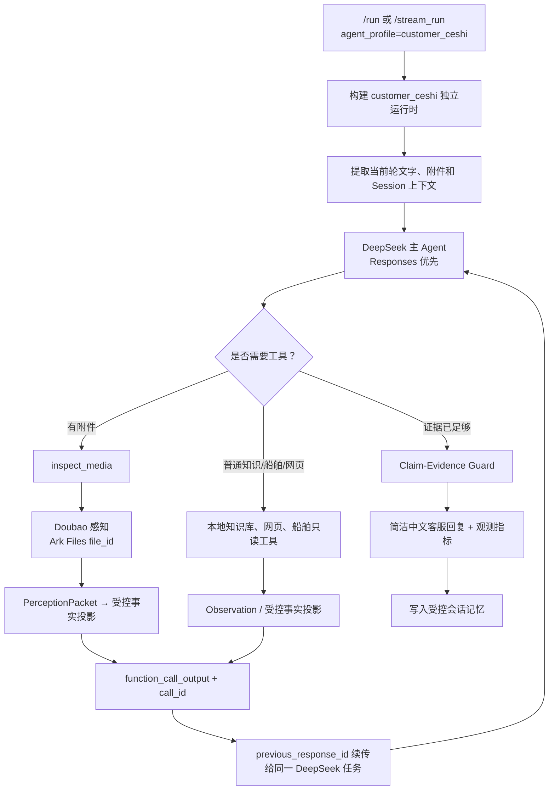
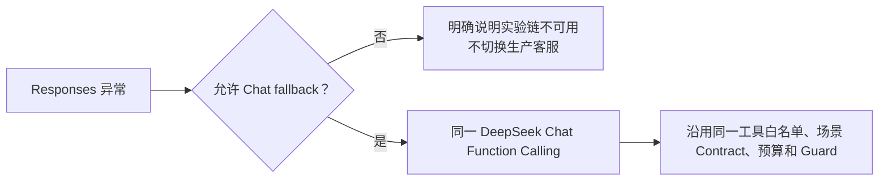
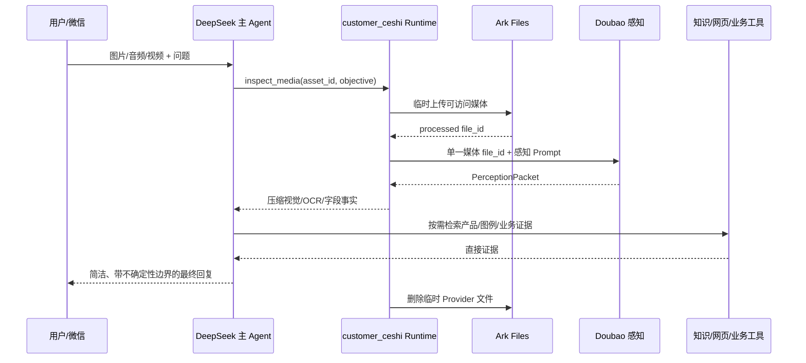
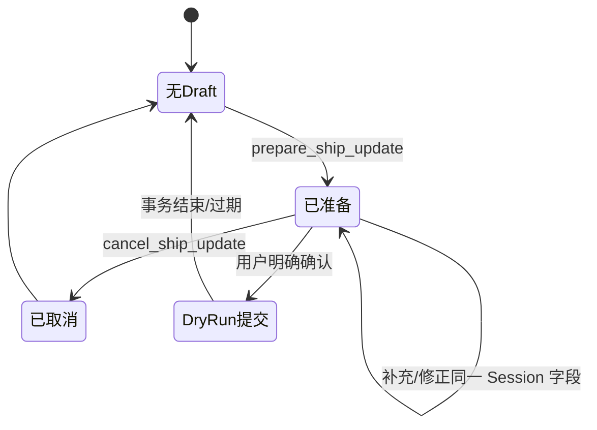

# customer_ceshi 架构、开发与验收交接文档

> **适用范围：** 仅 `customer_ceshi` 实验客服链。本文以当前代码、配置及验收产物为准，覆盖运行配置、推理链路、开发决策、验证结果和待优化项。生产 `customer_support` 不在本次改造范围内，且不得因本链路改动而改变其 Builder、State、Prompt、Router、工具权限、Checkpoint、写入链路、HTTP 格式或测试行为。
>
> **当前状态（2026-07-20）：** 主架构、文字链路、事务安全和大多数 HTTP/Responses 能力已完成验证；图像语义准确率与部分 Provider 能力仍未达到目标，因此整个目标不可宣称完成。详细逐项状态见 [customer_ceshi_acceptance_status.md](customer_ceshi_acceptance_status.md)，Provider 能力探测见 [customer_ceshi_capability_matrix.md](customer_ceshi_capability_matrix.md)。

---

## 1. 背景与目标

`customer_ceshi` 是 HiFleet 企业客服的实验链，用于验证：

- 火山方舟 Responses API 的原生函数调用、连续工具调用、流式输出与上下文管理；
- DeepSeek 作为持续主 Agent，对用户目标、工具调用、证据覆盖度和最终回复负责；
- Doubao 仅作为 `inspect_media` 感知工具，读取图片、音频和视频，不承担业务推理或客服回复；
- 船位与静态信息更新采用确定性的 `prepare → confirm → commit` 事务流程；
- 在知识、权限、产品入口、更新成功等高风险结论上，必须先获得直接证据；
- 测试和灰度过程与 `customer_support` 完全隔离。

本轮改造解决的核心问题是：旧链路中媒体模型可能独立完成业务回答、字段解析不稳定、工具失败可能被错误包装为成功、历史对话可能把旧 Agent 的结论误当真值，以及工具元数据可能替主模型提前结束回答。

---

## 2. 边界、入口与代码位置

### 2.1 入口与运行时

| 项目 | 当前实现 |
| --- | --- |
| HTTP 入口 | `/run`、`/stream_run`，请求中指定 `agent_profile=customer_ceshi` |
| Agent 构建 | `src/agents/agent.py` 根据 Profile 构建独立运行时 |
| 主运行时 | `src/agents/customer_ceshi_responses/builder.py` |
| 运行模式 | Responses 优先；Responses 不可用时仅降级到同一客户链的 Chat Function Calling |
| Namespace | `customer_ceshi_responses`，与生产客服链隔离 |
| Profile | `config/profiles/customer_ceshi_v2.md`、`config/agent_profiles.json` |
| 配置 | `config/agent_llm_config.json` 中的 `customer_ceshi_runtime` |
| 老链路 | `legacy_v2_enabled=false`，不再作为默认业务路径 |

### 2.2 主要模块职责

| 文件 | 职责 |
| --- | --- |
| `builder.py` | Responses/Chat 双运行时、系统提示、工具循环、媒体感知适配、记忆、观测指标、事务调用和安全兜底 |
| `ship_updates.py` | 坐标、时间、船舶身份、静态字段解析与 Session 级 Draft 持久化 |
| `scenarios.py` | 场景 Contract：限定可用工具与禁止结论，不直接产出固定答案 |
| `claim_guard.py` | 高风险 Claim 的证据词面检查与客户回复长度限制 |
| `tests/customer_ceshi/` | 新链路契约、字段解析、场景、能力产物和案例验证测试 |
| `scripts/probe_customer_ceshi_responses.py` | 真正的 Responses 能力探测与 Capability Matrix 写入 |
| `scripts/run_customer_ceshi_media_e2e.py` | OSS 临时上传后的图片/音频/视频 HTTP E2E |
| `scripts/run_customer_ceshi_p0_p1_e2e.py` | P0/P1 人工复核候选的 `/run` 回归 |
| `scripts/evaluate_customer_ceshi_parsers.py` | 独立规则的字段解析评估，不使用旧 Agent 回复作金标 |
| `scripts/evaluate_customer_ceshi_image_semantics.py` | 不保存答案/URL 的保守图像语义 Rubric |

---

## 3. 运行配置

### 3.1 `customer_ceshi_runtime` 关键配置

配置位于 `config/agent_llm_config.json`：

```json
{
  "mode": "responses",
  "fallback_mode": "chat_function_calling",
  "responses_enabled": true,
  "chat_fallback_enabled": true,
  "legacy_v2_enabled": false,
  "direct_updates": {
    "enabled": false,
    "dry_run": true
  }
}
```

关键含义：

- `mode=responses`：优先调用火山方舟 Responses API；
- `fallback_mode=chat_function_calling`：只有 Responses 客户端真实不可用时，才退到同一 `customer_ceshi` 内的 Chat Function Calling；绝不跳到 `customer_support`；
- `legacy_v2_enabled=false`：禁用旧 V2 主路径；
- `direct_updates.enabled=false` 与 `dry_run=true`：当前 E2E 不执行生产船舶写入。

### 3.2 模型分工

| 角色 | 模型/配置 | 职责 | 明确禁止 |
| --- | --- | --- | --- |
| 主编排模型 | `responses.deepseek`，当前为 `deepseek-v4-flash-260425`，深度思考开启 | 理解用户意图、决定工具、持续规划、判断证据覆盖度、生成最终客服回复 | 不直接调用底层写工具；不把隐藏推理返回客户；不转给 `customer_support` |
| 媒体感知模型 | `responses.doubao.image_video`，当前为 `doubao-seed-2-1-pro-260628`；音频模型为 `doubao-seed-2-0-lite-260428` | OCR、视觉对象、区域关系、字段提取、音频转写、视频时间线、置信度与限制 | 不回答产品规则/会员政策；不检索网页；不执行更新；不输出客服话术 |
| 降级模型 | `chat_fallback.deepseek` | 仅当 Responses 不可用时执行原生 Chat Function Calling | 不更改模型职责边界或跳转生产客服 |

DeepSeek 通过 `extra_body={"thinking":{"type":"enabled"}}` 启用官方深度思考传输；Doubao 感知请求显式关闭 thinking，并使用 Ark Files `file_id` 作为稳定媒体输入。

### 3.3 上下文、预算与输出控制

- 本地会话记忆：最多 10 轮；最近 3 轮保留完整压缩文本，其余轮次仅保留受控摘要；TTL 为 24 小时；
- 跨用户任务不复用 Provider `previous_response_id`，避免把上题上下文污染新任务；
- 同一任务内，工具结果通过 `function_call_output + call_id + previous_response_id` 续传；
- 默认本地知识库最多 2 次、联网搜索最多 2 次；海图符号场景进一步收紧为一次媒体读取和有限证据检索；
- 普通回复默认控制在约 80–180 个汉字，复杂排障最多 4 条；
- 工具预算耗尽时，不直接返回固定成功/失败结论，而是让 DeepSeek 在工具关闭的最终一轮内基于已获证据生成校准回复。

---

## 4. 总体思考与执行链路



### 4.1 关键原则

1. **模型决定下一步**：DeepSeek 选择是否调用查询、检索或 `inspect_media`；
2. **代码决定安全边界**：白名单、调用预算、输入校验、重复检索阻断、写入确认与日志脱敏由代码负责；
3. **工具返回事实，不宣告“已经回答”**：`can_answer`、推荐动作等元数据不再强制模型停止；
4. **场景定义 Contract，不替代 Agent 思考**：场景只收缩工具集合、定义禁止 Claim 和完成约束；
5. **无直接证据不得强答**：产品入口、权限、统计口径、更新成功、外部标准归属等都需要相应证据。

---

## 5. Responses 原生工具循环

### 5.1 正常循环

1. DeepSeek 创建初始 Responses；
2. Provider 返回 `function_call`，运行时保存原生 `response_id`、`call_id` 和调用参数；
3. 本地执行受限工具，得到 `Observation`；
4. 将压缩后的事实封装为 `function_call_output`，使用原 `call_id`；
5. 使用 `previous_response_id` 创建下一次 Responses；
6. DeepSeek 根据新证据决定继续调用或输出最终答复。

运行时不把每轮工具结果重新拼成无上下文的新任务；只有媒体 Provider 不发起预期调用时，才使用一次受控恢复读取，再把事实交回 DeepSeek。

### 5.2 降级路径

当 Responses API 客户端不可用或请求失败时：



Chat fallback 的重复查询、媒体预算和海图符号限制与 Responses 路径保持一致，避免降级后绕过安全约束。

### 5.3 流式响应

`/stream_run` 沿用共用 HTTP 契约，但保证至少按 start/answer/end 事件输出，不将全部结果攒到最后一次性返回。已验证流式链不泄露 `customer_support` 的调试信息。

---

## 6. 多模态链路

### 6.1 模型职责与数据流



### 6.2 `inspect_media` 的安全约束

- 外部媒体先经 OSS 临时对象，服务端下载后上传 Ark Files；不会将签名 URL 写入报告、普通日志或会话记忆；
- Provider 输入使用 `input_image` / `input_video` / `input_audio` 的 `file_id`，不依赖不稳定的远程 URL 直读；
- 感知 Prompt 要求输出结构化 `PerceptionPacket`：事实摘要、OCR、视觉对象、字段、置信度、限制、冲突等；
- 运行时将完整 Packet 保留在受控 Observation 中，只向 DeepSeek 回传有限事实：摘要、疑似对象、视觉特征、字段、OCR 和对象标签；
- Doubao 不能调用 HiFleet 检索、网页搜索、船舶查询或更新工具；最终结论始终由 DeepSeek 给出；
- 地图/海图带箭头、圆圈、方框等标注时，Prompt 要求优先观察标注区域与其附近文字和空间关系。

### 6.3 当前媒体限制

已验证图片、音频、视频都能通过“临时 OSS 上传 → `/run` → 删除对象”路径进入 Doubao，且最终响应由 DeepSeek 编排。

但**“媒体能读到”不等于“语义准确率已达标”**：复杂海图和低清/密集截图中，Doubao 可能只给出局部事实或不确定结果。当前保守语义 Rubric 最近为 1/5，故不把调用完成误记为 95% 准确率。复杂符号场景必须继续以图例、官方规则或用户补充截图核验。

---

## 7. 场景 Contract 与工具白名单

场景由 `scenarios.py` 识别，目的不是提供固定回复，而是定义当前任务允许调用什么、哪些结论不能无证据输出。

| 场景 | 触发示例 | 允许工具 | 主要限制 |
| --- | --- | --- | --- |
| `ship_lookup` | MMSI、IMO、船名查询 | 船舶搜索、位置、档案、挂靠港、港口搜索 | 多候选不得自动取第一条 |
| `position_update` | 更新经纬度、时间、航速/航向 | `prepare_ship_update`、`commit_ship_update`、`cancel_ship_update`、船舶搜索 | 禁止底层直写；必须完整字段与确认 |
| `static_update` | 更新船名、船型、目的港、ETA 等 | 三个 Draft 工具、船舶搜索/档案 | 不断言前台一定有编辑入口；不承诺立即生效 |
| `platform_operation` | 功能入口、产品操作、上传问题 | 本地知识库、网页、页面核验、浏览器深搜 | 不以内部工具证明前台功能 |
| `membership_permissions` | 会员、权限、套餐、价格、额度 | 本地知识库、网页、页面核验 | 不编造套餐、价格和额度 |
| `multimodal_symbol` | 海图、截图、图上/图中符号、圈圈、波浪线 | `inspect_media`、本地知识库、网页、页面核验 | 不仅按颜色/形状命名；一次媒体读取后优先证据检索 |

底层 `upload_ship_position`、`update_ship_static_info` 等直接写工具不在公开 Agent 工具白名单中。

---

## 8. 字段解析与更新事务

### 8.1 确定性解析

`ship_updates.py` 将高风险字段从 LLM 自由抽取中移出，重点包括：

- `PositionNormalizer`：识别经纬度的度分格式、N/S/E/W、前缀形式和连字符写法；
- `TimeNormalizer`：识别 UTC、紧凑时间与日期格式；五位年份等歧义不静默纠正，要求确认；
- `ShipIdentityNormalizer`：MMSI、IMO、船名等身份字段；
- `StaticFieldNormalizer`：船名、目的港、ETA、吃水、船型、呼号、建造年等静态字段；
- Placeholder 过滤：`--`、`N/A`、空白、未知、标签残片等不进入写入 Draft。

### 8.2 `prepare → confirm → commit`



- Draft 按 `tenant:user:session` 隔离，并持久化到配置的本地 Draft Store；
- `prepare` 只返回字段预览、缺失字段与 Draft 标识；
- bare `确认` 仅提交当前 Session 的 Draft；换船、换任务或新媒体需要清空旧证据；
- 当前配置是 `dry_run=true`，测试不会触发生产写入；
- 即使下游返回 `accepted`、`pending` 或测试校验通过，客户回复也必须表述为“尚不能确认已更新完成”。

---

## 9. Claim–Evidence Guard 与回复治理

### 9.1 高风险 Claim

`claim_guard.py` 对以下类型的句子进行保守拦截：

- 产品支持、权限、会员、价格、套餐、入口、按钮；
- 发布/制定部门、目的港/ETA 前台能力；
- 自动解析、立即生效、更新成功；
- “没有数据”“未找到”等无结果结论。

Guard 只认可成功/部分成功 Observation 中的直接事实；无关工具成功不能证明产品能力或写入完成。如果所有高风险句都缺证据，回复会退化为请求继续核验或补充信息，而不是补造答案。

### 9.2 事实型硬门禁

以下情况由运行时代码处理，不能交给模型自由发挥：

- 直接写工具调用：禁止；
- Draft 缺失、字段不完整、确认不匹配：拒绝提交并提示缺口；
- 写入未明确成功：禁止表述为成功；
- 查询工具没有返回“无结果”：禁止宣称没有数据；
- 工具超预算：允许模型基于已有证据做最后一轮回复，但不能虚构新事实。

---

## 10. 会话、记忆与观测

### 10.1 会话隔离

- 每个 Session 的 Draft、记忆和媒体更新证据使用独立 key；
- 跨 Session 不借用未完成 Draft、媒体字段或船舶身份；
- 跨任务不传递 Provider `previous_response_id`；
- 原始媒体 URL、凭据、隐藏推理、原始 Provider 包和长工具输出不进入用户回复或普通记忆。

### 10.2 关键指标

`/run` compact 响应中的 `metrics` 至少覆盖：

- `requested_runtime_mode`、`effective_runtime`、`runtime_mode`；
- 编排模型、感知模型；
- `model_calls`、`tool_calls`、`tool_names`、`media_calls`；
- 媒体状态/安全错误码摘要；
- 缓存命中、输入/输出/推理 token、延迟、工具延迟；
- `finish_reason`、`fallback_reason`、Provider 错误摘要、Guard 结果；
- 脱敏后的 `response_id_suffix`、输出长度、场景名、上下文轮数与压缩标记。

观测的目标是帮助定位“模型没有调用工具”“媒体感知失败”“重复检索”“回退发生”“写入尚未确认”等问题，而不是记录客户媒体、签名 URL 或推理内容。

---

## 11. 开发逻辑与关键演进

1. **先做只读审计与能力探测**：基于官方 Responses 文档、现有配置、真实对话和媒体 fixture 建立改造计划与 Capability Matrix；
2. **拆分生产与实验链**：只在 `customer_ceshi` 新建/改造运行时，保留 `customer_support` 的实现边界；
3. **将 Responses 作为默认协议**：支持原生调用 ID、工具输出续传和同任务 `previous_response_id`；
4. **移除媒体主控权切换**：媒体先经 `inspect_media`，再回到 DeepSeek 进行检索和回答；
5. **把写入转为事务**：解析、准备、确认、提交、持久化和 dry-run 分层；
6. **把高风险结论转为证据驱动**：场景 Contract、检索白名单、Guard 和结果状态共同约束；
7. **从历史对话中剥离旧 Agent 判断**：P0/P1 候选要经独立规则/人工复核，不能把历史回复直接当 Ground Truth；
8. **以 HTTP E2E 为最终证据**：真实模型、真实 `/run`、临时 OSS 对象和清理动作优先于仅调用 Python 类的测试；
9. **对未达标能力显式失败**：结构化输出、上下文缓存、图像语义准确率等问题不以“调用没报错”替代验收通过。

---

## 12. 测试、脚本与证据

### 12.1 单元与回归

最近一次隔离运行（2026-07-20）结果：

```text
PYTHONPATH=src ./.venv/bin/python -m pytest -q tests/customer_ceshi tests/customer_ceshi_v2
141 passed, 1 skipped, 7 xfailed
```

`git diff --check` 通过。`customer_support` 的专用受保护回归曾在 2026-07-17 得到 `226 passed`，该结果记录在验收台账；后续任何改动应重新执行对应保护套件。

### 12.2 真正的 Provider/HTTP 验证

| 脚本 | 验证范围 | 已知结果/用途 |
| --- | --- | --- |
| `probe_customer_ceshi_responses.py` | Responses、函数调用、`call_id`、`previous_response_id`、深度思考、流式、结构化输出、缓存、上下文编辑 | 结果写入 Capability Matrix；不输出 key |
| `probe_customer_ceshi_chat_fallback.py` | 人为制造 Responses 不可用时的同链 Chat fallback | 验证不落入 `customer_support` |
| `run_customer_ceshi_media_e2e.py` | OSS 图片/音频/视频 → `/run` → 删除临时对象 | 验证 DeepSeek 编排与 Doubao 感知存在 |
| `run_customer_ceshi_p0_p1_e2e.py` | P0/P1 `/run` 回归与禁止写工具检查 | 2026-07-17：24/24 通过；不是全量语义金标 |
| `evaluate_customer_ceshi_parsers.py` | 独立字段解析统计 | 工具证据子集 47/47 坐标、2/2 年份安全、19/19 静态字段覆盖；不代表全语料 99% |
| `evaluate_customer_ceshi_image_semantics.py` | 不落盘答案/URL 的保守图像语义 Rubric | 最近结果 1/5，通过率未达 95% |
| `validate_customer_ceshi_cases.py` | 过滤/标注可用于 P0/P1 的候选案例 | 旧回复不直接作为金标 |

### 12.3 已通过的关键能力

- DeepSeek Responses 的连续工具调用、`function_call_output`、`call_id`、`previous_response_id`；
- 深度思考、流式、上下文编辑；
- `/run` 文字、`/stream_run`、微信兼容文本、跨 Session 隔离、Draft 重启恢复；
- 图片/音频/视频的 OSS HTTP 传输与 Doubao 感知调用；
- 事务 Draft、bare 确认 dry-run、禁止虚假写入成功；
- P0/P1 运行候选 24/24；
- Chat fallback 保持在 `customer_ceshi`；
- `customer_support` 受保护回归（2026-07-17 证据）。

### 12.4 未通过或证据不足的能力

| 项目 | 状态 | 原因/处理原则 |
| --- | --- | --- |
| Responses JSON Schema 结构化输出 | FAILED | 当前 Gateway/模型不接受或不可用；不伪造通过状态 |
| 官方上下文缓存 | FAILED | Provider 返回 `AccessDenied.CacheService`；不声称已启用缓存 |
| 图像关键语义 ≥95% | FAILED | 复杂海图/密集截图的感知与图例证据不足；调用成功不等于语义正确 |
| 全语料字段 ≥99% | PARTIAL | 当前仅有独立、内部一致的工具证据子集，不能外推为全语料准确率 |

---

## 13. 当前已知限制与待优化方向

### P0：媒体语义准确率与图例证据

现状：图片、音频、视频传输与感知调用已打通，但 `test/image` 的保守语义 Rubric 最近仅 1/5。尤其是密集海图、低清符号和用户箭头标注区域，感知模型可能只给出不确定观察，无法证明官方命名。

建议：

1. 接入经账号/模型验证可用的官方图像处理能力（缩放、框选、裁剪），并以其真实多轮协议实现，不使用不兼容的多图片临时输入；
2. 建立经过业务审核、可溯源的 HiFleet 海图图例/图层知识库，而不是把测试 fixture 参考回复硬编码到运行时；
3. 将“用户标注区域”作为第一类感知请求参数，支持坐标/框选/多轮局部复核；
4. 使用人工复核的媒体金标集，分别统计 OCR、对象、字段、业务结论四层准确率；
5. 对无图例证据的符号严格输出不确定性与一个最关键的核验动作。

### P0：Provider 能力差异

现状：结构化输出与上下文缓存无法在当前账号/网关中验证通过。

建议：

1. 继续使用官方文档中的真实字段做独立 probe；
2. 在模型/账号升级后重新执行 Capability Matrix；
3. 能力不可用时保留 Pydantic/运行时校验，不把本地 JSON 约束误称为 Provider Structured Output；
4. 缓存未获授权时继续使用本地受控会话摘要，避免依赖不可用能力。

### P1：字段评估覆盖度

现状：解析器表现良好，但 47 条工具证据子集不足以证明全量 ≥99%。

建议：

1. 对全部候选记录做独立标注或双人复核；
2. 分别统计经纬度、时间、MMSI、目的港/ETA、占位符拒绝率和年份歧义；
3. 对失败样本建立 versioned fixture，而非只修正单个正则；
4. 保持五位年份“不静默纠正”的安全约束。

### P1：性能与稳定性

现状：图像场景可能因感知、检索和工具预算而耗时较长；预算最终轮能避免固定兜底，但不能替代准确证据。

建议：

1. 分别记录媒体上传、Ark Files 处理、Doubao 感知、DeepSeek 规划、检索和最终生成耗时；
2. 对同一附件的重复读取使用更明确的证据缺口提示；
3. 先本地知识库、后外部检索，避免相同语义的多轮搜索；
4. 在灰度阶段按场景和媒体类型设置 SLO、超时策略与人工转接阈值。

---

## 14. 运维与开发检查清单

### 修改前

- 确认改动路径不在 `customer_support`；
- 阅读 `customer_ceshi_acceptance_status.md`，不要把 FAILED/PARTIAL 项当成已完成；
- 对 Provider 字段先做真实 probe，不假设 OpenAI 兼容端点与火山方舟完全一致；
- 确认测试媒体使用临时 OSS 对象，且不会打印密钥或签名 URL。

### 修改后

```bash
# customer_ceshi 隔离回归
PYTHONPATH=src ./.venv/bin/python -m pytest -q tests/customer_ceshi tests/customer_ceshi_v2

# Parser 独立评估
PYTHONPATH=src ./.venv/bin/python scripts/evaluate_customer_ceshi_parsers.py

# Responses 能力探测
PYTHONPATH=src ./.venv/bin/python scripts/probe_customer_ceshi_responses.py

# OSS 媒体 E2E（需要本机安全 OSS 配置与本地服务）
PYTHONPATH=src ./.venv/bin/python scripts/run_customer_ceshi_media_e2e.py

# 图像保守语义评估（不得保存答案或 URL）
PYTHONPATH=src ./.venv/bin/python scripts/evaluate_customer_ceshi_image_semantics.py

# P0/P1 HTTP 回归
PYTHONPATH=src ./.venv/bin/python scripts/run_customer_ceshi_p0_p1_e2e.py

# 保护生产客服链
PYTHONPATH=src ./.venv/bin/python -m pytest -q \
  tests/test_customer_support_dialog_analysis.py \
  tests/test_customer_support_intent_agent.py \
  tests/test_customer_support_p0_optimization.py \
  tests/test_customer_support_router.py \
  tests/test_customer_support_stream_debug.py \
  tests/test_multimodal_customer_support_eval.py \
  tests/test_wechat_customer_support_http.py
```

### 交付判定

只有当：真实连续 Responses 工具调用、`/run` 文字、OSS 图片 `/run`、多轮 Session、`customer_support` 完整回归、P0/P1 回归、dry-run 确认链，以及明确要求的准确率门槛均有当前证据时，才能把总目标标记为完成。任何 `FAILED`、`PARTIAL`、`SKIPPED`、`NOT_RUN` 或过期证据都不能写成 `PASSED`。
