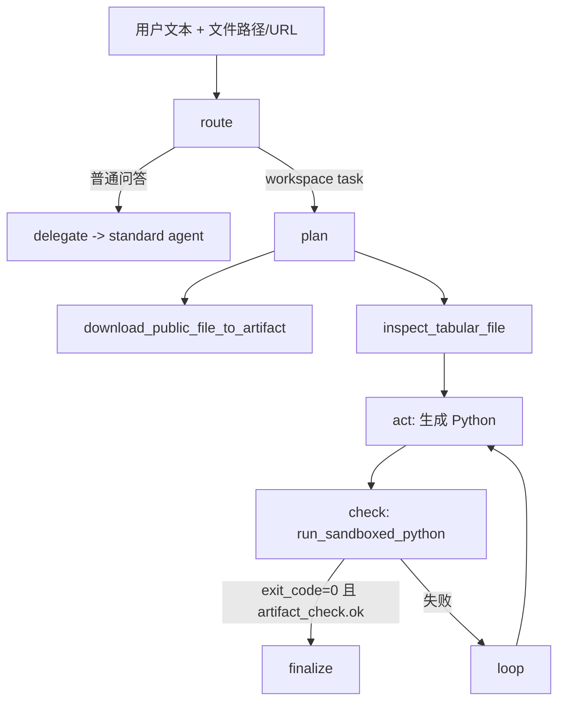

# customer_ceshi 沙盒与闭环 Runbook

本文只覆盖当前 `customer_ceshi` 的真实落地能力：表格探测、Docker sibling container 执行、自愈 loop、observability 对齐和发布前测试。

注意：`employee_assistant` 现在是 `customer_support` 的兼容别名，不再代表内部沙盒 profile。需要文件、表格或受控 Python 能力时，应显式使用 `agent_profile=customer_ceshi`。

## 1. 适用场景

- 读取 CSV/XLS/XLSX，分析字段、缺失值、样例数据。
- 处理公开 OSS/HTTP 文件链接，先下载再进入分析闭环。
- 生成报价汇总、内部统计表、临时分析产物。
- 在管理台 `Chat Debug` 中以 `agent_profile=customer_ceshi` 调试多轮复杂任务。

不适用：

- 外部客服会话。
- 未鉴权来源的用户上传执行。
- 需要联网、系统命令、宿主机路径扫描的脚本。

## 2. 运行时流程

在进入内部 workspace loop 之前，请求会先经过统一模型路由层：

- 纯文本消息默认走文本模型 `doubao-seed-2-0-lite-260428`
- 图片/音频/视频消息默认走多模态模型 `doubao-seed-2-0-lite-260428`
- 运行态路由结果会回写到 `llm_route`，用于调试页和 `/run` 返回体对齐

随后才进入以下内部测试执行流程：

1. `/run` 或 `/stream_run` 进入 `src/main.py`，按 `agent_profile` 或 `x-agent-profile` 选择 Profile，并记录 `source_channel` 作为观测字段。
2. `src/agents/agent.py` 在 `customer_ceshi` 下识别是否为“表格分析/产物任务”。
3. 命中后进入 `route -> plan -> act -> check -> loop/finalize/fail`。
4. 如果输入是公开 URL，`plan` 先调用 `download_public_file_to_artifact`。
5. `plan` 调用 `inspect_tabular_file` 返回 schema。
6. `act` 基于 schema 生成 Python。
7. `check` 调用 `run_sandboxed_python`：
   - 先 AST 扫描。
   - 再启动 Docker sibling container。
   - 校验 `exit_code` 与 `expected_artifact`。
7. 所有工具调用与错误通过 observability 落库。

### 2.1 先理解入口，再理解沙盒

如果你要读懂 `customer_ceshi`，不要从 Docker 配置开始。

推荐先回答这两个问题：

1. 什么请求会进入 employee loop？
2. 进入后每一轮到底靠什么判断成功或失败？

对应代码入口：

- [src/main.py](../src/main.py)
  - `normalize_request_payload(...)`
  - `/run`
  - `/stream_run`
- [src/agents/agent.py](../src/agents/agent.py)
  - `_detect_workspace_task(...)`
  - `_build_employee_agent(...)`
- [src/skills/employee_workspace/tools.py](../src/skills/employee_workspace/tools.py)
  - `inspect_tabular_file(...)`
  - `run_sandboxed_python(...)`

### 2.2 真实执行骨架

`customer_ceshi` 的核心不是“LLM 一次性把答案写对”，而是下面这条闭环：



读这条链时要抓住 4 个 state 字段：

- `workspace_task`
- `file_schema`
- `last_error`
- `loop_count`

这 4 个字段基本就解释了为什么它会进入沙盒、代码为什么这样生成、为什么会继续自愈。

### 2.3 route 节点到底在判断什么

`route` 节点不是“开始执行 Python”，而是先做任务分类。

它主要做 4 件事：

1. 取最新用户文本
2. 检查是否命中敏感内部请求
3. 解析本地文件路径或公开文件 URL
4. 判断是否同时满足：
   - 有真实文件输入
   - 用户意图包含分析/表格/数据/生成类关键词

只有这两个条件同时成立，才会把 `workspace_task=True`，进入后续 `plan -> act -> check`。

这意味着：

- 不是所有 `customer_ceshi` 请求都能跑 Python
- 它本质上是“文件任务代理”，不是“万能执行代理”
- 纯问答会直接 `delegate` 给标准 Agent

如果你当前要看的不是 sandbox 闭环，而是 `customer_ceshi` 普通问答链，直接跳到：

- [docs/AGENT_TECHNICAL_DOCUMENTATION.md](AGENT_TECHNICAL_DOCUMENTATION.md)
  - `9. customer_ceshi 当前链路`

### 2.4 plan 节点为什么必须先 inspect

`plan` 节点最关键的一步是先固定文件 schema。

它的顺序是：

1. 如果用户给的是公开 URL，先下载到 artifact 目录
2. 调 `inspect_tabular_file(...)`
3. 拿到：
   - `shape`
   - `columns`
   - `dtypes`
   - `missing_values`
   - `preview`
   - `schema`
4. 再把这些结果交给 `act`

这样做的意义不是“多做一步检查”，而是约束代码生成：

- 不允许模型臆造列名
- 不允许模型假设文件结构
- 不允许模型跳过实际输入，直接编故事

### 2.5 act 节点不是自由编程

`act` 节点会把下面这些信息一起喂给模型：

- `task_goal`
- `target_file_path`
- `source_file_url`
- `expected_artifact`
- `file_schema`
- `last_error`

同时提示词强制约束：

- 只返回 Python 代码
- 必须打印关键步骤和最终结果
- 必须从 `INPUT_FILE` 读取输入
- 必须写到 `ARTIFACT_DIR`
- 禁止 `eval/exec/compile/getattr/setattr`
- 禁止双下划线访问

所以这里更准确的理解不是“AI 写脚本”，而是“基于固定 schema 和错误反馈的受控 codegen”。

### 2.6 check 节点才是成败裁决点

`check` 节点调用 `run_sandboxed_python(...)` 后，不看模型怎么说，只看程序结果：

- `exit_code`
- `artifact_check.ok`
- `stdout`
- `stderr`

成功条件非常明确：

- `exit_code == 0`
- 并且 `artifact_check.ok == true`（或未要求产物校验）

只要失败，就会把失败信息写回 `last_error`，供下一轮 `act` 直接参考。

这也是这条链最值得理解的地方：

- 失败不是结束
- 失败会变成下一轮代码生成的输入
- 真正的“自愈”不是抽象概念，而是 `last_error -> 新代码 -> 重跑`

### 2.7 sandbox 工具层的安全边界

`run_sandboxed_python(...)` 的保护是程序硬约束，不是只靠 prompt：

1. `_ast_guard(...)`
   - 白名单 import
   - 禁用危险 builtin
   - 禁止双下划线属性
2. `_resolve_allowed_path(...)`
   - 限制输入路径只能在 workspace / artifact / `/tmp`
3. `_run_in_docker(...)`
   - `network_mode="none"`
   - `read_only=True`
   - 受限 CPU / 内存 / timeout
4. `_validate_expected_artifact(...)`
   - 防止产物路径逃逸
   - 校验文件存在且非空

理解 `customer_ceshi` 时，prompt 不是第一安全边界，工具实现才是。

### 2.8 推荐阅读顺序

按下面顺序读，理解成本最低：

1. [src/main.py](../src/main.py)
   先看 `normalize_request_payload(...)` 和 `/stream_run`，知道请求怎么进入 graph。
2. [src/agents/agent.py](../src/agents/agent.py)
   重点看 `_build_employee_agent(...)` 的 `route/plan/act/check/loop/finalize/fail`。
3. [src/skills/employee_workspace/tools.py](../src/skills/employee_workspace/tools.py)
   重点看 `inspect_tabular_file(...)` 和 `run_sandboxed_python(...)`。
4. [docs/AGENT_TECHNICAL_DOCUMENTATION.md](AGENT_TECHNICAL_DOCUMENTATION.md)
   对照两个 profile 的职责差异。

### 2.9 用 customer_support 做对照来理解

最容易混淆的点是：两个 profile 都是 graph，但目标完全不同。

`customer_support` 更重：

- route 准确性
- evidence 审查
- 最终话术安全收口

`customer_ceshi` 更重：

- 输入文件真实性
- 执行环境可控
- 结果可验证

所以：

- `customer_support` 的核心问题是“能不能安全、准确地说”
- `customer_ceshi` 的核心问题是“能不能基于真实输入把任务做完”

## 3. 关键环境变量

```bash
HIFLEET_AGENT_ARTIFACT_DIR=/workspace/artifacts
HIFLEET_PY_SANDBOX_IMAGE=hifleet/python-sandbox:3.11
HIFLEET_PY_SANDBOX_IMAGE_CANDIDATES=hifleet/python-sandbox:3.11,swr.cn-north-4.myhuaweicloud.com/ddn-k8s/docker.io/python:3.11-slim
HIFLEET_PY_SANDBOX_AUTO_PULL=1
HIFLEET_PY_SANDBOX_VOLUME=coze_ai_shared-artifacts
HIFLEET_PY_SANDBOX_VOLUME_MOUNT=/workspace/artifacts
HIFLEET_PY_SANDBOX_MEM_LIMIT=512m
HIFLEET_PY_SANDBOX_CPU_QUOTA=50000
HIFLEET_PY_SANDBOX_TIMEOUT_SEC=20
HIFLEET_PY_SANDBOX_MAX_CODE_CHARS=12000
HIFLEET_PY_SANDBOX_STDIO_CHARS=8000
HIFLEET_PY_SANDBOX_USER=1000:1000
HIFLEET_EMPLOYEE_MAX_LOOPS=4
HIFLEET_PUBLIC_FILE_TIMEOUT_SEC=30
HIFLEET_PUBLIC_FILE_MAX_MB=100
```

## 4. 观测对齐

`observability.tool_invocations`：

- `run_id`
- `session_id`
- `tool_name`
- `status`
- `code`
- `attempt`
- `tool_result.exit_code/stdout/stderr/artifact_check/input_file_path`
- `layer_trace.phase/security_blocked`

`observability.agent_errors`：

- `run_id`
- `session_id`
- `error_code`
- `node_name`
- `attempt`

关键错误码：

- `ERR_SANDBOX_SECURITY`
- `PYTHON_SANDBOX_NONZERO`
- `PYTHON_SANDBOX_ARTIFACT_CHECK_FAILED`
- `PYTHON_SANDBOX_DOCKER_FAILED`

## 5. 发布前测试

```bash
PYTHONPATH=src .venv/bin/python scripts/test_agent_profiles.py
PYTHONPATH=src .venv/bin/python scripts/test_employee_workspace.py
PYTHONPATH=src .venv/bin/python scripts/test_employee_agent_loop.py
PYTHONPATH=src .venv/bin/python scripts/test_llm_config.py
bash scripts/prepare_employee_sandbox_image.sh
cd frontend && npm run build
```

模型路由专项验证：

1. `PUT /admin/config/llm` 设置 `text_model/multimodal_model/thinking_type`。
2. 发一条纯文本 `/run` 请求，检查返回体中的 `llm_route.model=文本模型`。
3. 发一条包含 `image_url` 或 `input_audio` 的 `/run` 请求，检查返回体中的 `llm_route.model=多模态模型`。
4. 如需追查实际模型名，查看最终 AI message 的 `response_metadata.model_name`。

## 6. 排障

`ERR_SANDBOX_SECURITY`

- 说明脚本命中了 AST 白名单/黑名单规则。
- 优先检查 import、`eval/exec`、双下划线访问。

`PYTHON_SANDBOX_DOCKER_FAILED`

- 优先检查 Docker socket 权限。
- 容器内路径与共享卷是否和 `docker-compose.dev.yml` 一致。
- 优先执行 `bash scripts/prepare_employee_sandbox_image.sh` 预热镜像。

产物校验失败

- 检查模型要求输出的文件名与 `expected_artifact` 是否一致。
- 检查文件是否实际写入 `ARTIFACT_DIR`。

模型路由与返回模型名不一致

- 先看 `/run` 返回体中的 `llm_route`，确认应用层解析结果。
- 再看最终 AI message 的 `response_metadata.model_name`，确认上游实际返回模型。
- 若只在并发更新 `/admin/config/llm` 与并发请求时出现一次性不一致，优先按运行态竞态处理，不要立即修改核心路由代码。
- 若顺序复现也稳定失败，再分别用 OpenAI SDK 直连、`ChatOpenAI` 直连、`bind_tools` 最小样本拆分验证。
