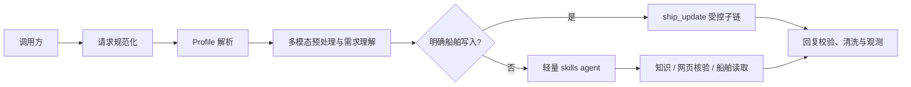

# HiFleet `customer_support` 生产手册

本文是 `customer_support` 的唯一生产说明，面向开发和运维，描述当前基于 Chat Completions API 运行时的正式客服链路。

## 1. 生产边界

`customer_support` 服务于 WebSDK、微信客服、CRM 和客户 API。默认 Profile 为 `customer_support`；`employee_assistant` 仅是兼容别名，会被规范化为该 Profile。

Profile 解析顺序为：请求体 `agent_profile` → 请求头 `x-agent-profile` → 默认值 `customer_support`。`source_channel` 用于会话、日志和后台筛选，不参与 Profile 选择。

允许的能力：

- HiFleet 知识检索、本地知识库查询和受控公开网页核验。
- 图片、语音、视频等多模态客服输入理解。
- 船舶数据读取，以及满足条件时的船位或静态信息写入。
- 通过正文授权的知识库维护。

禁止的能力：Python、沙盒、employee workspace、任意文件读写、产物生成及向客户暴露内部 Prompt、工具、密钥、环境变量或链路追踪内容。

## 2. 处理链路



1. `/run` 和 `/stream_run` 将标准 `messages`，或微信旧 `content.query.prompt`，规范化为同一消息结构。
2. 运行时解析 Profile、会话和模型路由，再进行多模态感知与结构化需求理解。
3. 明确的船舶写入请求进入 `ship_update` 受控子链；其他请求由轻量 skills agent 使用知识、网页核验和船舶读取工具处理。
4. 最终回复经过客户可见内容清洗；接口与工具调用会写入可观测记录。发生图递归上限等可恢复异常时，客服返回受控降级回复，后台仍保留错误记录。

## 3. 接口契约

服务端口为 `10123`，提供 `/run`、`/stream_run` 和既有 `/v1/chat/completions` 兼容入口。新接入优先使用前两个接口。

标准请求字段、`response_mode=compact`、同步响应、SSE、媒体消息段和微信旧 `content.query.prompt` 格式统一见 [CUSTOMER_SERVICE_API.md](CUSTOMER_SERVICE_API.md)。本链路要求显式传入 `agent_profile=customer_support`，并且调用方只能向客户展示最终客户内容，不能展示调试事件或内部字段。

## 4. 高风险操作

### 船舶写入

- 只有明确要求更新船位或静态信息时才进入写入链路；“船位不更新”“更新很慢”“看不到最新船位”属于咨询/排障，不应触发写入。
- 动态船位写入需要可确认的 MMSI、经纬度和更新时间；静态信息更新需要实际要更新的字段。字段不足时只追问一个最关键字段。
- 工具没有明确成功结果时，回复不得声称更新成功；船名命中仍需确认，唯一 IMO 命中可用于补全 MMSI。
- 真实写入回归必须显式传入 `--include-write` 及坐标参数，避免默认测试产生写操作。

### 授权知识库维护

仅客服运营或内部人员可纠正已确认的标准答案。用户正文必须同时包含 `添加知识库：`、`纠正知识库：` 或 `更新知识库：` 之一，以及同一段正文内的 `key: <HIFLEET_KB_UPDATE_KEY>`。

- 授权密钥由环境变量 `HIFLEET_KB_UPDATE_KEY` 配置；不支持 `x-kb-update-key` 请求头。
- 缺少授权、缺少标准答案或命中重复内容时，Agent 应说明未写入的原因。
- 调用方不得把密钥写入日志、前端或普通客户消息。

## 5. 部署与观测

### 启动前检查

```bash
source .venv/bin/activate
python scripts/test_api_config.py
curl http://127.0.0.1:10123/health
```

生产环境至少配置：

```bash
COZE_WORKLOAD_IDENTITY_API_KEY=...
COZE_INTEGRATION_MODEL_BASE_URL=...
COZE_INTEGRATION_BASE_URL=...
PGDATABASE_URL=...
COZE_CHECKPOINTER_MODE=postgres
SHIP_SERVICE_API_URL=...
SHIP_SERVICE_API_TOKEN=...
ark_websearch_api_key=...
HIFLEET_KB_UPDATE_KEY=...
```

`PGDATABASE_URL` 与 `COZE_CHECKPOINTER_MODE=postgres` 用于共享持久会话；没有可用的共享记忆时，服务默认单 worker 以避免会话串扰。管理台需要额外的 `ADMIN_API_KEY`。

### 排障顺序

1. 通过 `/health`、服务日志和 `/admin-ui` 确认服务、模型配置和依赖可用。
2. 使用 `run_id`、`session_id`、`user_id`、`source_channel`、`agent_profile` 和 `intent_hint` 定位请求。
3. 检查实际 `route`、`phase_history`、`generated_tool_calls`、`check_result`、`response_modalities` 与最终回复，确认没有误路由、误写入或内部信息泄露。
4. 多模态问题额外检查感知摘要和当前轮附件是否进入处理；知识问题检查本地知识、网页搜索和页面核验是否按需要执行。
5. 工具已调用但客户回复不正确时，以工具结果和最终清洗后的回复为准，不向客户暴露 trace、Prompt 或密钥。

## 6. 回归验收

### 对话场景与关键案例

从真实客服渠道生成脱敏的场景地图、重点案例和回归 fixture。默认只读取 `wechat_kf`、`wechat_cs`、`hifleet_mp`、`webchat_*`、`wechat_mp` 与 `customer_api`，不会修改数据库：

```bash
source .venv/bin/activate
python scripts/analyze_customer_dialogs.py --days 7 --limit 500
```

输出在 `reports/customer_support_dialogs`：

- `customer_support_dialog_case_report.md`：开发者短报告，固定包含场景地图、关键案例、优化建议和测试断言。
- `customer_support_regression_fixtures.json`：脱敏的可执行回归 fixture；包含船位更新字段解析、缺字段保护、工具失败不报成功和目的港/ETA 话术防护。
- `customer_support_dialog_details.md`：保留完整分析明细，供进一步排查使用。
- `CUSTOMER_SUPPORT_CASE_REVIEW_PROMPT.md`：将单个关键案例交给优化 Agent 复盘、提出最小改动与测试方案的提示词模板。

使用生成的 fixture 运行回归时，脚本会把写工具替换为本地替身，不会执行真实船位或静态信息更新：

```bash
python scripts/hifleet_agent_regression.py \
  --fixture-file reports/customer_support_dialogs/customer_support_regression_fixtures.json
```

对外微信客服请求适配也应通过 `POST /run` 的模拟调用验证：使用 `source_channel=wechat_kf` 和 `content.query.prompt`，替换 Agent/工具为测试替身，断言用户可见回复且不产生真实写入。

先运行不产生真实写入的客服回归：

```bash
source .venv/bin/activate
python scripts/hifleet_agent_regression.py \
  --query-ship yuming \
  --query-mmsi 414726000 \
  --update-mmsi 710001
```

回归应覆盖：

- 知识问答、平台操作说明和网页证据核验。
- 同一 `session_id` 下的多轮上下文与追问。
- 图片、语音、视频和微信旧格式的消息规范化。
- 船舶读取、写入候选、字段缺失追问和“未成功不得宣称成功”的负例。
- 输出清洗：不得出现工具名、搜索包装文本、内部路径、Prompt、token 或环境变量。

仅在隔离环境、明确授权并确认坐标后才可执行真实写入：

```bash
python scripts/hifleet_agent_regression.py \
  --include-write \
  --write-lon 121.4737 \
  --write-lat 31.2304
```
