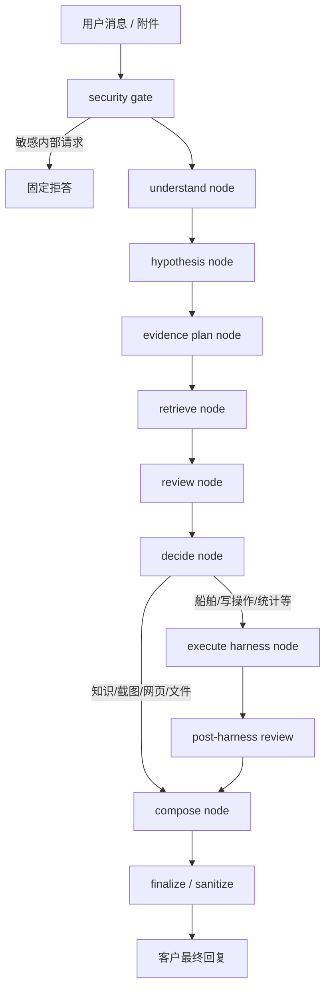

# HiFleet `customer_support` V2 设计稿

本文给出 `customer_support` 的下一版升级设计，目标是在保留当前安全性、可控性和确定性执行优势的前提下，把主链从“规则路由驱动”升级为“agent 理解驱动，架构兜底执行”。

本文不是理想化方案，而是基于当前仓库真实实现、现有工具边界、参考案例表现和客服场景风险约束形成的可落地设计。

---

## 1. 设计目标

### 1.1 核心目标

`customer_support` V2 需要同时满足 4 个目标：

1. 最大限度准确理解用户真实需求，而不是只做关键词命中。
2. 让“思考 -> 检索 -> 审查 -> 回答”成为真实运行链，而不是预写说明。
3. 保留当前面客客服场景需要的安全边界、确定性和可观测性。
4. 让复杂案例具备与参考案例接近的处理体验：
   - 先解释自己如何理解问题
   - 形成多个可能解释
   - 主动改写检索词
   - 比较多个来源
   - 收敛成高置信结论

### 1.2 非目标

这版设计不追求：

- 把 `customer_support` 改成全自由工具 Agent
- 暴露隐藏 chain-of-thought
- 让客服链承接复杂内部数据加工任务
- 推翻现有 `execute_*_chain` harness

---

## 2. 当前问题复盘

基于当前代码，`customer_support` 已具备以下基础：

- phase graph 主链：`route -> plan -> act -> check -> finalize`
- 多模态感知
- 分层知识检索
- 船舶查询/统计/写操作工具
- 文件检查和公开网页核验
- 输出脱敏和客服化收口

当前真实实现可见：

- [src/agents/agent.py](/Users/raymondlu/LocalProject/AIPM/智能客服/客服开发/本地agent/hifleet-agent/src/agents/agent.py)
- [src/agents/customer_support_router.py](/Users/raymondlu/LocalProject/AIPM/智能客服/客服开发/本地agent/hifleet-agent/src/agents/customer_support_router.py)
- [src/agents/customer_support_guard.py](/Users/raymondlu/LocalProject/AIPM/智能客服/客服开发/本地agent/hifleet-agent/src/agents/customer_support_guard.py)
- [src/agents/customer_support_stream_debug.py](/Users/raymondlu/LocalProject/AIPM/智能客服/客服开发/本地agent/hifleet-agent/src/agents/customer_support_stream_debug.py)

但当前链路离“参考案例式思考效果”仍有 5 个关键差距。

### 2.1 理解层不足

当前 `plan node` 主要做：

- 抽实体
- 规则路由
- 附件感知
- 继承上下文

它能分类，但不能充分回答以下问题：

- 用户真正要确认的是“图中是什么”，还是“这个功能为什么异常”？
- 当前问题是否依赖上一轮语义？
- 哪个事实是必须先确认的核心歧义？
- 用户是在要结论、教程、排障、还是证据核验？

### 2.2 检索规划不足

当前 `smart_search` 很强，但大部分调用方式仍是：

- 给一个 query
- 按 `depth` 搜索
- 用模板整理结果

缺少：

- 候选检索假设
- 多查询并行或顺序检索
- 弱命中后二次改写
- “本地知识库 -> 官方站点 -> 公共网页”之间的显式升级策略

### 2.3 证据审查层不足

当前 `check` 更偏执行校验：

- 是否有答案
- 链接是否可访问
- 工具结果字段是否齐

缺少：

- 多来源之间的一致性判断
- 官方源优先级裁决
- 低权威来源降级
- 置信度计算
- “能不能下确定结论”的正式判定

### 2.4 思考展示与真实执行脱节

当前 `/stream_run` 输出的 explainable debug 事件主要来自预生成逻辑，不完全来自 runtime 的真实决策状态。

这意味着：

- 看起来像在思考
- 实际上不是“思考驱动执行”
- 前端展示的 reasoning 不能完整回放真实决策过程

### 2.5 route 先行过强

当前架构是 Router 决定大部分事情，Agent 只在 fallback 场景出现。

这会带来两个问题：

1. 对模糊场景，容易过早定性。
2. 对复杂场景，缺少“先想清楚再执行”的空间。

---

## 3. 参考案例能力提炼

结合提供的参考截图，目标系统应具备以下外显能力。

### 3.1 用户可见层表现

参考案例对用户可见的表现主要有 4 类：

1. 已完成思考，并明确说明如何理解问题。
2. 展示检索关键词或检索方向，不是只给最终答案。
3. 说明为什么采用某个结论，而不是直接拍脑袋回答。
4. 最终答案结构稳定：
   - 先结论
   - 再详细说明
   - 再操作建议或后续引导

### 3.2 真实能力要求

这些外显表现背后对应的真实能力应是：

1. 问题建模能力
   - 把用户输入转成一个明确的待判定问题

2. 假设生成能力
   - 对模糊图标、故障截图、上传失败等情况生成多个候选解释

3. 检索规划能力
   - 针对不同假设生成不同关键词

4. 证据审查能力
   - 对资料进行来源优先级判断和相互印证

5. 收敛决策能力
   - 证据足够时下结论
   - 证据不足时只追问一个关键问题

---

## 4. V2 设计原则

### 4.1 总原则

V2 采用：

**Planner Agent 驱动决策，Harness 执行关键动作，Guard 做最终收口。**

一句话概括：

```text
理解和决策交给 Agent
执行和安全交给架构
```

### 4.2 具体原则

1. 先理解再路由，避免过早定性。
2. 先形成假设，再做检索，不直接拿用户原句硬搜。
3. 所有“思考展示”都必须来自真实 state。
4. 船舶、写操作、文件等高风险链路仍由 harness 托底。
5. 对外只展示安全的 reasoning summary，不展示隐藏 chain-of-thought。
6. 每一轮最多只追问一个关键缺失信息。

---

## 5. V2 总体架构



### 5.1 分层说明

#### A. Agent 决策层

负责：

- 理解问题
- 形成假设
- 规划检索
- 评估证据
- 决定是否调用 harness

#### B. 能力执行层

负责：

- `smart_search`
- `inspect_media_attachment`
- `verify_public_page`
- `inspect_customer_file`
- 船舶与写操作工具

#### C. 安全治理层

负责：

- 敏感请求拦截
- 输出脱敏
- 链接白名单
- 话术收口

#### D. 观测与展示层

负责：

- 结构化 `route_trace_v2`
- SSE 调试事件
- 真实 reasoning summary
- 线上回放与排障

---

## 6. V2 状态模型

建议在 `CustomerSupportState` 基础上新增如下字段。

### 6.1 新增状态字段

```text
problem_frame: dict
hypotheses: list[dict]
search_plan: list[dict]
evidence_items: list[dict]
evidence_summary: dict
decision_rationale: dict
final_confidence: str
missing_slot: dict
reasoning_public_trace: list[dict]
```

### 6.2 字段定义

#### `problem_frame`

用于描述当前问题的统一理解框架。

建议结构：

```json
{
  "user_goal": "用户真正想确认什么",
  "question_type": "definition|troubleshooting|how_to|verification|ship_query|file_task",
  "needs_context": true,
  "needs_attachment": true,
  "needs_search": true,
  "ambiguity_level": "low|medium|high",
  "critical_unknown": "最关键缺失信息"
}
```

#### `hypotheses`

用于保存候选解释。

建议结构：

```json
[
  {
    "id": "H1",
    "label": "安全水域浮标",
    "reason": "图中红色圆形带中心黑点，符合常见海图符号特征",
    "confidence": "medium",
    "status": "active"
  }
]
```

#### `search_plan`

用于保存检索计划。

建议结构：

```json
[
  {
    "hypothesis_id": "H1",
    "query": "HiFleet 全球海图 红色圆形 黑点 中心点 符号",
    "source_priority": ["local_kb", "official_site", "official_community", "public_web"],
    "purpose": "确认图标是否属于安全水域浮标"
  }
]
```

#### `evidence_items`

保存每条证据，不直接面向用户。

建议结构：

```json
[
  {
    "source_type": "local_kb|official_site|official_community|public_web|tool",
    "source_name": "HiFleet 帮助中心",
    "url": "https://...",
    "snippet": "证据摘要",
    "supports": ["H1"],
    "contradicts": [],
    "authority": 0.95,
    "relevance": 0.83
  }
]
```

#### `evidence_summary`

保存证据收敛结果。

建议结构：

```json
{
  "best_hypothesis": "H1",
  "support_count": 3,
  "official_support_count": 2,
  "conflict_count": 0,
  "confidence": "high",
  "can_answer_directly": true
}
```

#### `decision_rationale`

用于记录为什么走这个执行路径。

建议结构：

```json
{
  "chosen_route": "chart_symbol",
  "why_not_other_routes": [
    "不是页面故障，因为没有明显 error 文案",
    "不是普通知识问答，因为强依赖截图对象识别"
  ],
  "need_harness": false,
  "response_mode": "direct_answer"
}
```

#### `reasoning_public_trace`

用于给前端和 `/stream_run` 输出安全 reasoning summary。

每项应是对外安全文本，不得包含 prompt、内部规则、路径、tool registry、token、env。

---

## 7. V2 节点设计

## 7.1 `security_gate_node`

职责：

- 沿用当前敏感内部请求识别逻辑
- 对明确的内部架构、prompt、key、路径等请求直接拒答

输出：

- `blocked = true/false`

说明：

这一层继续保留为确定性规则，不交给 Agent。

## 7.2 `understand_node`

职责：

- 读取当前消息、历史上下文、附件感知结果
- 生成 `problem_frame`
- 判断用户问题真正的目标

输入：

- 最新文本
- 会话上下文
- 抽取实体
- 附件元信息
- 初步多模态感知

输出：

- `problem_frame`
- `missing_slot`

关键要求：

- 对“这个是什么”“上面这个是什么意思”“为什么上传不了”这类问题做真实问题建模
- 明确问题是否依赖上下文
- 明确回答前是否必须先补材料

## 7.3 `hypothesis_node`

职责：

- 基于 `problem_frame` 形成 1~3 个候选解释
- 给每个解释分配初始置信度

示例：

### 海图图标场景

- H1：安全水域浮标
- H2：普通航标/定位点
- H3：页面标注点，不是海图标准符号

### 上传失败场景

- H1：文件格式不支持
- H2：经纬度或字段内容异常
- H3：浏览器/网络/权限问题
- H4：平台状态异常

约束：

- 假设数量控制在 3 个左右
- 高相似假设合并
- 不允许出现明显编造假设

## 7.4 `evidence_plan_node`

职责：

- 为每个活跃假设生成检索计划
- 产出 `search_plan`

生成规则：

1. 本地知识库优先
2. HiFleet 官网/帮助中心/官方社区优先于公共网页
3. 对截图问题，检索词应组合：
   - 用户原问题
   - 感知对象
   - 视觉特征
   - 场景限定词

4. 对排障问题，检索词应按原因域拆开：
   - 文件格式类
   - 数据内容类
   - 浏览器/网络类
   - 权限/平台状态类

## 7.5 `retrieve_node`

职责：

- 执行 `search_plan`
- 产出 `evidence_items`

执行策略：

### 轻量策略

- 先执行 1~2 条主检索词
- 若命中强，则停止扩展

### 扩展策略

- 若命中弱，再执行备选 query
- 若本地知识库弱命中，则升级官方站点
- 若官方站点仍弱命中，再升级公共网页

### 工具使用

- 知识问答：`smart_search`
- 多模态截图：`inspect_media_attachment` + `smart_search`
- 官方网页核验：`verify_public_page`
- 文件问题：`inspect_customer_file`
- 船舶问题：仅在 `decide_node` 明确要求时进入 harness

## 7.6 `review_node`

职责：

- 对 `evidence_items` 做审查和收敛
- 生成 `evidence_summary`

审查维度：

1. 来源权威性
2. 与问题相关性
3. 是否支持同一结论
4. 是否存在冲突
5. 是否足以直接作答

建议评分规则：

```text
confidence = authority * 0.4 + relevance * 0.3 + consistency * 0.3
```

可简化为离散判定：

- `high`
  - 至少 2 条强证据
  - 至少 1 条官方源
  - 无冲突

- `medium`
  - 有支持证据
  - 但官方性不足或一致性不足

- `low`
  - 证据稀薄
  - 冲突明显
  - 只能追问或给弱结论

## 7.7 `decide_node`

职责：

- 根据 `problem_frame + evidence_summary` 决定后续动作

决策分支：

1. `direct_answer`
   - 证据充分，直接组织客服回复

2. `ask_one_question`
   - 证据不足，但只缺一个关键信息

3. `use_harness`
   - 问题属于船舶、统计、写操作、复杂文件等确定性任务

4. `fallback_to_standard_agent`
   - 极少数复杂未覆盖场景

关键原则：

- 不因为检测到船名就直接船舶链
- 不因为有截图就直接海图符号链
- 决定必须基于审查后的证据

## 7.8 `execute_harness_node`

职责：

- 调用现有确定性执行链

可复用当前能力：

- `execute_simple_ship_chain`
- `execute_complex_ship_chain`
- `execute_stats_chain`
- `execute_update_chain`
- `execute_file_chain`
- `execute_browser_verify_chain`

改造建议：

- 入参改为接收 `decision_rationale`
- 执行结果写回 `evidence_items`
- 让 harness 结果也参与 `post-harness review`

## 7.9 `compose_node`

职责：

- 将 `problem_frame`、`evidence_summary`、`decision_rationale`、`harness result` 组织为客服回答

统一模板：

1. 结论
2. 详细说明
3. 操作建议
4. 如需补充，只追问一个关键问题

对不同场景要求：

- 图标/符号：先识别对象，再说明含义，再给易混点
- 排障：先给最可能原因排序，再给排查路径
- 船舶：先给当前结论，再给关键数据，再给校验说明

## 7.10 `finalize_node`

职责：

- 继续沿用当前 sanitize 逻辑
- 对外输出安全版本 reasoning summary

增加要求：

- `reasoning_public_trace` 中不得包含工具名以外的内部实现细节
- 如需展示“检索了 3 个关键词、参考了 12 篇资料”，应来自真实计数

---

## 8. 检索体系设计

## 8.1 `smart_search` 的 V2 角色

`smart_search` 不再只是一个被动工具，而是证据检索引擎。

建议扩展：

### 当前接口

```json
{"query": "...", "depth": "quick|normal|deep"}
```

### 建议接口

```json
{
  "queries": [
    {
      "query": "...",
      "depth": "normal",
      "purpose": "确认安全水域浮标定义"
    }
  ],
  "merge": true,
  "dedupe": true
}
```

### 建议返回

```json
{
  "results": [
    {
      "query": "...",
      "items": [...]
    }
  ],
  "summary": "...",
  "official_hits": 2,
  "public_hits": 3
}
```

## 8.2 多查询策略

### 图标/符号识别

检索词应来自 4 部分拼接：

1. 用户问题
2. 视觉特征
3. 疑似对象
4. 场景上下文

示例：

- `HiFleet 全球海图 红色圆形 黑点 中心点 符号`
- `HiFleet 海图 安全水域浮标 图标`
- `ECDIS 红色圆形 中心黑点 航标 含义`

### 上传失败排障

检索词按原因域拆开：

- `HiFleet 上传航线 失败 文件格式 要求`
- `HiFleet 计划航线 经纬度 模板`
- `HiFleet 上传航线 浏览器 网络 权限`

### 小圈圈/锚地类图层问题

- `HiFleet 全球海图 小圈圈 图层 含义`
- `HiFleet 锚地 圆圈 海图 标识`
- `ECDIS anchor area circle symbol`

## 8.3 来源优先级

建议固定优先级：

1. 本地 FAQ/结构化客服知识
2. 本地 Wiki/产品资料
3. HiFleet 帮助中心
4. HiFleet 官网
5. HiFleet 官方社区
6. 其他权威公共网页
7. 普通公共网页

任何结论如果只来自第 6、7 层，回答中必须降低确定性。

---

## 9. 多模态设计

## 9.1 角色定位

多模态模型在 V2 中只负责：

- 看见什么
- 识别到什么对象或异常
- 输出哪些可见特征

它不直接决定最终客服答案。

## 9.2 标准输出

建议多模态感知统一输出：

```json
{
  "confidence": "high|medium|low",
  "summary": "整体观察",
  "visible_text": "截图可见文字",
  "objects": ["红色圆点", "中心黑点"],
  "suspected_symbol": "安全水域浮标",
  "suspected_issue": "页面异常/图层符号咨询/上传失败",
  "focus_region": "用户圈选区域描述",
  "need_followup": false
}
```

## 9.3 与检索的关系

多模态结果只用于：

- 生成更好的检索词
- 帮助 `understand_node`
- 帮助 `hypothesis_node`

不能直接绕过证据审查。

---

## 10. 前端思考展示设计

## 10.1 展示原则

前端展示的“思考过程”必须满足：

1. 真实
   - 来自 runtime state
2. 安全
   - 不暴露内部 prompt、链路、key、路径
3. 有用
   - 让运营、开发、客服能看懂系统为什么这么回答

## 10.2 建议事件类型

建议 `/stream_run` 输出以下事件：

- `understanding`
- `hypothesis`
- `evidence_plan`
- `tool_request`
- `tool_response`
- `evidence_review`
- `decision`
- `answer`
- `message_end`

## 10.3 示例

### `understanding`

```json
{
  "type": "understanding",
  "text": "用户在询问截图中某个海图符号的含义。当前问题强依赖截图，不适合仅按文字直答。"
}
```

### `hypothesis`

```json
{
  "type": "hypothesis",
  "items": [
    "可能是安全水域浮标",
    "也可能是普通航标或平台标注点，需要进一步核对"
  ]
}
```

### `evidence_review`

```json
{
  "type": "evidence_review",
  "text": "本地知识和官方资料均支持“安全水域浮标”解释，当前未发现冲突来源，结论置信度较高。"
}
```

---

## 11. 与现有代码的映射

## 11.1 保留模块

这些模块应保留并复用：

- `customer_support_guard.py`
- `smart_search`
- `execute_*_chain`
- `build_conversation_context`
- `extract_entities`
- `extract_attachments`
- 现有 ship/file/browser tools

## 11.2 重点改造模块

### [src/agents/agent.py](/Users/raymondlu/LocalProject/AIPM/智能客服/客服开发/本地agent/hifleet-agent/src/agents/agent.py)

改造内容：

- 扩展 `CustomerSupportState`
- 增加新节点
- 重构 graph 拓扑
- 将 `plan` 拆为多阶段

### [src/agents/customer_support_router.py](/Users/raymondlu/LocalProject/AIPM/智能客服/客服开发/本地agent/hifleet-agent/src/agents/customer_support_router.py)

改造内容：

- 新增结构化 planner 函数
- 保留旧 route/harness 逻辑
- 增加 evidence review 工具函数

### [src/agents/customer_support_stream_debug.py](/Users/raymondlu/LocalProject/AIPM/智能客服/客服开发/本地agent/hifleet-agent/src/agents/customer_support_stream_debug.py)

改造内容：

- 从“预演式 debug 事件”改为“真实状态事件”

### [src/skills/knowledge_qa/tools.py](/Users/raymondlu/LocalProject/AIPM/智能客服/客服开发/本地agent/hifleet-agent/src/skills/knowledge_qa/tools.py)

改造内容：

- 增加多 query 检索接口
- 增加结果分 query 回传
- 增加证据结构化输出

---

## 12. 关键运行流程示例

## 12.1 案例 A：海图红色圆点黑点

### 目标

用户发图并问：“这个在全球海图里是什么意思？”

### V2 流程

1. `understand`
   - 识别为“截图对象含义确认”
   - 强依赖截图

2. `hypothesis`
   - H1 安全水域浮标
   - H2 其他航标

3. `evidence_plan`
   - 组合图像特征和海图场景生成 2~3 个检索词

4. `retrieve`
   - 先查本地知识和官方资料
   - 再查官方社区和必要公共资料

5. `review`
   - 官方资料和本地知识均支持 H1
   - 无明显冲突

6. `compose`
   - 结论：安全水域浮标
   - 说明：含义、作用、位置、易混点

### 预期效果

与参考案例接近，但 reasoning 来自真实执行状态。

## 12.2 案例 B：上传不了航线

### 目标

用户问：“hifleet 平台上传不了航线怎么办？”

### V2 流程

1. `understand`
   - 识别为排障型问题，不是单纯 how-to

2. `hypothesis`
   - 文件格式问题
   - 文件内容问题
   - 浏览器网络问题
   - 权限/平台状态问题

3. `evidence_plan`
   - 分原因域生成检索词，而不是只搜用户原句

4. `retrieve`
   - 主检索词先查本地知识和帮助中心

5. `review`
   - 形成常见原因优先级排序

6. `compose`
   - 按优先级给排查步骤
   - 仅在必要时追问报错截图

### 预期效果

用户能看到系统是在按层排查，而不是泛泛而答。

## 12.3 案例 C：图中的小圈圈

### 目标

用户发图问：“图中的小圈圈是什么意思？”

### V2 流程

1. `understand`
   - 识别为图层对象解释

2. `hypothesis`
   - 锚地/锚泊区
   - 特定图层范围圈
   - 非 AIS 单船标识

3. `review`
   - 结合图像上下文和资料收敛到锚地/锚泊范围标识

4. `compose`
   - 先结论，再解释“为什么不是单船目标”

---

## 13. 准确性保障设计

## 13.1 准确性优先于速度

本项目场景是客服直面客户，错误结论的成本高于稍慢的响应。

因此 V2 明确采用：

- 可变检索轮次
- 允许更长思考时间
- 多来源交叉验证
- 证据不足时不硬答

## 13.2 四道准确性防线

1. **理解防线**
   - 先确认问题类型和真实目标

2. **检索防线**
   - 查询改写和分层搜索

3. **审查防线**
   - 多来源交叉验证和置信度判断

4. **输出防线**
   - 最终 sanitize 和客服话术收口

## 13.3 回答策略分级

### 高置信

- 直接给明确结论

### 中置信

- 给倾向性结论
- 标明“根据当前资料”

### 低置信

- 不下硬结论
- 只追问一个关键问题

---

## 14. 实施方案

## 14.1 分三期实施

### 第一期：真实 reasoning state 化

目标：

- 不大动主执行链
- 先让思考展示与真实状态对齐

改动：

- 扩展 `CustomerSupportState`
- 把 `plan` 拆成 `understand/hypothesis/evidence_plan`
- `/stream_run` 输出真实事件

验收：

- 调试页看到的 reasoning 不再是预写脚本

### 第二期：检索规划与证据审查

目标：

- 让系统具备真正的多 query 检索和证据收敛能力

改动：

- 扩展 `smart_search`
- 引入 `evidence_items` 和 `evidence_summary`
- 新增 `review_node`

验收：

- 复杂截图和排障问题能解释“为什么这么判断”

### 第三期：Planner 驱动 Harness

目标：

- 由 planner 决定是否调用船舶/文件/网页等确定性链

改动：

- 新增 `decide_node`
- 重构 `act` 为 `retrieve/decide/harness/compose`

验收：

- route 不再是唯一中心
- 复杂案例正确率和解释性显著提升

---

## 15. 测试与验收

## 15.1 新增测试维度

建议新增以下测试文件：

- `tests/test_customer_support_understanding.py`
- `tests/test_customer_support_hypothesis.py`
- `tests/test_customer_support_evidence_review.py`
- `tests/test_customer_support_v2_stream_debug.py`

## 15.2 重点验收指标

### 功能指标

1. 复杂截图类问题正确率提升
2. 平台故障排查类回答结构更稳定
3. 上下文追问误判率下降

### 过程指标

1. reasoning 事件与真实 state 一致
2. 每轮 query 和 evidence 可回放
3. `decision_rationale` 可用于排障

### 安全指标

1. 不暴露 prompt、key、env、路径
2. 不展示原始工具 JSON
3. 仍满足当前 `sanitize_customer_output` 约束

---

## 16. 风险与取舍

## 16.1 主要风险

1. 节点变多后，整体延迟会增加。
2. 如果 planner 写得过重，简单问答也会被拖慢。
3. 如果 reasoning 展示不收口，容易泄露内部实现细节。

## 16.2 应对策略

1. 简单问题走轻量路径
   - glossary / FAQ 强命中可提前收敛

2. 复杂问题走完整路径
   - 截图、排障、证据核验、上下文追问

3. 展示层与内部层分离
   - `reasoning_public_trace` 只保留安全摘要

---

## 17. 一句话方案总结

当前 `customer_support` 的问题不是“没有架构”，而是“架构已经有了，但上层缺少一个真实的 Agent 决策层”。

V2 的正确方向不是改成全自由 Agent，而是：

**用 Planner Agent 负责理解、假设、检索规划、证据审查和决策；用现有 Harness 负责高风险确定性执行；用 Guard 负责最终对外收口。**

最终目标是把系统从：

```text
Router 驱动 Agent
```

升级为：

```text
Planner Agent 驱动 Router / Harness
```

这才是“agent 驱动，架构辅助”的正确落点。
