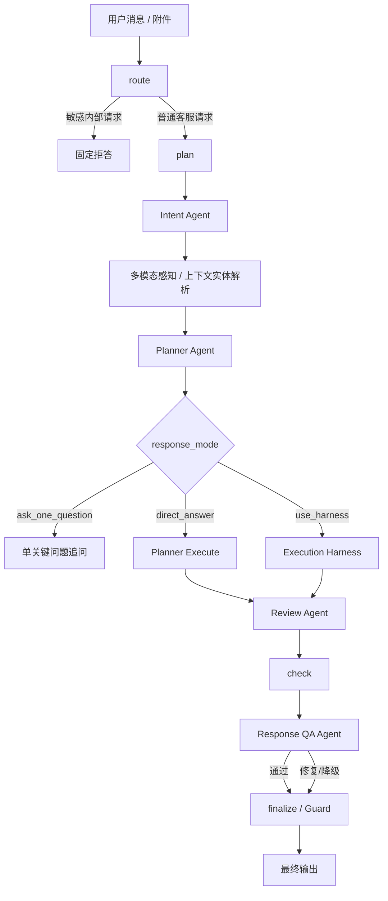
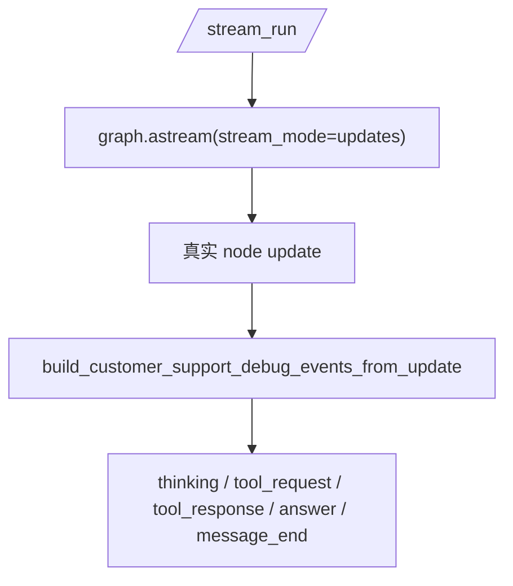

# HiFleet `customer_support` V3 当前实现与学习改进指南

本文不是历史方案稿，而是基于当前仓库代码整理出的 `customer_support` 真实实现说明。重点回答 4 个问题：

1. 现在的 `customer_support` 到底是怎么跑的
2. 相关提示词、节点、判断逻辑分别在哪
3. 新同学应该按什么顺序学习，才能真正读懂这条链
4. 以后如果要改进，应优先改哪里、怎么改才不破坏边界

---

## 1. 当前结论

当前 `customer_support` 已经完成 V3 的 4 个核心目标：

1. `Intent Agent`
2. `Planner Agent`
3. `Review Agent`
4. `Response QA Agent`
5. `/stream_run` 改为读取真实 runtime state，而不是伪造 explainable 文案

一句话概括当前架构：

```text
Harness 决定边界和执行权限
Prompt 约束每个节点如何思考和输出
Agent 负责理解、规划、审查和修正
Guard 负责最后一道对外收口
```

---

## 2. 先建立整体脑图



相关代码入口：

- 主 graph: [src/agents/agent.py](/Users/raymondlu/LocalProject/AIPM/智能客服/客服开发/本地agent/hifleet-agent/src/agents/agent.py)
- 路由、Planner、Harness、证据总结: [src/agents/customer_support_router.py](/Users/raymondlu/LocalProject/AIPM/智能客服/客服开发/本地agent/hifleet-agent/src/agents/customer_support_router.py)
- 输出安全收口: [src/agents/customer_support_guard.py](/Users/raymondlu/LocalProject/AIPM/智能客服/客服开发/本地agent/hifleet-agent/src/agents/customer_support_guard.py)
- `/stream_run` runtime debug 映射: [src/agents/customer_support_stream_debug.py](/Users/raymondlu/LocalProject/AIPM/智能客服/客服开发/本地agent/hifleet-agent/src/agents/customer_support_stream_debug.py)
- 角色主提示词: [config/profiles/customer_support.md](/Users/raymondlu/LocalProject/AIPM/智能客服/客服开发/本地agent/hifleet-agent/config/profiles/customer_support.md)

---

## 3. 学习顺序

如果你的目标是“真正理解并能安全修改 `customer_support`”，推荐严格按这个顺序读：

### 第 1 步：先看入口和 phase graph

文件：

- [src/main.py](/Users/raymondlu/LocalProject/AIPM/智能客服/客服开发/本地agent/hifleet-agent/src/main.py)
- [src/agents/agent.py](/Users/raymondlu/LocalProject/AIPM/智能客服/客服开发/本地agent/hifleet-agent/src/agents/agent.py)

要看懂：

1. `/run` 和 `/stream_run` 都会走 `build_agent(...)`
2. `customer_support` 会进入 `_build_customer_support_agent(...)`
3. graph 的固定骨架仍然是：
   - `route -> plan -> act -> check -> finalize`
   - 失败时 `loop` 或 `fail`

学习目标：

- 先把“有哪些节点”搞清楚
- 不要一上来就钻检索细节

### 第 2 步：再看 plan 节点

文件：

- [src/agents/agent.py](/Users/raymondlu/LocalProject/AIPM/智能客服/客服开发/本地agent/hifleet-agent/src/agents/agent.py)
- [src/agents/customer_support_router.py](/Users/raymondlu/LocalProject/AIPM/智能客服/客服开发/本地agent/hifleet-agent/src/agents/customer_support_router.py)

要看懂：

1. 文本、附件、上下文怎么抽出来
2. `Intent Agent` 怎么决定 route
3. 多模态感知怎样影响 route
4. `Planner Agent` 最终产出哪些结构化字段

学习目标：

- 明白系统是“先建模问题，再决定执行”
- 明白 `route` 和 `response_mode` 是两层不同决策

### 第 3 步：再看 act/check/finalize

要看懂：

1. 哪些 route 走 Planner 直执链
2. 哪些 route 必须走 Harness
3. `Review Agent` 怎么判断“能不能直接回答”
4. `Response QA Agent` 怎么判断“这段话能不能直接发给客户”
5. `Guard` 最后会删什么

学习目标：

- 明白业务正确性和安全正确性分别在哪层保证

### 第 4 步：最后看 `/stream_run`

文件：

- [src/main.py](/Users/raymondlu/LocalProject/AIPM/智能客服/客服开发/本地agent/hifleet-agent/src/main.py)
- [src/agents/customer_support_stream_debug.py](/Users/raymondlu/LocalProject/AIPM/智能客服/客服开发/本地agent/hifleet-agent/src/agents/customer_support_stream_debug.py)

要看懂：

1. explainable stream 现在直接消费 graph `updates`
2. 调试事件是如何从真实 state 映射成：
   - `message_start`
   - `thinking`
   - `tool_request`
   - `tool_response`
   - `answer`
   - `message_end`

学习目标：

- 明白调试展示已经和 runtime state 对齐
- 修改 state 字段时知道 `/stream_run` 也要一起更新

---

## 4. 提示词层怎么理解

`customer_support` 当前有两类提示词：

### 4.1 角色主提示词

文件：

- [config/profiles/customer_support.md](/Users/raymondlu/LocalProject/AIPM/智能客服/客服开发/本地agent/hifleet-agent/config/profiles/customer_support.md)

作用：

- 定义“你是 HiFleet 官方客服”
- 限制不能表现成泛搜索助手或内部运维机器人
- 统一最终语气、边界、输出风格

### 4.2 节点级提示词

文件：

- [src/agents/agent.py](/Users/raymondlu/LocalProject/AIPM/智能客服/客服开发/本地agent/hifleet-agent/src/agents/agent.py)

当前节点：

1. `CUSTOMER_SUPPORT_INTENT_PROMPT`
2. `CUSTOMER_SUPPORT_PLANNER_PROMPT`
3. `CUSTOMER_SUPPORT_REVIEW_PROMPT`
4. `CUSTOMER_SUPPORT_RESPONSE_QA_PROMPT`
5. `CUSTOMER_SUPPORT_REPAIR_PROMPT`

理解原则：

- 角色主提示词定义“你是谁”
- 节点提示词定义“这一层只能做什么”
- 真正的边界仍由程序保证，不能靠 prompt 自觉

---

## 5. 各节点真实职责

## 5.1 route

职责：

- 判断是不是敏感内部请求
- 命中就直接固定拒答

关键点：

- 这一层不做业务理解
- 只做安全入口裁决

## 5.2 plan

职责：

1. 取最新用户消息
2. 组装上下文
3. 抽取实体
4. 抽取附件
5. 跑 `Intent Agent`
6. 做多模态感知
7. 跑 `Planner Agent`
8. 产出结构化计划

核心 state 字段：

- `route`
- `task_type`
- `entities`
- `perception_result`
- `problem_frame`
- `hypotheses`
- `search_plan`
- `decision_rationale`
- `missing_slot`
- `reasoning_public_trace`
- `intent_agent_result`
- `planner_agent_result`

## 5.3 act

职责：

- 根据 `response_mode` 决定执行路径

三种情况：

1. `ask_one_question`
   - 直接返回一个关键追问
2. `direct_answer`
   - 走 Planner 直执链
3. `use_harness`
   - 走确定性 Harness

## 5.4 review

职责：

- 判断当前证据是否足以直接回答
- 如果不够，就阻止硬答，改成追问

它解决的是：

- “搜到了东西”不等于“可以安全回答”
- “有一条公开网页”不等于“结论可靠”

## 5.5 check + response qa

职责：

- 链接校验
- 输出质量检查
- 必要时修复
- 修复仍失败则降级

这一层解决的是：

- 不是所有“逻辑上对”的回复都适合直接发给客户

## 5.6 finalize / guard

职责：

- 最终脱敏
- 清理工具名、路径、prompt、key、日志、检索包装残片
- 输出最终客服回复

---

## 6. 判断逻辑应该重点读什么

理解 `customer_support` 时，最值得重点读的是这几类判断：

### 6.1 route 判断

文件：

- [src/agents/customer_support_router.py](/Users/raymondlu/LocalProject/AIPM/智能客服/客服开发/本地agent/hifleet-agent/src/agents/customer_support_router.py)

重点函数：

- `classify_message(...)`
- `classify_multimodal_message(...)`
- `refine_multimodal_route_with_perception(...)`
- `resolve_entities_with_context(...)`

要看什么：

- 平台问题和船舶问题怎么区分
- 截图符号和异常截图怎么区分
- 哪些路由允许继承上一轮船舶上下文

### 6.2 Planner 判断

重点函数：

- `build_customer_support_plan(...)`
- `_planner_question_type(...)`
- `_planner_missing_slot(...)`
- `_planner_hypotheses(...)`
- `_planner_search_plan(...)`

要看什么：

- `problem_frame` 怎样抽象问题
- `missing_slot` 怎样决定“只追问一个问题”
- `search_plan` 怎样改写检索词，而不是复读原句

### 6.3 Harness 进入条件

重点常量：

- `HARNESSED_ROUTES`
- `PLANNER_DIRECT_ROUTES`

要看什么：

- 为什么船舶、写操作、文件、网页核验不能交给自由回答链

### 6.4 Review / QA 判断

重点 helper：

- `_run_customer_support_review_agent(...)`
- `_run_customer_support_response_qa_agent(...)`
- `_repair_customer_support_answer(...)`

要看什么：

- 哪些场景禁止直接回答
- 哪些场景必须降级为单关键追问

---

## 7. 现在线上的 `/stream_run` 是怎么工作的

当前实现目标不是暴露私有 CoT，而是把真实 runtime state 安全映射成调试事件。



当前会映射的真实信息包括：

- `intent_agent_result`
- `perception_result`
- `reasoning_public_trace`
- `search_plan`
- `generated_tool_calls`
- `review_agent_result`
- `response_qa_result`
- `finalize` 里的最终回复

这意味着：

- `/stream_run` 已经不再是“静态脚本解释”
- 它现在是“runtime state 的安全摘要”

---

## 8. 修改时怎么下手

## 8.1 改提示词

适用场景：

- 模型理解方向不稳
- 输出 JSON 字段不稳定
- 客服语气不一致

优先改：

- `src/agents/agent.py` 中对应节点 prompt
- `config/profiles/customer_support.md`

不要做：

- 用一个大 prompt 把所有节点职责揉在一起

## 8.2 改 route 判断

适用场景：

- 平台问题误进船舶链
- 报错截图误进海图符号链
- 上下文船舶继承错误

优先改：

- `classify_message(...)`
- `classify_multimodal_message(...)`
- `refine_multimodal_route_with_perception(...)`
- `resolve_entities_with_context(...)`

## 8.3 改 Planner

适用场景：

- `problem_frame` 建模不准
- `search_plan` 改写质量差
- 该追问时没追问

优先改：

- `build_customer_support_plan(...)`
- `CUSTOMER_SUPPORT_PLANNER_PROMPT`

## 8.4 改 Harness

适用场景：

- 某个高风险 route 的工具顺序不对
- 缺字段追问不对
- 返回格式不适合客服场景

优先改：

- `src/agents/customer_support_router.py` 中对应 `execute_*_chain`

## 8.5 改 Review / QA

适用场景：

- 明明证据不足却硬答
- 最终回复太像检索结果，不像客服回复
- 应该降级追问却没有降级

优先改：

- `_run_customer_support_review_agent(...)`
- `_run_customer_support_response_qa_agent(...)`
- `_repair_customer_support_answer(...)`

## 8.6 改 `/stream_run`

适用场景：

- 新增了 state 字段，调试流没展示
- 调试流顺序不对
- 调试事件和 runtime 真实执行不一致

优先改：

- `build_customer_support_debug_events_from_update(...)`
- `src/main.py` 中 `explainable_stream_sse(...)`

---

## 9. 安全改进原则

后续改进必须守住这些边界：

1. 是否允许执行高风险能力，永远由程序决定，不由 Agent 决定
2. 写操作权限不能只靠 prompt，必须保留 `allow_write` 强制覆盖
3. 最终输出仍必须经过 `sanitize_customer_output(...)`
4. `/stream_run` 只能输出安全摘要，不能输出 prompt、私有 CoT、路径、key、内部 JSON 原文
5. 回退链必须保留：
   - Intent 失败 -> 回退规则分类
   - Planner 失败 -> 回退 `build_customer_support_plan(...)`
   - Review 失败 -> 回退程序证据总结
   - QA/Repair 失败 -> 降级为更保守输出

---

## 10. 推荐联动阅读

建议一起看：

- 当前真实架构总览: [AGENT_TECHNICAL_DOCUMENTATION.md](/Users/raymondlu/LocalProject/AIPM/智能客服/客服开发/本地agent/hifleet-agent/docs/AGENT_TECHNICAL_DOCUMENTATION.md)
- 客服回归矩阵: [CUSTOMER_SUPPORT_AGENT_REGRESSION.md](/Users/raymondlu/LocalProject/AIPM/智能客服/客服开发/本地agent/hifleet-agent/docs/CUSTOMER_SUPPORT_AGENT_REGRESSION.md)
- 知识检索链: [KNOWLEDGE_BASE_GUIDE.md](/Users/raymondlu/LocalProject/AIPM/智能客服/客服开发/本地agent/hifleet-agent/docs/KNOWLEDGE_BASE_GUIDE.md)

如果只想最快读懂 `customer_support`，建议按这个顺序：

1. 本文
2. `src/agents/agent.py`
3. `src/agents/customer_support_router.py`
4. `src/agents/customer_support_stream_debug.py`
5. `tests/test_customer_support_intent_agent.py`
6. `tests/test_customer_support_stream_debug.py`
