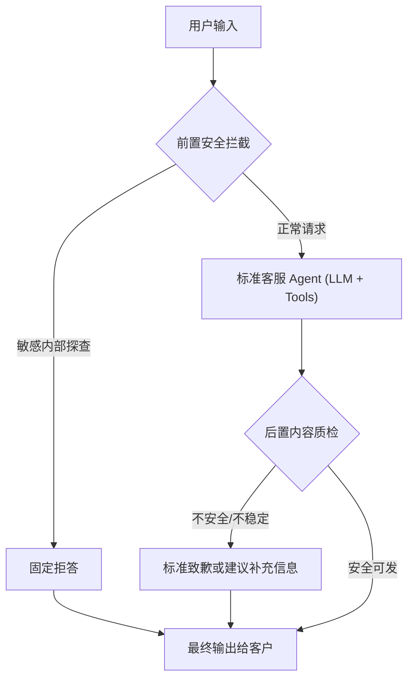
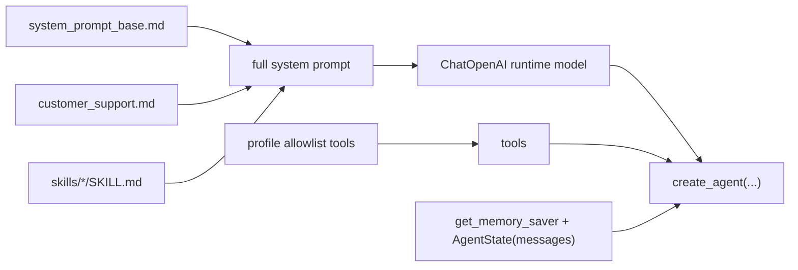

# HiFleet `customer_support` 当前实现与学习改进指南

本文描述当前仓库里真实生效的 `customer_support` 实现。当前版本已经不再走 `Planner Agent -> Harness -> Review -> QA` 主链，而是改成更贴近 `employee_assistant` 标准问答链的轻量结构。

## 1. 当前结论

当前 `customer_support` 的核心链路是：



一句话概括：

```text
customer_support 现在的重点不是复杂链路编排，
而是用更稳定的标准问答 Agent 结合知识库/业务工具回答，再用前后置 Guard 收住风险。
```

## 2. 为什么这样改

当前项目里的经验结论已经比较明确：

1. `employee_assistant` 的标准问答 Agent 更稳定，符合实际需求。
2. 当前知识库内容仍不足，后续应优先补知识库，而不是继续加重链路复杂度。
3. 当前公网搜索能力仍偏弱，后续更适合通过补强检索能力或接入 `agent-browser` 来解决，而不是再叠更多中间 Agent。

所以现在 `customer_support` 的优化重点变成：

- 保留官方客服 prompt 和工具边界
- 保留前置安全拦截
- 保留后置输出收口
- 取消复杂 Planner/Harness/Review/QA 主执行链

## 3. 真实代码入口

先读这几个文件：

- [src/main.py](/Users/raymondlu/LocalProject/AIPM/智能客服/客服开发/本地agent/hifleet-agent/src/main.py)
- [src/agents/agent.py](/Users/raymondlu/LocalProject/AIPM/智能客服/客服开发/本地agent/hifleet-agent/src/agents/agent.py)
- [config/profiles/customer_support.md](/Users/raymondlu/LocalProject/AIPM/智能客服/客服开发/本地agent/hifleet-agent/config/profiles/customer_support.md)
- [src/agents/customer_support_guard.py](/Users/raymondlu/LocalProject/AIPM/智能客服/客服开发/本地agent/hifleet-agent/src/agents/customer_support_guard.py)
- [src/agents/customer_support_stream_debug.py](/Users/raymondlu/LocalProject/AIPM/智能客服/客服开发/本地agent/hifleet-agent/src/agents/customer_support_stream_debug.py)

当前主入口：

1. `/run` 或 `/stream_run` 进入 [src/main.py](/Users/raymondlu/LocalProject/AIPM/智能客服/客服开发/本地agent/hifleet-agent/src/main.py)
2. `resolve_profile_id(...)` 识别 `customer_support`
3. `build_agent(...)` 命中 `_build_customer_support_agent(...)`
4. `customer_support` graph 只保留：
   - `route`
   - `delegate`
   - `check`
   - `finalize`

## 4. 当前节点职责

### 4.1 route

职责：

- 读取最新用户问题
- 执行前置安全拦截
- 做轻量 route / task_type / entities / attachments 标注

关键点：

- 命中内部敏感探查，直接固定拒答
- 正常请求不再进入复杂 Planner
- route 的分类现在主要用于 trace 和调试展示，不再驱动复杂执行分支

### 4.2 delegate

职责：

- 调用 `_build_standard_agent(...)` 构造的标准客服 Agent
- 把会话历史、profile prompt、skills prompt 和 tools 一起交给 `create_agent(...)`
- 从返回的 messages 中提取真实工具调用序列

这一层和 `employee_assistant` 的普通问答链是同型的。

### 4.3 check

职责：

- 从标准 Agent 返回结果中提取最终回答
- 调用 `sanitize_customer_output(...)`
- 做链接校验
- 如果答案为空、不安全或不稳定，降级到统一致歉/建议补充信息

这就是当前的后置质检层。

### 4.4 finalize

职责：

- 产出最终客户回复
- 汇总 `route_trace / tool_call_sequence / check_result / latency`
- 保证返回给调用方和 `/stream_run` 的最终状态一致

## 5. 标准客服 Agent 的装配方式

`customer_support` 的核心执行现在直接复用标准 Agent 装配：



这意味着当前 `customer_support` 的能力上限主要取决于：

1. `customer_support` profile prompt 是否写得对
2. `smart_search` 和 ship tools 是否足够可靠
3. 知识库内容是否完整
4. 公网搜索能力是否能补足知识库缺口

## 6. 学习顺序

如果你的目标是“真正理解并能继续改这条链”，建议按这个顺序读：

1. [src/main.py](/Users/raymondlu/LocalProject/AIPM/智能客服/客服开发/本地agent/hifleet-agent/src/main.py)
   先看 `/run`、`/stream_run` 如何设置 `agent_profile / intent_hint / llm_route`
2. [src/agents/agent.py](/Users/raymondlu/LocalProject/AIPM/智能客服/客服开发/本地agent/hifleet-agent/src/agents/agent.py)
   重点看 `_build_standard_agent(...)` 和 `_build_customer_support_agent(...)`
3. [config/profiles/customer_support.md](/Users/raymondlu/LocalProject/AIPM/智能客服/客服开发/本地agent/hifleet-agent/config/profiles/customer_support.md)
   理解客服角色约束、检索优先级和写操作边界
4. [src/agents/customer_support_guard.py](/Users/raymondlu/LocalProject/AIPM/智能客服/客服开发/本地agent/hifleet-agent/src/agents/customer_support_guard.py)
   理解最终有哪些内容绝不能对客户暴露
5. [src/agents/customer_support_stream_debug.py](/Users/raymondlu/LocalProject/AIPM/智能客服/客服开发/本地agent/hifleet-agent/src/agents/customer_support_stream_debug.py)
   理解调试展示如何映射到真实 runtime

## 7. `/stream_run` 现在展示什么

`/stream_run` 现在不再展示旧 Planner/Harness/Review/QA 的伪阶段，而是对齐当前 runtime：

- `message_start`
- `thinking`
  - 前置安全与问题识别
  - 标准客服 Agent 装配
  - 附件输入分析
  - 后置内容质检
- `tool_response`
  - 基于真实 `tool_call_sequence`
- `answer`
- `message_end`

## 8. 当前已知能力边界

当前版本最重要的两个限制：

1. 知识库内容仍不足
   - 这会直接限制 `smart_search` 的命中质量
   - 优先补知识库内容，而不是再叠复杂链路
2. 公网搜索能力仍偏弱
   - 当知识库里没有答案时，可能无法在公网检索到最匹配的信息
   - 后续可以考虑引入 `agent-browser` 做更强的全网补充能力

## 9. 后续改进优先级

建议按这个顺序继续演进：

1. 先补知识库内容
2. 再补 `smart_search` 的 query 改写和弱命中兜底
3. 再引入 `agent-browser` 补强知识库外知识
4. 最后再看是否需要恢复更复杂的中间推理层

当前阶段不建议优先做的事情：

- 再引入多层 Planner/Review/QA 主执行链
- 再把 `customer_support` 设计成复杂 Harness 驱动系统
- 在知识库和搜索能力不足时，用更多中间 Agent 掩盖底层能力问题
