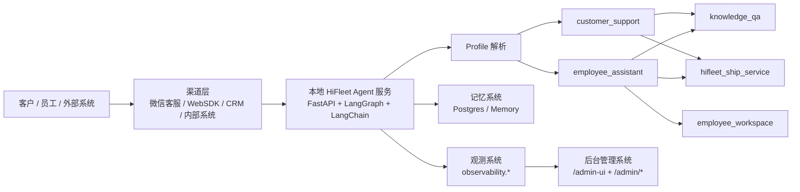
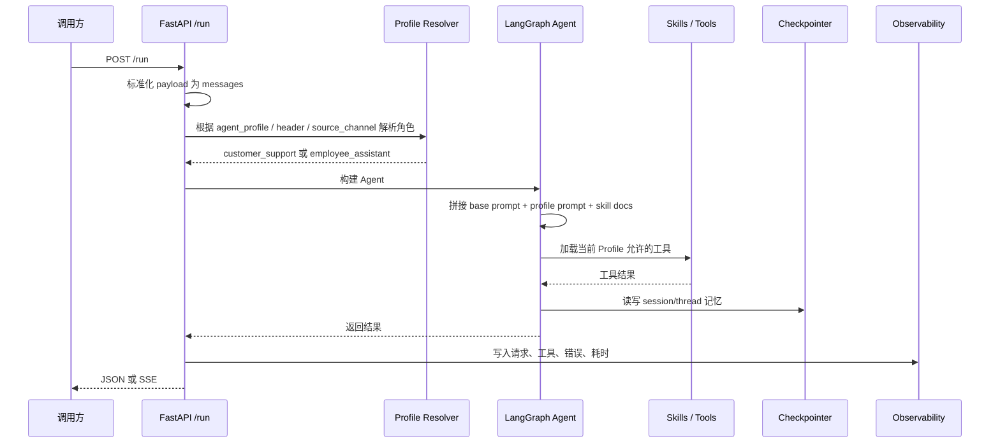
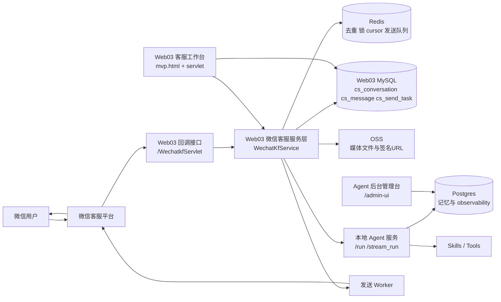
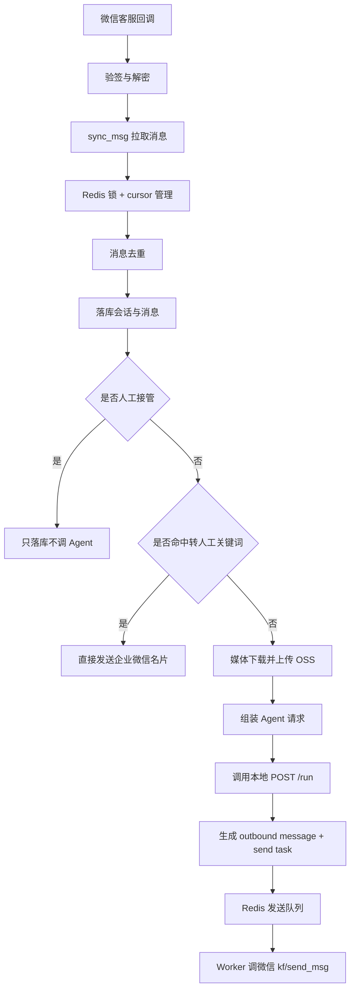
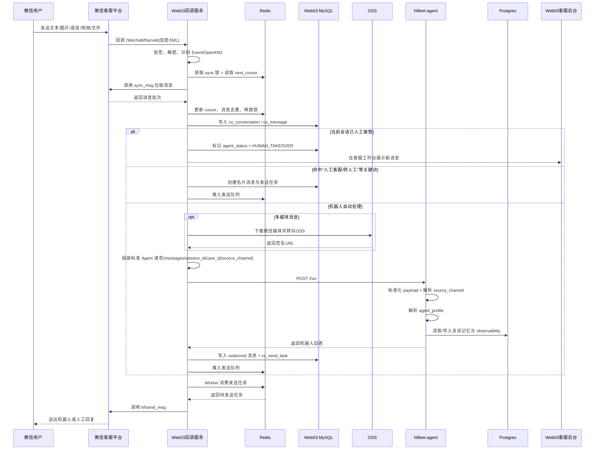
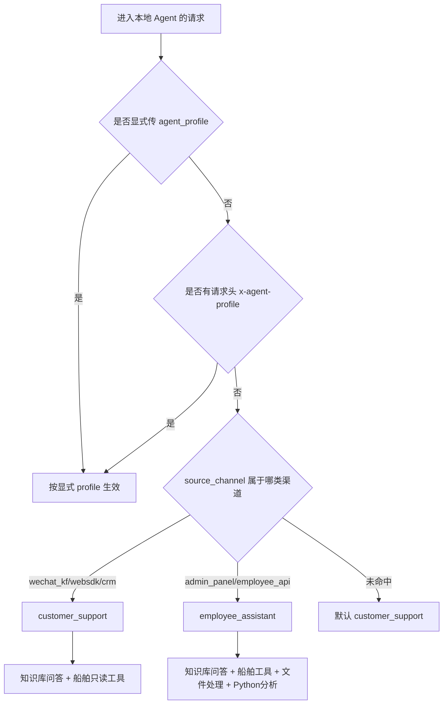
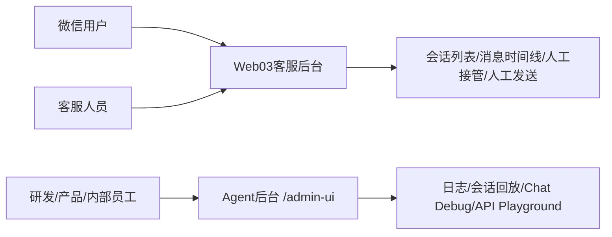
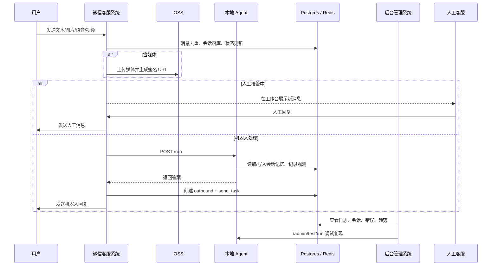
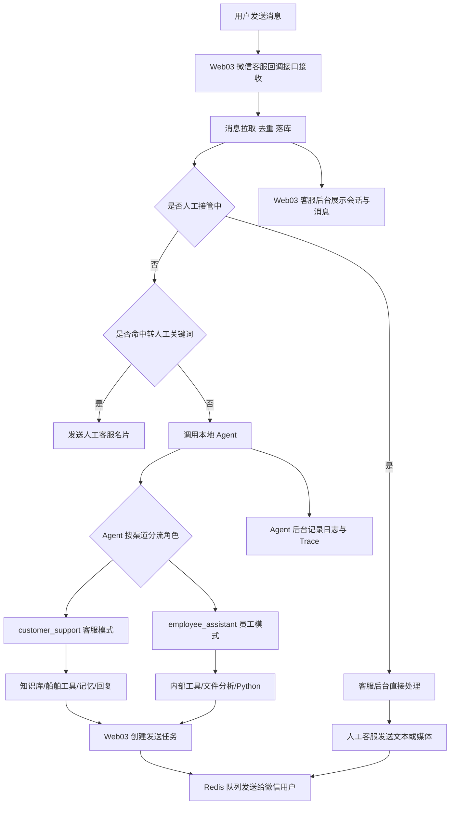

# HiFleet Agent 开发范式、架构与流程汇报稿

本文用于对当前 HiFleet Agent 体系做汇报级总结，覆盖三部分：

1. 本地 Agent 服务的开发范式
2. 微信客服接入范式
3. 后台管理系统的实现方案、架构与流程

目标不是描述理想方案，而是总结当前代码与文档所体现的正式实现基线。

---

## 1. 一句话概括当前范式

当前 HiFleet Agent 采用的是一套很明确的“三层协同”范式：

- 底层是本地部署的统一 Agent 服务，负责大模型、工具、知识库、记忆和观测。
- 中间层是微信客服等渠道接入层，负责把真实用户消息转成标准 Agent 请求，并承接人工接管、媒体处理和发送队列。
- 上层是后台管理系统，负责观测、调试、会话回放、接口测试和问题定位。

可以理解为：

```text
渠道接入层负责“接消息、发消息、接人工”
本地 Agent 层负责“理解问题、调用能力、生成回答”
后台管理层负责“观测运行、调试问题、支撑运营”
```

这不是“一个孤立 chatbot”，而是一套面向业务运行的客服 Agent 基础设施。

---

## 2. 总体架构



---

## 3. 本地 Agent 的开发范式

### 3.1 设计核心

本地 Agent 不是为单一渠道单独开发，而是作为统一能力底座，通过固定端口对外提供服务。

当前主入口是：

- `POST /run`
- `POST /stream_run`
- `GET /health`
- `/admin-ui`
- `/admin/*`

实现基座是：

- Web 框架：`FastAPI`
- Agent 编排：`LangGraph`
- 模型与工具：`LangChain`
- 会话记忆：`Postgres checkpointer` 或内存
- 观测存储：`Postgres observability schema`

### 3.2 当前不是多 Agent 微服务，而是“一个主 Agent + 多 Profile”

这是当前最关键的开发范式。

不是：

- 客服单独一套 Agent 服务
- 员工助手再单独一套 Agent 服务

而是：

- 一套主 Agent 执行链路
- 多个角色 Profile 做权限和行为隔离

当前两个正式 Profile：

- `customer_support`
- `employee_assistant`

这种设计的意义是：

- 共享同一套知识库、工具注册、记忆、日志、后台调试能力
- 用 Prompt、Skills、禁用工具、渠道映射来做角色边界隔离
- 对接方只需要调用统一接口，集成成本低
- 后续新增角色时，只需要新增配置和 Prompt，而不必复制整套服务

### 3.3 Profile 边界

#### `customer_support`

面向外部客户、微信公众号、CRM、客服渠道。

特点：

- 强调客户友好表达
- 优先知识问答与检索
- 可调用 HiFleet 只读业务工具
- 禁止高风险写操作
- 不开放文件处理和 Python 沙盒

当前禁用工具：

- `upload_ship_position`
- `update_ship_static_info`

#### `employee_assistant`

面向内部员工和后台。

特点：

- 继承客服知识问答和船舶工具能力
- 增加表格检查能力
- 增加受控 Python 分析能力
- 可生成内部分析产物

### 3.4 本地 Agent 请求处理链路



### 3.5 本地 Agent 的工程实现模式

当前实现体现出几个非常稳定的工程范式：

#### 范式一：统一输入标准化

不同来源的请求格式先被标准化为 `messages`，再走统一链路。

这样兼容：

- WebSDK 的 `messages` / `input`
- 微信客服的 `content.query.prompt`
- 纯文本和多模态混合输入

价值是：

- 渠道差异不进入 Agent 主逻辑
- 主链路只维护一种输入语义

#### 范式二：Prompt 不是写死的，而是动态拼装

最终系统提示词由三部分组成：

1. 基础 Prompt
2. 当前 Profile Prompt
3. 当前允许 Skills 的 `SKILL.md`

价值是：

- 公共规则统一维护
- 不同角色单独补行为约束
- 技能说明跟技能代码一起演进

#### 范式三：工具按 Skill 组织，而不是散落在主工程里

当前 Skill 体系：

- `knowledge_qa`
- `hifleet_ship_service`
- `employee_workspace`

每个 Skill 自带：

- `SKILL.md`
- `tools.py`
- 必要脚本和参考文档

价值是：

- 业务能力具备清晰边界
- 工具可被 Profile 精准放行或禁用
- 后期新增业务技能时结构稳定

#### 范式四：记忆按 `session_id` 隔离

Agent 记忆不是按进程共享，而是按会话键隔离：

- 同一用户同一业务会话保持连续上下文
- 不同渠道、不同客服会话避免串话

这对客服场景非常关键，因为客服不是“单次问答”，而是持续会话。

#### 范式五：所有运行都尽量可观测

本地 Agent 会记录：

- 请求主记录
- 工具调用记录
- 错误记录
- 时间线与统计信息

这意味着系统的定位目标不是“能回答”，而是“出了问题能排查”。

---

## 4. 微信客服开发范式

### 4.1 微信客服不是直接接模型，而是“微信接入层 + 本地 Agent”

微信公众号客服系统当前扮演的是业务接入层，不直接承载完整推理逻辑。

其职责是：

- 接收微信加密回调
- 拉取和去重消息
- 落库
- 处理媒体
- 生成标准 Agent 请求
- 调用本地 `POST /run`
- 把回复转为出站消息
- 承接人工接管和发送队列

也就是说，微信客服层是“客服运行编排层”，本地 Agent 是“智能决策与回答层”。

### 4.2 面向汇报的微信客服总体架构

如果按你给的附件图风格进一步抽象，当前真实落地链路更适合画成“渠道回调层 + Web03 业务编排层 + 本地 Agent 层 + 数据与发送层”的结构，而不是只有“回调服务直连 Agent”。



这张图更准确反映了当前部署现实：

- `Web03` 是微信客服业务主控层。
- 本地 `hifleet-agent` 是智能处理层。
- Redis/MySQL/Postgres/OSS 分别承担不同状态与数据职责。
- 客服人工操作主要发生在 `Web03` 工作台。
- Agent 观测和技术调试主要发生在 `/admin-ui`。

### 4.3 微信客服总体链路



### 4.4 用户输入到微信回调再到 Agent 的细化时序

这一版时序图，更接近你附件图想表达的内容，但补足了 `Web03`、角色分流、人工接管和后台介入点。



### 4.5 角色分流机制：客服与员工不是两套系统，而是同一 Agent 的两种入口

你这次特别提到“区分客服/员工角色”，这个点在汇报中建议单独强调，因为它直接体现当前架构不是散装拼接，而是有统一治理能力。

当前角色分流不是发生在 `Web03` 里，而是由本地 Agent 服务基于请求参数和渠道来解析：



落到实际业务上：

- 微信客服回调进入 Agent 时，默认走 `customer_support`。
- Agent 后台调试、内部员工使用时，通常走 `employee_assistant`。
- 也就是说，“客服”和“员工”是统一 Agent 平台上的两种受控运行模式，而不是两套割裂产品。

### 4.6 Web03 项目上的微信客服回调接口与客服后台

这一部分建议在汇报里讲清楚，因为 `Web03` 是当前客服业务真正的承接者。

#### 4.6.1 Web03 的两个核心职责

`Web03` 不是简单转发器，而是同时承担两个系统角色：

1. 微信客服回调与发送中心
2. 客服人工工作台与会话管理中心

也就是说，`Web03` 一边对接微信，一边对接客服人员。

#### 4.6.2 回调接口职责

部署在 `Web03` 上的 `/WechatkfServlet` 负责：

- 接收微信加密回调
- 验签和解密
- 触发 `sync_msg`
- 维护 `open_kfid` 级别同步锁
- 管理 `next_cursor`
- 消息去重
- 多模态消息落库
- 人工/机器人路由判断
- 调用本地 Agent
- 创建发送任务

可以把它理解为：

```text
微信客服的统一消息入口和业务编排入口
```

#### 4.6.3 客服后台职责

`WebRoot/customer-service/mvp.html` 及相关 servlet 负责：

- 展示会话列表
- 展示消息时间线
- 展示媒体预览
- 设置会话备注
- 人工接管
- 释放回机器人
- 人工发送文本
- 人工发送图片/音频/视频/文件

它解决的不是“技术调试”，而是“客服业务处理”。

#### 4.6.4 Web03 后台与 Agent 后台的区别

这两个后台在汇报里需要明确区分：

- `Web03` 客服后台：面向客服运营，处理真实用户会话和人工回复。
- `hifleet-agent` 管理后台：面向研发和内部排障，查看日志、Trace、Profile、工具调用和接口测试。

建议用下面这张图讲两套后台的定位差异：



### 4.7 Web03 维度的数据流说明

从数据流角度，`Web03` 这套客服体系至少维护 4 条并行流：

#### 4.7.1 入站消息流

路径：

```text
微信客服平台 -> Web03回调接口 -> sync_msg -> 去重 -> 会话/消息落库
```

承载数据：

- 用户文本
- 图片/语音/视频/文件元数据
- 微信消息 ID
- external_userid
- open_kfid
- 会话状态

#### 4.7.2 智能处理流

路径：

```text
Web03 -> 组装标准请求 -> 本地 Agent -> 返回回答
```

承载数据：

- `messages`
- `session_id`
- `user_id`
- `source_channel=wechat_kf`
- `agent_profile=customer_support`

#### 4.7.3 媒体数据流

路径：

```text
微信媒体 -> Web03 -> OSS -> 签名URL -> Agent / 客服后台预览
```

承载数据：

- 媒体二进制内容
- OSS object key
- 短时签名 URL
- Content-Type 修正信息

#### 4.7.4 出站发送流

路径：

```text
Web03生成 outbound -> cs_send_task -> Redis队列 -> Worker -> 微信 kf/send_msg
```

承载数据：

- 机器人回答
- 人工客服回复
- 名片消息
- 图片/音频/视频/文件发送任务
- 限流重试状态

### 4.8 微信客服当前实现重点

#### 重点一：回调与拉消息分离，缩短锁时间

微信回调到了之后，不是在回调线程里做所有处理，而是：

1. 先验签、解密
2. 以 `open_kfid` 为粒度做 Redis 锁
3. 调 `sync_msg` 拉取一轮消息
4. 保存 `next_cursor`
5. 尽快释放锁
6. 后续处理交给线程池

价值：

- 避免慢处理拖住微信回调
- 同一客服账号串行，不同账号可并行

#### 重点二：去重是三层结构

去重顺序：

1. Redis 去重
2. JVM 内存去重
3. 数据库唯一幂等兜底

价值：

- 兼顾重启、多实例、重复回调场景
- 不把幂等完全压在单层机制上

#### 重点三：媒体不落本地磁盘，统一转 OSS

图片、语音、视频、文件的处理方式是：

1. 从微信下载
2. 直接流式上传 OSS
3. 生成短时签名 URL
4. 传给 Agent 或供后台预览

价值：

- 统一媒体访问方式
- 兼容本地 Agent 的多模态输入要求
- 降低本地磁盘管理复杂度

#### 重点四：微信会话记忆和本地 Agent 的记忆键对齐

当前会话键规则不是简单的用户 ID，而是：

```text
wechat_kf:hifleet:{open_kfid}:{external_userid}:c_{conversationId}
```

价值：

- 避免同一微信用户在不同客服账号下串话
- 避免多个业务会话复用同一记忆线程
- 让微信客服会话和 Agent 记忆真正一一对应

#### 重点五：人工接管是业务状态，不是临时逻辑

如果当前会话已人工接管：

- 入站消息继续落库
- `agent_status` 标记为 `HUMAN_TAKEOVER`
- 不再调用 bot
- 不再自动回复

这说明系统当前不是“机器人失败才人工补救”，而是“机器人与人工可切换的正式客服流程”。

#### 重点六：出站发送采用任务队列，不同步直发

发送链路是：

1. 生成 outbound 消息记录
2. 生成 `cs_send_task`
3. 推入 Redis 队列
4. Worker 异步发送
5. 更新状态

价值：

- 发送与推理解耦
- 更好承接重试和限流
- 后台能观察发送状态

### 4.9 微信客服的业务处理策略

当前已经形成清晰的业务路由：

#### 机器人自动回复

适用于：

- 一般文本咨询
- 平台功能问题
- 船舶查询类问题
- 可转为多模态理解的问题

#### 关键词直转人工

命中以下词时不走 Agent：

- `人工客服`
- `人工服务`
- `转人工`
- `联系人工`

系统直接发送企业微信成员名片。

#### 人工接管模式

客服人员接管后：

- 用户消息继续进入会话
- 机器人不再回复
- 人工通过工作台发送文本或媒体

### 4.10 微信客服范式总结

当前微信客服方案的本质，不是“公众号对话机器人”，而是：

```text
微信消息中台 + 本地智能应答 + 人工客服协同
```

它已经具备典型生产客服系统的几个关键特征：

- 幂等
- 多模态
- 会话落库
- 人工接管
- 发送队列
- 限流重试
- 运营工作台

---

## 5. 后台管理系统开发范式

### 5.1 后台不是独立系统，而是嵌入在主 Agent 服务中

后台系统没有另起一个服务，而是直接挂在本地 Agent 服务内：

- 前端页面：`/admin-ui`
- 后端接口：`/admin/*`

好处是：

- 部署简单
- 调试链路短
- 后台天然可直接联调 Agent

### 5.2 后台总体架构

```mermaid
flowchart LR
    Browser[浏览器] --> UI[React Admin UI]
    UI --> Client[API Client]
    Client --> AdminAPI[/admin/*]
    AdminAPI --> Service[admin_api/service.py]
    Service --> Repo[observability/repository.py]
    Repo --> DB[(Postgres observability)]
    Service --> Proxy[/admin/test/run]
    Proxy --> Agent[/run 或 /stream_run]
```

### 5.3 后台管理系统的定位

后台不是面向客户的业务系统，而是面向内部的“运营 + 联调 + 排障工作台”。

它承担四类功能：

1. 观测
2. 会话回放
3. 在线调试
4. 接口测试

### 5.4 当前页面范式

#### Dashboard

用途：

- 看调用量、成功率、平均延迟、工具成功率、估算成本
- 看渠道分布、路由分布、Profile 分布
- 看高风险会话

这是运营和技术的统一总览页。

#### Sessions

用途：

- 浏览会话列表
- 还原用户问题和回答过程
- 看单会话的轮次、状态、平均耗时
- 跳转到日志明细

这是客服问题复盘入口。

#### Logs

用途：

- 按 `run_id`、`session_id`、`user_id`、渠道、Profile、状态、关键词查问题
- 查看 request / response / tool_invocations / errors / trace

这是技术排障入口。

#### Chat Debug

用途：

- 模拟多轮对话
- 手工指定 `session_id`、`user_id`、`source_channel`、`agent_profile`
- 上传图片、音频、视频附件
- 观察流式思考、工具调用、响应过程

这是 Prompt、工具、多模态联调入口。

#### API Playground

用途：

- 构造 `/run` 与 `/stream_run` 请求
- 验证同步和流式接口
- 快速复现线上请求

这是接口联调入口。

### 5.5 后台的数据基础

后台并不是前端自己维护状态，而是建立在观测表之上。

核心表：

- `observability.api_calls`
- `observability.tool_invocations`
- `observability.agent_errors`
- `observability.chat_debug_sessions`

关键维度：

- `run_id`
- `session_id`
- `user_id`
- `source_channel`
- `agent_profile`

这意味着后台系统本质上是“面向运行时数据的可视化与调试层”。

### 5.6 后台管理系统范式总结

当前后台不是传统 CRM，也不是单纯日志页，而是：

```text
一个围绕 Agent 运行全链路设计的观测与调试平台
```

其关键价值在于：

- 让客服运营看得懂
- 让研发排查有抓手
- 让接口联调不需要写临时脚本
- 让多 Profile、多渠道、多会话问题可以复盘

---

## 6. 三套系统如何协同

### 6.1 端到端业务全景



### 6.1 补充：从“用户输入”到“后台介入”的完整业务闭环

如果用于汇报，可以再补一张更偏业务闭环的流程图，把“谁在什么时候介入”讲清楚：



这张图的汇报价值在于：

- 把用户侧、客服侧、Agent 侧、后台侧放进一个闭环
- 把“机器人自动处理”和“人工接管”同时表达出来
- 把“客服角色”和“员工角色”统一到 Agent 分流机制里
- 把 `Web03` 与 `hifleet-agent` 的边界说清楚

### 6.2 当前协同关系

三者分工非常明确：

- 微信客服系统负责业务接入、消息编排、人工协同
- 本地 Agent 负责智能处理、知识调用、工具调用、记忆和回复生成
- 后台管理系统负责可观测、调试和运营支撑

这套边界是当前体系可以稳定演进的根本原因。

---

## 7. 适合汇报时强调的价值点

### 7.1 架构价值

- 已经形成统一 Agent 底座，而不是每个渠道重复造轮子
- 通过 Profile 机制，实现外部客服与内部员工的权限边界隔离
- 渠道接入层与智能能力层解耦，后续扩展新渠道成本低

### 7.2 业务价值

- 客服场景已支持机器人回复与人工接管并存
- 已支持文本、图片、语音、视频、文件等多模态客服消息
- 已形成会话记忆和上下文连续能力，不是单轮问答

### 7.3 工程价值

- Agent 全链路可观测，能定位请求、工具、错误、性能
- 已有后台调试能力，研发和运营可以共用一套排障工作台
- 已有发送队列、限流重试、去重幂等，具备生产系统特征

---

## 8. 当前阶段结论

可以把当前 HiFleet Agent 体系总结为一句更适合管理层理解的话：

```text
HiFleet 已经不是在做一个“问答机器人”，而是在建设一套可接渠道、可做客服、可控权限、可观测、可人工协同的 Agent 服务平台。
```

其当前成熟度体现在三点：

1. 统一底座已经形成
2. 微信客服闭环已经跑通
3. 后台运营与调试能力已经具备

下一阶段如果继续演进，最自然的方向不是重做架构，而是在现有范式上继续增强：

- 更多渠道接入
- 更完善的人工协同与权限系统
- 更完整的任务编排与监控告警
- 更成熟的知识库与业务工具体系

---

## 9. 代码与文档依据

本汇报稿主要基于以下真实实现与文档整理：

- `docs/AGENT_TECHNICAL_DOCUMENTATION.md`
- `docs/ADMIN_BACKEND_SYSTEM_GUIDE.md`
- `docs/ADMIN_PLATFORM_DEVELOPER_GUIDE.md`
- `README.md`
- `src/main.py`
- `src/agents/agent.py`
- `src/agents/profiles.py`
- `src/skills/skill_loader.py`
- `config/agent_profiles.json`
- `/Users/raymondlu/LocalProject/AIPM/智能客服/客服开发/HiFleetOLWeb03-master/docs/customer-service-mvp.md`

如果后续要继续用于正式汇报，建议下一步基于本文再派生两份材料：

1. 一版 6 到 8 页的管理层 PPT 提纲
2. 一版面向研发交接的详细架构说明
