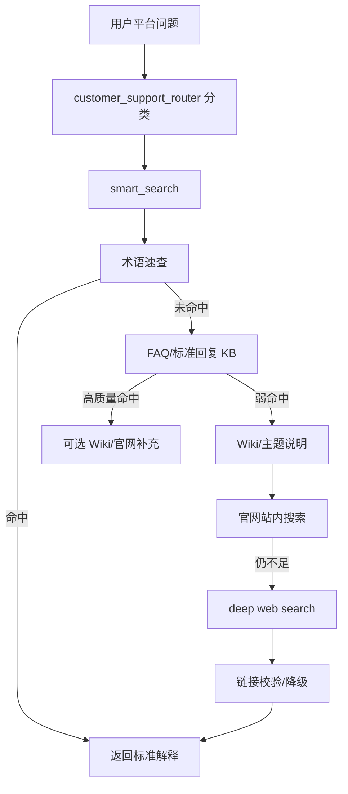

# 知识库与 smart_search 指南

本文只描述当前代码里的知识检索链路。实现文件：

- `src/skills/knowledge_qa/tools.py`
- `config/system_prompt_base.md`
- `config/profiles/customer_support.md`

## 1. 当前检索链路

`customer_support` 的平台问题只暴露 `knowledge bundle`，即 `smart_search`。



## 2. 搜索深度

| depth | 使用场景 | 搜索范围 |
| --- | --- | --- |
| `quick` | 平台术语、简单功能问答 | 术语速查 + FAQ + Wiki |
| `normal` | 平台排障、常规客服问题 | `quick` + 官网站内搜索 |
| `deep` | `normal` 仍不足、需要公开资料交叉验证 | `normal` + 联网深搜 |

路由策略：

- 平台知识默认 `quick`。
- 平台故障/异常/加载失败默认 `normal`。
- `quick` 弱命中自动升级到 `normal`。
- 排障问题 `normal` 仍空时升级到 `deep`。

## 3. 有效命中标准

认为可以直接回答：

- 术语速查命中，例如“绿点”“船舶颜色”“岸基值班”。
- FAQ 标准回复高质量命中。
- 官网搜索返回可访问链接和可用摘要。

认为弱命中或未命中：

- 返回包含“未找到精确的FAQ匹配”。
- 返回“未检索到足够可信”。
- 只有不带来源的摘要。
- 链接校验失败。

## 4. 链接规范

统一帮助中心：

```text
https://www.hifleet.com/helpcenter/?i18n=zh
```

规则：

- 不允许编造 URL。
- 不允许输出占位链接。
- `smart_search` 会对候选链接做可访问性校验。
- 无效链接会被移除，并回退到官方帮助中心。

## 5. 常用排障

### 5.1 平台问题误入船舶链路

示例：`HiFleet 轨迹加载失败怎么办`

期望：

- `route=knowledge`
- `task_type=platform_troubleshooting`
- `tool_bundle=["smart_search"]`

若误入 `ship_complex`，检查：

- `src/agents/customer_support_router.py` 中平台故障词是否优先于 voyage markers。
- 用户消息是否包含明确 MMSI/IMO/船名。

### 5.2 搜索太慢

检查：

- 是否简单问题被错误设为 `deep`。
- 是否链接校验数量过大。
- 是否多轮中重复搜索相同问题，缓存 TTL 是否生效。

相关环境变量：

```bash
SMART_SEARCH_CACHE_TTL_SEC=600
SMART_SEARCH_URL_TIMEOUT_SEC=2.0
SMART_SEARCH_URL_TOP_N=2
SMART_SEARCH_DEEP_VARIANTS_MAX=3
```

### 5.3 官网链接不可访问

处理：

1. 确认是否是 `help.hifleet.com` 历史链接。
2. 优先替换为统一帮助中心。
3. 不确定时不要输出该链接。

## 6. 回归验证

知识链路由客服回归覆盖：

```bash
.venv/bin/python scripts/hifleet_agent_regression.py
```

重点场景：

- `knowledge_glossary_fast`
- 平台故障类问题不误入船舶链路。
- 输出链接可访问或降级到官方帮助中心。

## 7. 维护知识内容

新增或更新 FAQ 后：

1. 确认数据集名称仍与代码一致：
   - `hifleet_cs_outputs_v2`
   - `hifleet_cs_wiki_v2`
2. 用典型用户问法跑 `smart_search(depth="quick")`。
3. 弱命中时补充关键词、标准问题或答案片段。
4. 跑客服回归，确认没有触发不必要 `deep`。

