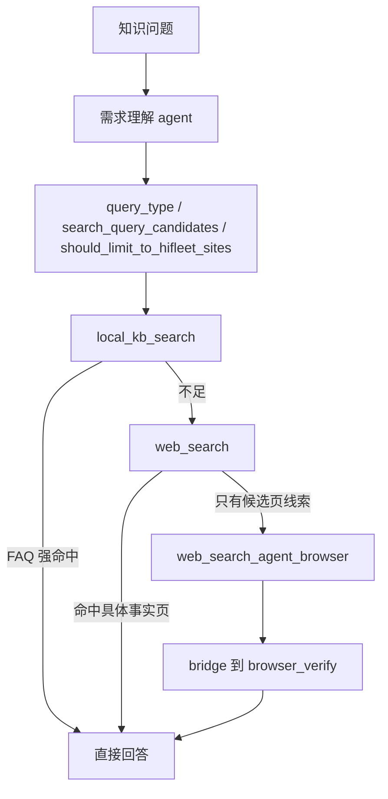

# 知识检索链指南

本文只描述当前代码里真实生效的知识检索链。当前设计不是“拆多个 skill”，而是：

- `knowledge_qa` 保持为一个 skill
- tool 层拆成三个主工具
- `smart_search` 仅作为兼容 facade 保留

实现文件：

- `src/skills/knowledge_qa/tools.py`
- `src/skills/knowledge_qa/local_kb_runtime.py`
- `src/skills/knowledge_qa/web_search_runtime.py`
- `src/skills/knowledge_qa/browser_bridge.py`
- `config/system_prompt_base.md`
- `config/profiles/customer_support.md`

## 1. 当前主链

`customer_support` 收到知识问题后，会先跑需求理解 agent，再进入 `knowledge_qa`。



固定升级顺序：

1. `local_kb_search`
2. `web_search`
3. `web_search_agent_browser`

约束：

- tool 只做本层事情，不在内部偷偷串下一层
- agent 或 `smart_search` facade 才负责编排
- browser 没有 `target_urls` 或明确 HiFleet 域提示时不允许裸跑

## 2. 首步需求理解如何影响检索

当前首步固定使用 `doubao-seed-2-0-lite-260428` 生成 understanding 契约。知识检索最关心这几个字段：

- `rewritten_user_need`
- `query_type`
- `search_keywords`
- `search_query_candidates`
- `should_prefer_local_kb`
- `should_limit_to_hifleet_sites`

影响方式：

- `execute_knowledge_chain()` 和 `execute_planned_knowledge_chain()` 优先使用 `search_query_candidates[0]` 作为主查询
- 不再默认套旧的 `_rewrite_hifleet_knowledge_query()` 模板
- browser 的 `site_hint` 优先使用 `should_limit_to_hifleet_sites`
- trace 中会落 `understanding_summary` 和 `retrieval_trace`

示例：

- `Hifleet筛选船队有记忆功能吗`
  - 主查询应接近 `hifleet 筛选船队 记忆功能`
- `今日长江水位`
  - 主查询应接近 `今日长江水位 长江海事局 交通运输部`
  - 不应误带 HiFleet 站点过滤

## 3. `knowledge_qa` 三工具

### 3.1 `local_kb_search`

第一版直接检索仓库内 `docs/RAG`，不依赖远端 KB recall。

数据源优先级：

- `docs/RAG/hifleet_cs_outputs/客服知识库结构化.jsonl`
- `docs/RAG/hifleet_cs_outputs/客服问答对.md`
- `docs/RAG/hifleet_cs_outputs/FAQ检索词.md`
- `docs/RAG/hifleet_cs_wiki/*.md`
- `docs/RAG/raw/产品文档/*.md`

当前行为：

- FAQ 强命中：`can_answer=true`
- 只有 wiki / 产品文档主题说明：`can_answer=false`，`should_continue=true`
- 完全 miss：`can_answer=false`，`should_continue=true`

返回重点：

- `items[].source_type`
- `items[].score`
- `trace.source_breakdown`

### 3.2 `web_search`

这是三工具里最核心的一层，负责“关键词式结构化联网搜索 + 结果分析”。

优先调用结构化搜索接口：

```text
POST https://open.feedcoopapi.com/search_api/web_search
Authorization: Bearer <API_KEY>
```

默认请求特征：

- `SearchType=web`
- `NeedSummary=true`
- `NeedUrl=true`
- `NeedContent=false`
- `ContentFormats=text`
- `QueryRewrite=false`

query 规则：

- 保留 2 到 5 个高信息量词块
- 产品问题优先：品牌词 + 功能词 + 判定词
- 公共数据问题优先：主题词 + 时效词 + 机构词
- 禁止自动补“产品功能 使用说明”这类泛化尾词

请求画像分三类：

- `hifleet_product`
- `authoritative_public_data`
- `general_public_info`

站点过滤规则：

- 只有 `hifleet_product` 允许 `Sites=HIFLEET_SITES`
- `authoritative_public_data` 禁止带 `Sites`
- `general_public_info` 默认不带 `Sites`

返回分析会补这些标签：

- `is_hifleet_official`
- `is_authoritative`
- `is_specific_page`
- `is_directory_page`
- `is_aggregated_page`
- `has_specific_fact`

结果评估规则：

- 具体官方页且摘要含明确事实：`can_answer=true`
- 权威公共页且摘要含日期/数值/机构信息：`can_answer=true`
- 只有目录页或聚合页：`should_continue=true`
- 有具体候选页但摘要不足：`continue_with=agent_browser`
- 若公共数据 query 却携带 `Sites`：标记 `risk_flags=["site_filter_polluted"]`

### 3.3 Ark fallback

只有结构化搜索失败时才允许退回 Ark 生成式联网搜索。

要求：

- 必须保留 `used_ark_fallback=true`
- 必须保留原始 `request_profile`
- 不允许 fallback 覆盖原始 query 类型判断或站点过滤策略

### 3.4 `web_search_agent_browser`

这个工具不独立做开放式搜索，只负责“目标页已锁定后抓正文”。

它只是 `knowledge_qa` 对 `browser_verify.agent_browser_deep_search` 的包装桥接：

- 负责把 `target_urls / site_hint / query` 整形成 browser 输入
- 负责把 browser 输出适配成 `knowledge_qa` 统一协议
- browser 失败时返回结构化失败，不伪装成功

严格限制：

- 没有 `target_urls` 且没有 HiFleet 域提示时，不运行
- 不允许把首页、社区目录页、帮助中心入口页当成成功证据

## 4. `smart_search` 当前定位

`smart_search` 仍保留，但已经不是推荐的新主入口。

它现在的角色是兼容 facade：

- 兼容旧 prompt
- 兼容旧 route
- 兼容旧测试

内部会尽量复用：

- `local_kb_search`
- `web_search`
- 必要时的 browser bridge

原则：

- 新逻辑优先写在三工具实现里
- 不要再把新能力只堆回 `smart_search`

## 5. 统一输出协议

三个主工具都返回 JSON 字符串，字段尽量统一：

- `tool`
- `query`
- `status`
- `can_answer`
- `should_continue`
- `continue_with`
- `confidence`
- `summary`
- `items`
- `best_urls`
- `recommended_next_action`
- `trace`

这样 agent 可以直接基于结构化字段决策，而不是从大段自然语言里反推下一步。

## 6. 链接规范

统一帮助中心：

```text
https://www.hifleet.com/helpcenter/?i18n=zh
```

规则：

- 不允许编造 URL
- 不允许输出占位链接
- 候选链接可访问性校验失败时，应剔除或降级到官方帮助中心

## 7. Linux 部署配置

当前项目启动入口 [src/main.py](/Users/raymondlu/LocalProject/AIPM/智能客服/客服开发/本地agent/hifleet-agent/src/main.py) 会在启动时加载：

```text
COZE_WORKSPACE_PATH/.env
```

Linux 服务器部署时需要确认：

1. `COZE_WORKSPACE_PATH` 指向实际工作目录
2. 对应目录下存在 `.env`
3. 进程启动用户对 `.env` 有读取权限

结构化联网搜索当前兼容这些环境变量名：

```bash
VOLC_WEB_SEARCH_API_KEY=
WEB_SEARCH_API_KEY=
TORCHLIGHT_API_KEY=
ARK_WEBSEARCH_API_KEY=
ark_websearch_api_key=
```

现网如果已经使用 `ark_websearch_api_key`，无需修改变量名即可命中结构化联网搜索逻辑。

## 8. 常用排障

### 8.1 公共数据 query 被 HiFleet 站点污染

示例：`今日长江水位`

期望：

- understanding 输出 `query_type=authoritative_public_data`
- `search_query_candidates[0]` 接近 `今日长江水位 长江海事局 交通运输部`
- `web_search.request_profile.Filter.Sites` 为空

若仍带 `Sites`，优先检查：

- `customer_support_router` 是否正确透传 `query_type`
- `web_search_runtime.looks_like_authoritative_data_query(...)`
- fallback trace 是否覆盖了真实请求画像

### 8.2 平台问题误入船舶链路

示例：`HiFleet 轨迹加载失败怎么办`

期望：

- `route=knowledge`
- `task_type=platform_troubleshooting`
- knowledge 检索应优先吃 understanding 产出的主查询

若误入船舶链路，检查：

- `src/agents/agent.py` 中 understanding prompt 或 schema 是否被近期修改
- 会话上下文是否错误继承了上一个船舶实体

### 8.3 搜索太慢

检查：

- 是否简单问题误升级到 browser
- 是否链接校验数量过大
- 是否多轮中重复搜索相同问题，缓存 TTL 是否生效

相关环境变量：

```bash
SMART_SEARCH_CACHE_TTL_SEC=600
SMART_SEARCH_URL_TIMEOUT_SEC=2.0
SMART_SEARCH_URL_TOP_N=2
SMART_SEARCH_DEEP_VARIANTS_MAX=3
VOLC_WEB_SEARCH_TIMEOUT_SEC=15
VOLC_WEB_SEARCH_DEFAULT_COUNT=5
```

### 8.4 结构化联网搜索未生效

现象：

- 日志里频繁出现 `Structured web search failed, fallback to Ark`
- `used_ark_fallback=true`
- 结果明显退化成“从生成文本里抽链接”

检查顺序：

1. 进程是否加载了正确的 `.env`
2. `ark_websearch_api_key` 或其他兼容变量名是否已注入进程环境
3. Linux 服务器是否能访问 `https://open.feedcoopapi.com/search_api/web_search`
4. 是否触发接口错误码：
   - `10403` 权限错误
   - `10406` 免费额度用尽
   - `700429` QPS 限流

### 8.5 `.venv-test` 下 router 测试导入失败

当前已知环境阻塞：

- `.venv-test` 缺少 `docker` Python 包
- 导致 `browser_verify` skill 导入失败
- 这会影响完整 `tests/test_customer_support_router.py`，不是本次知识链改造本身引入的问题

可先做的最小验证：

- `python3 -m py_compile`
- `tests/test_customer_support_intent_agent.py`
- `tests/test_smart_search_tools.py`

### 8.6 官网链接不可访问

处理：

1. 确认是否是 `help.hifleet.com` 历史链接
2. 优先替换为统一帮助中心
3. 不确定时不要输出该链接

## 9. 回归验证

知识链路由客服回归覆盖：

```bash
.venv/bin/python scripts/hifleet_agent_regression.py
```

重点场景：

- `knowledge_glossary_fast`
- `智能视频监控`
- `今日长江水位`
- `Hifleet筛选船队有记忆功能吗`
- 平台故障类问题不误入船舶链路
- 输出链接可访问或降级到官方帮助中心

## 10. 维护知识内容

新增或更新 FAQ 后：

1. 优先补 `docs/RAG` 对应 FAQ / wiki / 产品文档
2. 用典型用户问法验证 `local_kb_search`
3. 再验证 `web_search` 的 query 和 `Sites` 是否符合预期
4. 跑客服回归，确认没有触发不必要 browser 升级
