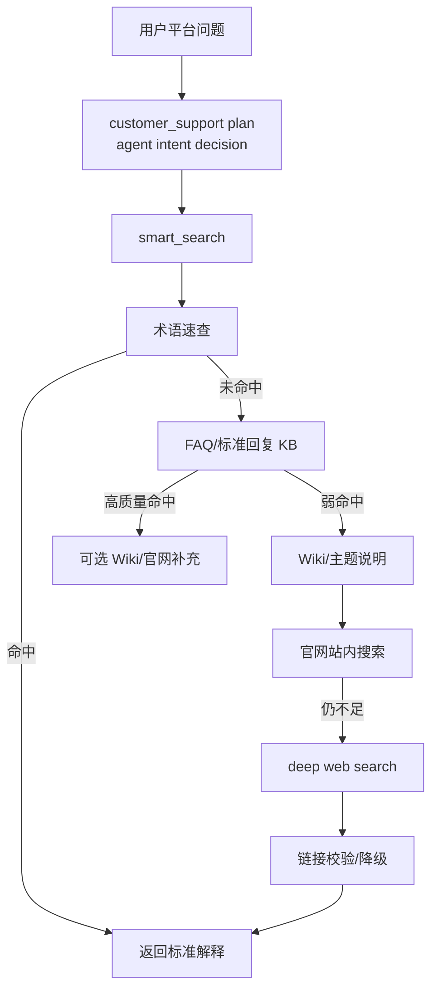

# 知识库与 smart_search 指南

本文只描述当前代码里的知识检索链路。实现文件：

- `src/skills/knowledge_qa/tools.py`
- `config/system_prompt_base.md`
- `config/profiles/customer_support.md`

## 1. 当前检索链路

`customer_support` 的平台问题在 `plan` 阶段被判定为 `knowledge` 后，只暴露 `knowledge bundle`，即 `smart_search`。



### 1.1 当前联网搜索实现

`smart_search` 的外部搜索层现在优先使用**结构化联网搜索 API**，只有结构化调用失败时才回退到 Ark 的生成式联网搜索。

优先调用：

```text
POST https://open.feedcoopapi.com/search_api/web_search
Authorization: Bearer <API_KEY>
```

当前使用方式：

- `web`
  - 用于 HiFleet 官网站内搜索
  - 用于 `normal` 模式的常规公开网页补充
- `web_summary`
  - 用于 `deep` 模式的多查询深搜
  - 优先拿结构化 `Summary` 和总结结果，而不是只依赖 `Snippet`

回退方式：

- 当结构化联网搜索调用失败
- 当 Linux 部署环境没有读到 API Key
- 当接口返回错误码或超时

此时才会退回 `_ark_web_search(...)`，以尽量保证不空答。

## 2. 搜索深度

| depth | 使用场景 | 搜索范围 |
| --- | --- | --- |
| `quick` | 平台术语、简单功能问答 | 术语速查 + FAQ + Wiki |
| `normal` | 平台排障、常规客服问题 | `quick` + 官网站内搜索 |
| `deep` | `normal` 仍不足、需要公开资料交叉验证 | `normal` + 联网深搜 |

路由策略：

- 平台知识默认 `quick`。
- 平台故障/异常/加载失败默认 `normal`。
- `quick` 弱命中自动升级到 `normal`。
- 排障问题 `normal` 仍空时升级到 `deep`。

### 2.1 `normal` 与 `deep` 的联网差异

`normal`：

- 优先 HiFleet 官网站内搜索
- 站内搜索会开启 `QueryRewrite`
- 必要时补一轮公开网页搜索

`deep`：

- 生成少量查询变体
- 每个变体优先用 `web_summary`
- 合并多个查询结果后按权威度排序
- 结果用于 agent 做证据归纳，不直接把搜索模板回给客户

## 3. 有效命中标准

认为可以直接回答：

- 术语速查命中，例如“绿点”“船舶颜色”“岸基值班”。
- FAQ 标准回复高质量命中。
- 官网搜索返回可访问链接和可用摘要。

认为弱命中或未命中：

- 返回包含“未找到精确的FAQ匹配”。
- 返回“未检索到足够可信”。
- 只有不带来源的摘要。
- 链接校验失败。

## 4. 链接规范

统一帮助中心：

```text
https://www.hifleet.com/helpcenter/?i18n=zh
```

规则：

- 不允许编造 URL。
- 不允许输出占位链接。
- `smart_search` 会对候选链接做可访问性校验。
- 无效链接会被移除，并回退到官方帮助中心。

## 5. 结构化联网搜索字段使用原则

`smart_search` 当前遵循以下字段使用规则：

1. `Summary` 优先于 `Snippet`
   - `Snippet` 只适合结果列表展示
   - agent 总结和客服回答优先使用 `Summary`

2. `AuthInfoLevel / AuthInfoDes` 参与来源排序
   - HiFleet 官方域名优先
   - 其他站点结合接口返回的权威等级做加权

3. `PublishTime` 作为时效判断辅助
   - 深搜和公开资料场景应尽量保留发布时间
   - 客服最终答复通常不直接展示所有时间字段，但 planner 审查时应可用

4. `Choices` 仅用于 `web_summary`
   - 用于提取接口生成的结构化总结
   - 不应把原始流式过程文本直接透传给客户

5. `CardResults` 当前不作为客服主答案依据
   - 如后续要接入天气、汇率、油价等结构化卡片，应单独设计映射逻辑

## 6. Linux 部署配置

当前项目启动入口 [src/main.py](/Users/raymondlu/LocalProject/AIPM/智能客服/客服开发/本地agent/hifleet-agent/src/main.py) 会在启动时加载：

```text
COZE_WORKSPACE_PATH/.env
```

Linux 服务器部署时需要确认：

1. `COZE_WORKSPACE_PATH` 指向实际工作目录
2. 对应目录下存在 `.env`
3. 进程启动用户对 `.env` 有读取权限

结构化联网搜索当前兼容这些环境变量名：

```bash
VOLC_WEB_SEARCH_API_KEY=
WEB_SEARCH_API_KEY=
TORCHLIGHT_API_KEY=
ARK_WEBSEARCH_API_KEY=
ark_websearch_api_key=
```

现网如果已经使用 `ark_websearch_api_key`，无需修改变量名即可命中结构化联网搜索逻辑。

## 7. 常用排障

### 7.1 平台问题误入船舶链路

示例：`HiFleet 轨迹加载失败怎么办`

期望：

- `route=knowledge`
- `task_type=platform_troubleshooting`
- `tool_bundle=["smart_search"]`

若误入船舶链路，检查：

- `src/agents/agent.py` 中客服意图判定 prompt 是否被近期修改。
- 会话上下文是否错误继承了上一个船舶实体。

### 7.2 搜索太慢

检查：

- 是否简单问题被错误设为 `deep`。
- 是否链接校验数量过大。
- 是否多轮中重复搜索相同问题，缓存 TTL 是否生效。

相关环境变量：

```bash
SMART_SEARCH_CACHE_TTL_SEC=600
SMART_SEARCH_URL_TIMEOUT_SEC=2.0
SMART_SEARCH_URL_TOP_N=2
SMART_SEARCH_DEEP_VARIANTS_MAX=3
VOLC_WEB_SEARCH_TIMEOUT_SEC=15
VOLC_WEB_SEARCH_DEFAULT_COUNT=5
```

### 7.3 结构化联网搜索未生效

现象：

- 日志里频繁出现 `Structured web search failed, fallback to Ark`
- 结果明显退化成“从生成文本里抽链接”

检查顺序：

1. 进程是否加载了正确的 `.env`
2. `ark_websearch_api_key` 或其他兼容变量名是否已注入进程环境
3. Linux 服务器是否能访问 `https://open.feedcoopapi.com/search_api/web_search`
4. 是否触发接口错误码：
   - `10403` 权限错误
   - `10406` 免费额度用尽
   - `700429` QPS 限流

### 7.4 官网链接不可访问

处理：

1. 确认是否是 `help.hifleet.com` 历史链接。
2. 优先替换为统一帮助中心。
3. 不确定时不要输出该链接。

## 8. 回归验证

知识链路由客服回归覆盖：

```bash
.venv/bin/python scripts/hifleet_agent_regression.py
```

重点场景：

- `knowledge_glossary_fast`
- 平台故障类问题不误入船舶链路。
- 输出链接可访问或降级到官方帮助中心。

## 9. 维护知识内容

新增或更新 FAQ 后：

1. 确认数据集名称仍与代码一致：
   - `hifleet_cs_outputs_v2`
   - `hifleet_cs_wiki_v2`
2. 用典型用户问法跑 `smart_search(depth="quick")`。
3. 弱命中时补充关键词、标准问题或答案片段。
4. 跑客服回归，确认没有触发不必要 `deep`。
