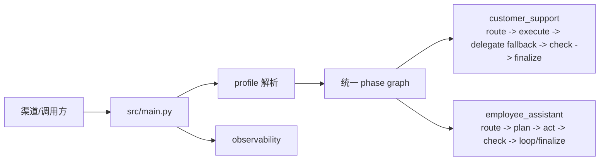

# HiFleet Agent 文档入口

本文是当前仓库文档索引。新同学或排障时先看这里，避免在历史文档中来回跳转。

## 推荐阅读顺序

| 目标 | 文档 |
| --- | --- |
| 快速学习 `customer_support` 当前实现、标准客服 Agent 组装方式、前后置 Guard、提示词与工具边界 | [CUSTOMER_SUPPORT_V3_AGENT_HARNESS_PROMPT_DESIGN.md](CUSTOMER_SUPPORT_V3_AGENT_HARNESS_PROMPT_DESIGN.md) |
| 理解当前 Agent 架构、customer_support 的 `route -> execute/delegate -> check -> finalize` 逻辑、profile 对比、流程图 | [AGENT_TECHNICAL_DOCUMENTATION.md](AGENT_TECHNICAL_DOCUMENTATION.md) |
| 接入 `/run`、`/stream_run`，处理多用户会话 | [API_MULTI_USER_INTEGRATION.md](API_MULTI_USER_INTEGRATION.md) |
| 管理台使用、日志查询、调试入口 | [ADMIN_BACKEND_SYSTEM_GUIDE.md](ADMIN_BACKEND_SYSTEM_GUIDE.md) |
| 客服 Agent 回归矩阵、execute/harness/browser/context 压缩验收、线上排障重点 | [CUSTOMER_SUPPORT_AGENT_REGRESSION.md](CUSTOMER_SUPPORT_AGENT_REGRESSION.md) |
| 异地服务器部署联调、远端回归、日志观察字段 | [CUSTOMER_SUPPORT_REMOTE_DEPLOYMENT_RUNBOOK.md](CUSTOMER_SUPPORT_REMOTE_DEPLOYMENT_RUNBOOK.md) |
| 给远端代码 Agent 的快速理解、检查、烟测提示词 | [CUSTOMER_SUPPORT_REMOTE_AGENT_PROMPT.md](CUSTOMER_SUPPORT_REMOTE_AGENT_PROMPT.md) |
| `agent-browser` 受控兜底策略、HiFleet 页面抓取与 Bing 检索方式 | [agent_browser_fallback_integration.md](agent_browser_fallback_integration.md) |
| 知识库与 `smart_search` 分层检索 | [KNOWLEDGE_BASE_GUIDE.md](KNOWLEDGE_BASE_GUIDE.md) |
| 内部员工表格/Python 沙盒闭环 | [EMPLOYEE_ASSISTANT_SANDBOX_RUNBOOK.md](EMPLOYEE_ASSISTANT_SANDBOX_RUNBOOK.md) |

## 当前主链路

## 文档维护规则

- 架构变化先更新 `AGENT_TECHNICAL_DOCUMENTATION.md`。
- `customer_support` 的主链、上下文策略、browser fallback 变化，先更新 `AGENT_TECHNICAL_DOCUMENTATION.md` 和 `agent_browser_fallback_integration.md`。
- 异地部署与远端回归变化，更新 `CUSTOMER_SUPPORT_REMOTE_DEPLOYMENT_RUNBOOK.md`；如果会影响远端 Agent 接手流程，同步更新 `CUSTOMER_SUPPORT_REMOTE_AGENT_PROMPT.md`。
- 新增客服回归场景先更新 `scripts/hifleet_agent_regression.py`，再更新 `CUSTOMER_SUPPORT_AGENT_REGRESSION.md`。
- 一次性导入报告、过期方案和历史记录放入 `docs/archive/`，不要作为主入口。
- 文档中不要写入 API key、token、数据库密码或真实用户隐私数据。
