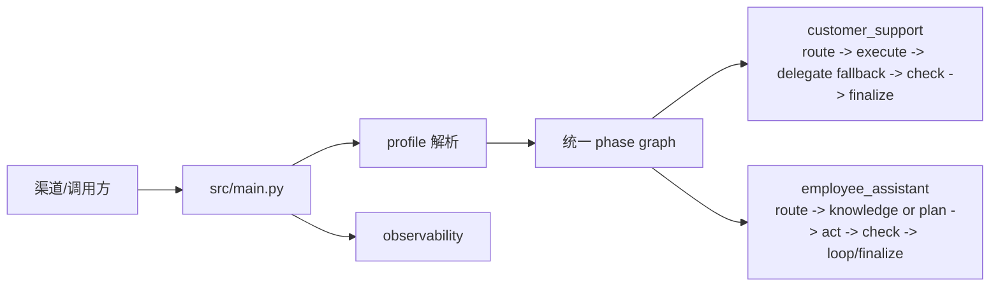

# HiFleet Agent 文档入口

本文是当前仓库文档索引。目标是让新同学先看到“现状文档”，再按需要进入回归、部署或历史设计稿。

## 推荐阅读顺序

先读下面 5 份，足够理解当前客服链路和下一阶段收敛方向：

| 目标 | 文档 |
| --- | --- |
| 理解当前 Agent 架构、`customer_support` 主链、需求理解 agent、knowledge route 与工具边界 | [AGENT_TECHNICAL_DOCUMENTATION.md](AGENT_TECHNICAL_DOCUMENTATION.md) |
| 查看最近几轮开发日志的压缩总结，并为“以 `employee_assistant` 为主线收敛架构”做准备 | [EMPLOYEE_ASSISTANT_MAINLINE_PREP.md](EMPLOYEE_ASSISTANT_MAINLINE_PREP.md) |
| 理解知识检索链、`knowledge_qa` 单 skill / 三工具 / `smart_search` 兼容层 | [KNOWLEDGE_BASE_GUIDE.md](KNOWLEDGE_BASE_GUIDE.md) |
| 查看客服主链回归矩阵、测试入口、验收标准、环境阻塞说明 | [CUSTOMER_SUPPORT_AGENT_REGRESSION.md](CUSTOMER_SUPPORT_AGENT_REGRESSION.md) |
| 接入 `/run`、`/stream_run`，处理多用户会话 | [API_MULTI_USER_INTEGRATION.md](API_MULTI_USER_INTEGRATION.md) |
| 异地服务器部署联调、远端回归、日志观察字段 | [CUSTOMER_SUPPORT_REMOTE_DEPLOYMENT_RUNBOOK.md](CUSTOMER_SUPPORT_REMOTE_DEPLOYMENT_RUNBOOK.md) |

按专题补充阅读：

| 目标 | 文档 |
| --- | --- |
| 管理台使用、日志查询、调试入口 | [ADMIN_BACKEND_SYSTEM_GUIDE.md](ADMIN_BACKEND_SYSTEM_GUIDE.md) |
| `agent-browser` 受控兜底策略、HiFleet 页面抓取方式 | [agent_browser_fallback_integration.md](agent_browser_fallback_integration.md) |
| 给远端代码 Agent 的快速理解、检查、烟测提示词 | [CUSTOMER_SUPPORT_REMOTE_AGENT_PROMPT.md](CUSTOMER_SUPPORT_REMOTE_AGENT_PROMPT.md) |
| 内部员工表格/Python 沙盒闭环 | [EMPLOYEE_ASSISTANT_SANDBOX_RUNBOOK.md](EMPLOYEE_ASSISTANT_SANDBOX_RUNBOOK.md) |

历史设计稿与演进记录：

| 目标 | 文档 |
| --- | --- |
| 查看已归档的历史设计稿、旧版方案与阶段性报告 | [archive/](archive/) |

## 当前主链路

## 当前收敛方向

当前代码仍同时保留 `customer_support` 与 `employee_assistant` 两个 profile，但最近几轮修复已经把以下能力逐步统一：

- 三层知识链：`local_kb_search -> web_search -> web_search_agent_browser`
- 历史压缩上下文
- 多模态输入标准化与 direct perception
- `employee_assistant` 的纯文本 knowledge 快捷主链

因此，后续架构演进默认应优先参考：

- 统一执行内核
- `customer_support` 更偏向外部客户输出策略层
- `employee_assistant` 更接近未来主执行骨架

详细背景见 [EMPLOYEE_ASSISTANT_MAINLINE_PREP.md](EMPLOYEE_ASSISTANT_MAINLINE_PREP.md)。

## 文档维护规则

- 架构变化先更新 `AGENT_TECHNICAL_DOCUMENTATION.md`。
- 若变化会影响“统一到 `employee_assistant` 主线”的判断，同步更新 `EMPLOYEE_ASSISTANT_MAINLINE_PREP.md`。
- `customer_support` 的主链、需求理解 agent、上下文策略变化，先更新 `AGENT_TECHNICAL_DOCUMENTATION.md`。
- `knowledge_qa` 的工具顺序、query 生成、站点过滤、browser 升级规则变化，先更新 `KNOWLEDGE_BASE_GUIDE.md` 和 `src/skills/knowledge_qa/SKILL.md`。
- `browser` 受控兜底策略变化，再同步更新 `agent_browser_fallback_integration.md`。
- 异地部署与远端回归变化，更新 `CUSTOMER_SUPPORT_REMOTE_DEPLOYMENT_RUNBOOK.md`；如果会影响远端 Agent 接手流程，同步更新 `CUSTOMER_SUPPORT_REMOTE_AGENT_PROMPT.md`。
- 新增客服回归场景先更新 `scripts/hifleet_agent_regression.py`，再更新 `CUSTOMER_SUPPORT_AGENT_REGRESSION.md`。
- 一次性导入报告、过期方案和历史记录放入 `docs/archive/`，不要作为主入口。
- 文档中不要写入 API key、token、数据库密码或真实用户隐私数据。
