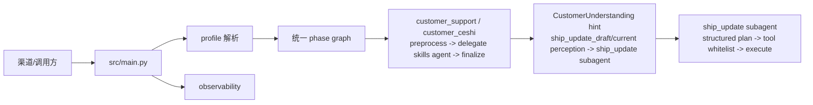

# HiFleet Agent 文档入口

本文是当前仓库文档索引。目标是让新同学先看到“现状文档”，再按需要进入回归、部署或历史设计稿。

## 推荐阅读顺序

先读下面 3 份，足够理解当前客服链路、ship_update 特殊分支、日志排障和回归验收：

| 目标 | 文档 |
| --- | --- |
| 理解当前 Agent 架构、`customer_support` 轻量 graph、`ship_update` 子 agent、knowledge/browser/ship 工具边界 | [AGENT_TECHNICAL_DOCUMENTATION.md](AGENT_TECHNICAL_DOCUMENTATION.md) |
| 异地服务器部署联调、远端回归、ship_update 日志观察字段与误路由排障 | [CUSTOMER_SUPPORT_REMOTE_DEPLOYMENT_RUNBOOK.md](CUSTOMER_SUPPORT_REMOTE_DEPLOYMENT_RUNBOOK.md) |
| 查看客服主链回归矩阵、ship_update 验收标准、负例场景与环境阻塞说明 | [CUSTOMER_SUPPORT_AGENT_REGRESSION.md](CUSTOMER_SUPPORT_AGENT_REGRESSION.md) |

按专题补充阅读：

| 目标 | 文档 |
| --- | --- |
| 接入 `/run`、`/stream_run`，处理多用户会话、微信旧接口和 Profile 选择 | [API_MULTI_USER_INTEGRATION.md](API_MULTI_USER_INTEGRATION.md) |
| 理解 `customer_ceshi` 当前链路、`ship_update_draft`、目的港/ETA 风险边界和 readable trace | [CUSTOMER_CESHI_ARCHITECTURE.md](CUSTOMER_CESHI_ARCHITECTURE.md) |
| 理解客服知识检索、平台操作类证据收口、授权写库和运维回归 | [CUSTOMER_SUPPORT_KB_OPERATIONS.md](CUSTOMER_SUPPORT_KB_OPERATIONS.md) |
| 深入理解 `knowledge_qa` 单 skill / 三工具 / `smart_search` 兼容层 | [KNOWLEDGE_BASE_GUIDE.md](KNOWLEDGE_BASE_GUIDE.md) |
| 管理台使用、日志查询、调试入口 | [ADMIN_BACKEND_SYSTEM_GUIDE.md](ADMIN_BACKEND_SYSTEM_GUIDE.md) |
| `agent-browser` 受控兜底策略、HiFleet 页面抓取方式、Linux `--no-sandbox` 实测注意点 | [agent_browser_fallback_integration.md](agent_browser_fallback_integration.md) |
| 历史内部测试表格/Python 沙盒闭环 | [archive/CUSTOMER_CESHI_SANDBOX_RUNBOOK.md](archive/CUSTOMER_CESHI_SANDBOX_RUNBOOK.md) |

历史设计稿与演进记录：

| 目标 | 文档 |
| --- | --- |
| 查看已归档的历史设计稿、旧版方案与阶段性报告 | [archive/](archive/) |
| 查看已归档的远端代码 Agent 派生提示词与一次性说明 | [archive/CUSTOMER_SUPPORT_REMOTE_AGENT_PROMPT.md](archive/CUSTOMER_SUPPORT_REMOTE_AGENT_PROMPT.md) |

## 当前主链路

## 当前收敛方向

当前代码保留两个 canonical profile：`customer_support` 与 `customer_ceshi`。`employee_assistant` 仅作为兼容别名存在，运行时会规范化为 `customer_support`。Profile 只由请求体 `agent_profile` 或请求头 `x-agent-profile` 决定，缺省回退 `customer_support`；`source_channel` 仅用于日志和后台筛选。

最近几轮修复已经把以下能力逐步统一：

- 三层知识链：`local_kb_search -> web_search -> web_search_agent_browser`
- ship_update 子 agent 结构化计划、`ship_update_draft` 跨轮补字段、当前轮优先和写前 trace 记录
- 平台操作/问题反馈类问题的 3 到 5 组关键词多轮检索与证据充分性复核
- 授权知识库维护：`knowledge_admin.upsert_local_kb_entry`
- 完整会话上下文交给 agent/checkpointer 处理，历史多媒体内容仅做安全脱敏
- 多模态输入标准化与 direct perception
- `customer_ceshi` 使用同一轻量客服 graph，并通过 `ship_update` 子 agent、`ship_update_draft`、兼容 pending 视图和 readable trace 验证高风险写入链路

## 文档维护规则

- 架构变化先更新 `AGENT_TECHNICAL_DOCUMENTATION.md`。
- `customer_ceshi` 专属链路、`ship_update_draft`、目的港/ETA 风险边界和 readable trace 变化，更新 `CUSTOMER_CESHI_ARCHITECTURE.md`。
- `customer_support` 的主链、多模态预处理、ship_update 特殊分支、工具边界、上下文策略变化，只在 `AGENT_TECHNICAL_DOCUMENTATION.md` 维护。
- 客服知识检索、平台操作类收口、授权写库变化，先更新 `CUSTOMER_SUPPORT_KB_OPERATIONS.md`；底层三工具协议变化再同步 `KNOWLEDGE_BASE_GUIDE.md` 和 `src/skills/knowledge_qa/SKILL.md`。
- `browser` 受控兜底策略变化，再同步更新 `agent_browser_fallback_integration.md`。
- 异地部署与远端回归、日志排障字段、误路由案例，只在 `CUSTOMER_SUPPORT_REMOTE_DEPLOYMENT_RUNBOOK.md` 维护。
- 新增客服回归场景、验收矩阵与 ship_update 负例，只在 `CUSTOMER_SUPPORT_AGENT_REGRESSION.md` 维护。
- 派生提示词、一次性联调说明、远端接手脚本一律归档，不再作为并行事实来源维护。
- 一次性导入报告、过期方案和历史记录放入 `docs/archive/`，不要作为主入口。
- 文档中不要写入 API key、token、数据库密码或真实用户隐私数据。
