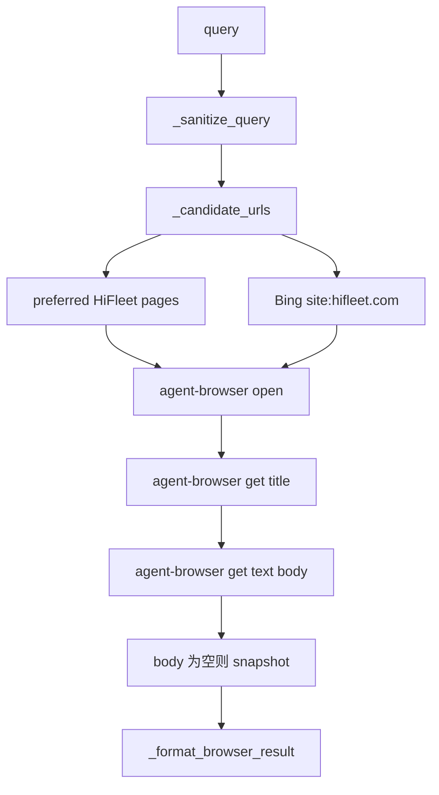

# Agent-Browser 受控兜底集成说明

## 1. 当前定位

当前 `agent-browser` 已经接入 `customer_support` 主链，但不是作为自由浏览器 Agent 暴露给 LLM，而是作为知识检索链路的最后一层受控兜底。

它只在以下条件同时满足时触发：

1. 当前问题被路由到 `knowledge`
2. `smart_search` 未命中有效官方/知识库内容
3. 工具白名单里包含 `agent_browser_deep_search`

## 2. 实际接入点

### 2.1 路由工具束

文件：[src/agents/customer_support_router.py](/Users/raymondlu/LocalProject/AIPM/智能客服/客服开发/本地agent/hifleet-agent/src/agents/customer_support_router.py)

- `KNOWLEDGE_BUNDLE = ["smart_search", "agent_browser_deep_search"]`
- `BROWSER_VERIFY_BUNDLE = ["verify_public_page", "smart_search", "agent_browser_deep_search"]`

这意味着：

- 平台知识问答默认就允许知识检索 + browser 兜底
- 网页核验链路也能复用 `agent-browser`

### 2.2 主链触发位置

`customer_support` 当前主图是：

```text
route -> execute -> check -> finalize
            \-> delegate -> check -> finalize
```

真正触发 `agent-browser` 的位置在：

1. `execute_node(...)`
2. `build_customer_support_plan(...)`
3. `execute_planned_knowledge_chain(...)`
4. `execute_knowledge_chain(...)`

也就是说，`agent-browser` 是被 `execute` 分支里的 knowledge 链显式调用的，不是 delegate 标准 Agent 自己随意决定。

## 3. 当前实现细节

### 3.1 工具实现

文件：[src/skills/browser_verify/tools.py](/Users/raymondlu/LocalProject/AIPM/智能客服/客服开发/本地agent/hifleet-agent/src/skills/browser_verify/tools.py)

当前核心函数：

- `verify_public_page(url)`
- `agent_browser_deep_search(query)`
- `_preferred_hifleet_candidates(query)`
- `_bing_search_candidates(query)`
- `_candidate_urls(query)`
- `_browser_capture_page_text(url)`

### 3.2 检索优先级

`agent_browser_deep_search(query)` 当前优先抓 HiFleet 公开页面，再用 Bing 做补充候选。

优先页面包括：

- `https://www.hifleet.com/`
- `https://www.hifleet.com/wp/communities`
- `https://www.hifleet.com/wp/community/`
- `https://www.hifleet.com/data/index.html`
- `https://www.hifleet.com/helpcenter/?i18n=en`
- `https://www.hifleet.com/account/index.html?type=account`

### 3.3 抓取流程



### 3.4 Bing 的使用方式

当前不是通用全网搜，而是：

- 通过 Bing HTML 搜索页拿候选 URL
- 查询词强制偏向 `site:hifleet.com`
- 若用户 query 本身没带 `HiFleet`，会补 `HiFleet` 再搜

这样做的目的是把外网检索尽量收敛到 HiFleet 官方公开内容。

## 4. 当前安全边界

`agent-browser` 当前有以下限制：

- 禁止 `localhost`、`127.0.0.1`、`.local`
- 仅允许 `http/https`
- 不处理登录态
- 不传 Cookie
- 不抓浏览器日志
- query 会做长度限制和注入字符过滤
- 输出最终仍要经过 `sanitize_customer_output(...)`

## 5. 当前触发策略

### 5.1 `execute_knowledge_chain(...)`

当 `smart_search` 返回无有效结果时：

1. 设置 `trace.fallback_reason = "smart_search_empty_agent_browser_fallback"`
2. 调 `agent_browser_deep_search`
3. 若抓到有效公开内容，则用 browser 结果继续收口

### 5.2 `execute_planned_knowledge_chain(...)`

planner 知识链里也有同样兜底：

1. 先按 `search_plan` 执行 `smart_search`
2. 若全部结果都判为 `no hit`
3. 再调 `agent_browser_deep_search`
4. 并把结果记成 `public_web` 证据项

## 6. 开发人员如何理解这块代码

建议按下面顺序阅读：

1. [src/agents/agent.py](/Users/raymondlu/LocalProject/AIPM/智能客服/客服开发/本地agent/hifleet-agent/src/agents/agent.py)
   - 看 `execute_node(...)`
2. [src/agents/customer_support_router.py](/Users/raymondlu/LocalProject/AIPM/智能客服/客服开发/本地agent/hifleet-agent/src/agents/customer_support_router.py)
   - 看 `KNOWLEDGE_BUNDLE`
   - 看 `build_customer_support_plan(...)`
   - 看 `execute_knowledge_chain(...)`
   - 看 `execute_planned_knowledge_chain(...)`
3. [src/skills/browser_verify/tools.py](/Users/raymondlu/LocalProject/AIPM/智能客服/客服开发/本地agent/hifleet-agent/src/skills/browser_verify/tools.py)
   - 看候选 URL 生成和 agent-browser 抓取逻辑
4. [tests/test_customer_support_router.py](/Users/raymondlu/LocalProject/AIPM/智能客服/客服开发/本地agent/hifleet-agent/tests/test_customer_support_router.py)
   - 看 browser fallback 的回归用例

## 7. 异地服务器联调建议

如果项目部署在另一台 Linux 服务器上，建议按这个顺序排查：

1. 确认 `agent-browser` 命令可执行
2. 确认服务器可以访问：
   - HiFleet 官网
   - HiFleet 帮助中心
   - Bing 搜索页
3. 用 `tests/test_customer_support_router.py` 先做本地单测
4. 再通过 `/run` 或 `/stream_run` 发送知识类问题做联调
5. 观察：
   - `generated_tool_calls`
   - `route_trace.fallback_reason`
   - 最终回复是否有公开页面摘要

## 8. 当前不是它该做的事

为了避免误解，下面这些目前都不属于 `agent-browser` 在本项目里的职责：

- 模拟用户登录 HiFleet
- 在站内做复杂点击流程
- 作为任意问题的通用浏览器代理
- 代替知识库成为主检索入口
- 在 customer reply 中暴露浏览器执行细节
