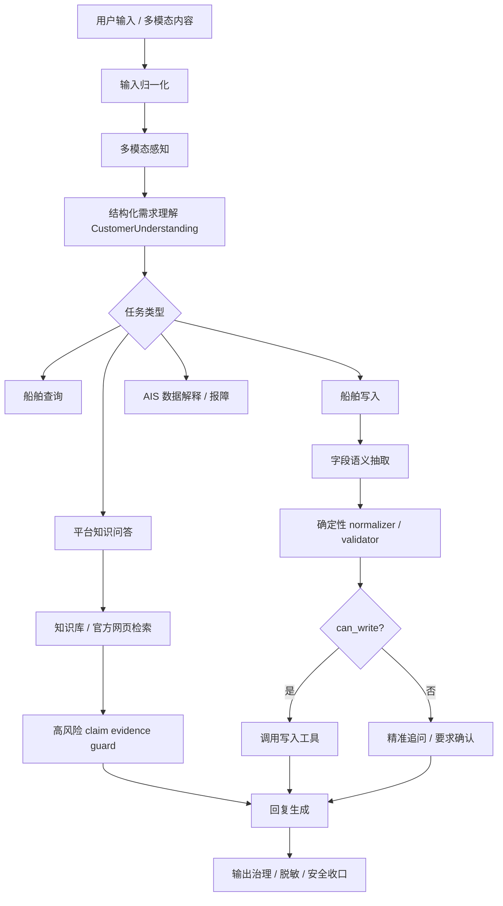

# Customer Support Agent P0 Optimization

## 1. 当前问题背景

当前 `customer_support` 主链是轻量 LangGraph 外壳包裹标准 tool-calling Agent。它已经具备多渠道输入归一化、工具调用、船舶写入预检和输出脱敏能力，但在企业客服场景里仍存在三个 P0 风险：

- 平台功能类问题可能在证据不足时生成看似完整的操作教程。
- 目的港 / ETA 场景容易把客服后台处理能力误说成普通用户前台自助功能。
- 船舶写入参数抽取偏正则，遇到非标准坐标、语音转写或 OCR 文本时容易误判缺字段。

典型错误边界：普通用户前台未确认开放自助编辑目的港 / ETA 入口；`reports@hifleet.com` 不应被描述为文本邮件自动更新目的港 / ETA 的入口；目的港 / ETA 属 AIS 静态信息，平台展示可能存在滞后。

## 2. 优化后的架构



本轮没有重写完整 graph，而是在现有 `preprocess -> delegate -> finalize` 轻量链路中增加：

- 结构化理解结果写入 `route_trace.reasoning_trace.understanding_result`。
- 目的港 / ETA 前台功能、邮箱用途、AIS 延迟解释场景在 `CustomerUnderstanding` 中标记为非写入。
- 最终回复后的规则版 high-risk claim guard。
- 船位写入字段的语义抽取 + 确定性归一化校验。

## 3. 核心模块职责

| 模块 | 职责 |
| --- | --- |
| `customer_support_understanding.py` | 统一理解用户意图，输出 `CustomerUnderstanding`，包括 `operation_type`、`ship_update_candidate`、`pending_action`、`non_write_reason` 和候选字段 |
| `customer_support_scenarios.py` | 目的港 / ETA 等高风险场景分流 |
| `customer_support_evidence_guard.py` | 拦截无证据平台功能声明 |
| `ship_update_extractor.py` | 结构化抽取船舶写入字段，默认确定性实现，预留 LLM schema 接口 |
| `ship_update_normalizer.py` | 坐标、时间、数值字段归一化和校验 |
| `write_preflight_guard` | 只在 `CustomerUnderstanding` 判定为写入候选或 active pending 恢复时进入 harness；最终是否调用写入工具由 `execute_update_chain` 校验 |

## 4. 典型场景链路

### 平台功能咨询

用户问“怎么在平台手动更新目的港 / ETA”时，理解层标记 `frontend_capability_question=true`、`evidence_required=true`，不会进入写入工具链。无明确证据时返回保守口径：当前未查到普通用户前台自助编辑入口，可提供 MMSI 由客服协助。

### 目的港 / ETA 为什么没更新

用户问“船上已经改了，平台为什么没变”时，分流为 `AIS_DELAY_EXPLANATION`。回复说明目的港 / ETA 属 AIS 静态信息，更新频率低于动态船位，展示可能滞后，并引导提供 MMSI 和最新信息。

### 用户请求客服后台代更新

用户明确说“帮我把 MMSI xxx 目的港改成 Shanghai”时，理解为后台代操作请求，进入静态信息更新 harness 校验。前台能力咨询仍走知识/证据链，不调用后台写工具。

### 格式不统一的船位更新

例如：

```text
更新船位，mmsi：730285526，更新时间：22026-07-04 15:36，经度：038°48.771′ E，纬度：19°40.094′ N，船艏向：166
```

字段抽取可识别 MMSI、DMM 坐标、航速、船艏向、航迹向和吃水；normalizer 会判断 `22026` 疑似年份多输入一个 `2`，不自动修正写入，而是要求用户确认。

## 5. 回归测试说明

P0 测试覆盖：

- 不再虚构网页端目的港 / ETA 编辑按钮。
- 不再虚构 `reports@hifleet.com` 文本邮件自动解析 ETA。
- 最终回复 high-risk claim guard 能重写无证据平台功能声明。
- 识别 `038°48.771′ E`、`19°40.094′ N`。
- 识别 `22026-07-04 15:36` 为疑似错误时间，并给出 `2026-07-04 15:36` 建议。
- 识别 `船艏向` 为 `heading`。
- 坐标缺 E/W/N/S 时不允许写入。
- 字段完整合法时才调用 `upload_ship_position`。

## 6. 后续优化方向

- 增加 LLM JSON schema extractor，并与当前确定性 extractor 交叉校验。
- 继续增强 LLM JSON schema extractor 与 deterministic parser 的一致性校验，减少 OCR 和语义抽取冲突。
- 建设 claim-level evidence judge，对每条平台功能声明输出 `supported / unsupported / missing_evidence`。
- 标准化工具返回结构，减少最终回复阶段对原始文本的依赖。
- 固化 `route_trace` 字段版本，方便后台排障和回归测试。
- 建设产品功能边界知识表，由产品、客服、开发共同维护。
