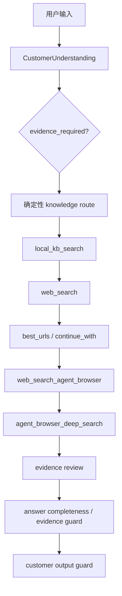

# HiFleet 客服检索链审计（2026-07-13）

## 当前真实架构

- `CustomerUnderstanding` 在 `src/agents/customer_support_understanding.py` 以规则构造 `evidence_required`；平台入口、网页端、自动解析、立即生效等问题会启用强证据要求。
- 主确定性链位于 `src/agents/customer_support_router.py` 的 `execute_planned_knowledge_chain`：每个查询按本地知识、结构化网页、页面正文核验顺序执行，并将证据交给 `review_evidence_items`。
- `local_kb_search`、`web_search`、`web_search_agent_browser` 是 `knowledge_qa` 的真实注册工具；`verify_public_page` 与 `agent_browser_deep_search` 是 `browser_verify` 的真实注册工具。
- `smart_search` 是兼容 facade，不是新主链唯一入口。标准 tool-calling agent 仍可自行选择工具；确定性知识链由 router 控制。
- `finalize` 的客户输出清理由 `sanitize_customer_output` 和高风险证据 guard 完成，避免暴露工具、内部 trace、路径与凭据。

## 注册检查

使用 `SkillLoader.get_tools_by_skill_names` 实测：

| Skill | 已注册工具 |
| --- | --- |
| `knowledge_qa` | `local_kb_search`、`web_search`、`web_search_agent_browser` |
| `browser_verify` | `verify_public_page`、`agent_browser_deep_search` |

## 请求与证据契约

### `web_search`

- 请求构造由 `src/skills/knowledge_qa/tools.py` 与 `web_search_runtime.py` 负责；HiFleet 产品问题自动限制官方域，权威公共数据问题不强制官网。
- 响应包含 `status`、`can_answer`、`should_continue`、`continue_with`、`items`、`best_urls` 和 trace。
- 主接口失败后尝试 Ark fallback；两者均失败时现在返回 `status=unavailable`，trace 的 `failure_code` 区分 primary/fallback 异常类型，不把失败伪装成“未命中”。
- `block_hosts` 会进入请求 trace 的 `Filter.BlockHosts`，并在本地后过滤结果；已用安全加载的部署 `.env` 真实调用验证 trace 与返回 items 一致。

### Browser

- `web_search_agent_browser` 将 `best_urls` 或无 URL 的短关键词转交给 `agent_browser_deep_search`。
- browser 使用真实 `agent-browser` CLI 会话；候选页抓取失败、不可用、无候选均返回结构化状态。
- bridge 仅将**HiFleet 官方、具体页面、非目录页、且与查询有匹配**的正文作为可回答证据。官网首页、社区目录、帮助中心入口即使可抓取，也不再产生 `can_answer=true`。
- `verify_public_page` 增加 DNS/IP 公网校验和逐跳重定向校验，拒绝 loopback、私网、link-local、保留地址及重定向到这类地址的请求。

## 发现与修复

### P0：页面验证 SSRF 防护不足（已修复）

旧逻辑仅拒绝 `localhost`/`.local`，不能阻止 DNS 解析到私网或公网 URL 重定向到私网。现已在 `src/skills/browser_verify/tools.py` 增加地址解析、IP 全局可路由性校验和手动重定向逐跳校验。

### P1：browser 将目录页视为正文证据（已修复）

真实运行可抓取官网首页/社区目录并返回页面文本，原 bridge 只要有 `pages` 就 `can_answer=true`。现已在 `src/skills/knowledge_qa/browser_bridge.py` 拒绝目录、首页、非具体页和无关页，状态为 `generic_or_irrelevant_page`。

### P1：结构化搜索双失败不可诊断（已修复）

旧调用会在主接口失败后调用 Ark；若 Ark 同样缺配置则向上传播泛化 `RuntimeError`。现返回客户链可处理的 `status=unavailable`，并记录 `web_search_unavailable:primary=...;fallback=...`。

### P2：查询改写可能丢失核心技术限定词（已修复）

HiFleet 产品规则以前只保留固定产品标签，容易丢失 `CCTV`、`GB28181`、`接入`、`价格`、`异常` 等限定词。现在将这些关键短语保真加入改写查询，并把产品 query 上限由 5 提升到 8。

## 修改前后指标（本环境）

| 指标 | 修改前实测 | 修改后实测 |
| --- | ---: | ---: |
| focused unit tests | 167（全基线）通过 | 180（全套）通过 |
| 结构化搜索无凭据结果 | RuntimeError | `unavailable` + failure code |
| browser 目录页 `can_answer` | 3/3 实测为 true | 3/3 实测为 false |
| browser 调用延迟 | 40.2–58.5s | 40.6–58.5s（未增加调用） |
| browser 成功率（具体相关页） | 0/3 | 0/3（保守拒绝，不伪造成功） |
| 查询核心词保留 | 未覆盖 | CCTV/GB28181/接入/价格/异常 单测覆盖 |

本次已完成凭据支持的 structured-search、browser 和当前 worktree `/run` trace 实测；由于样本量只有 3 个查询，尚不能把单次延迟当作稳定的 p50/p95、Ark fallback 比例或长期 Precision@3 基线。生产环境应持续采集这些指标。

## 文档与代码差异

- `customer_support.md` 描述“无 target_urls 可用短关键词 browser fallback”，代码路径确实可达。
- 文档对 browser 的“抓取即证据”表述不足；实际应满足具体页面和相关性门槛，本次已在 bridge 中实现。
- 现有 docs 没有说明主接口与 Ark 同时不可用的结构化状态；本审计补充了该部署限制。

## 部署限制与建议

1. 生产部署执行 `PYTHONPATH=src .venv/bin/python scripts/test_web_search_live.py`，脚本会安全读取项目 `.env` 而不回显凭据；保留脱敏 JSON 作为上线证据。
2. browser 当前约 40–58 秒/次，仍只应作为最后一轮核验；后续应增加整体预算与页面/候选提前终止指标。
3. 对实际远端 `BlockHosts` 行为补充带可控公开域的集成测试，验证请求 trace 与服务端过滤结果一致。
4. 在 `/run` 可用的部署环境执行三类样例（教程、故障、CCTV/GB28181）并保存无敏感信息的 retrieval trace。

## 追加验收（2026-07-13）

### 确定性链修复

- `block_hosts` 现在同时传入结构化搜索请求的 `Filter.BlockHosts`，并对返回项做本地 host 后过滤；trace 明确记录 `block_hosts_applied_locally` 与 `blocked_result_count`。这避免“trace 声称已屏蔽而实际请求未传参”的不一致。
- browser 不再以“被触发”作为多 query 停止条件。每个查询记录 `t2_attempted`、`t2_status`、`t2_can_answer`、`t2_page_count`、`t2_relevant_page_count`、`t2_failure_code`；只有存在可支持回答的相关页面才停止。
- `web_search` 没有 `best_urls` 时，若问题需要强证据，确定性链会以短关键词、空 `target_urls` 和 `site_hint=hifleet.com` 继续触发 browser fallback。
- `agent_browser_deep_search` 现在会探测 CLI，并返回 `browser_cli_missing`、`browser_doctor_failed`、`browser_open_timeout`、`browser_empty_body`、`browser_irrelevant_page`、`browser_no_candidates` 等结构化状态；每轮结束后尝试关闭 session。
- browser 页面返回 `specific_page`、`query_term_coverage`、`body_quality`、`fact_evidence_count`、`step_evidence_count`、`relevance_score`、`can_support_answer`。bridge 只接受 `can_support_answer=true` 的页面。
- 对 `evidence_required=true`，若页面核验已尝试但没有可支持页面，最终回答改为保守核验提示，不会把无关本地 KB 片段拼成完整操作答案。

### 真实运行补充

- 显式目标页：`HiFleet 船舶智能视频监控产品介绍` 对具体社区页真实抓取成功；bridge 返回 `status=ok`、`can_answer=true`、`specific_page=true`、`body_quality=good`、`query_term_coverage=0.5`、`fact_evidence_count=1`、`step_evidence_count=2`。
- 无 `target_urls`：同类关键词真实发现到候选页，bridge 返回 `status=ok`、`can_answer=true`、`raw_page_count=2`、`relevant_page_count=1`。
- `/run` 当前 worktree 的独立服务实例已实测进入 `knowledge` 确定性链，并记录完整的多 query trace。浏览器无关页时，trace 为 `t2_attempted=true`、`t2_status=browser_irrelevant_page`、`t2_can_answer=false`、`query_trace_count=4`，证明失败后继续余下 query。该次运行暴露无关 KB 片段会被回答合成的问题，已修复并由回归测试覆盖。

### 仍需部署验证

- 本机持久 `10123` 服务不是本次进程启动的实例；独立端口在后续重启时存在端口/反向代理归属冲突，因此最终保守回答修复通过单元回归验证，而非再次通过该端口 API 验证。
- 生产部署仍需用已配置的正式服务复跑 `/run`，确认 `evidence_required_browser_not_verified` 对客户显示为保守提示。不得把此部署验证缺口解释为功能已在线生效。

### 最终实时 structured-search 验证

通过 `scripts/test_web_search_live.py` 安全读取 `.env`（不回显值）后实测：

- `HiFleet 筛选船队记忆功能`：`web_search` 约 984ms，3 条候选、`can_answer=true`；browser 对泛候选返回 `browser_irrelevant_page`，未伪装成功。
- `HiFleet CCTV GB28181 接入价格异常`：`web_search` 约 346ms，3 条官方候选、`can_answer=false`；browser 约 34.6s，因无关页保守失败。
- `怎么绘制区域标注`：本地 KB 可回答；网页结果不满足教程证据门槛，browser 约 16.7s，因无关页保守失败。
- `block_hosts=hifleet.com` 的真实调用：请求 trace 显示 `Filter.BlockHosts=hifleet.com`、`block_hosts_applied_locally=true`，最终 item host 列表为空。远端服务是否原生执行该参数不以 trace 猜测；本地后过滤保证返回项不违反 block rule。
- 默认 deterministic 多 query 预算已收敛为最多 3 组；单元测试验证此上限。

### 最终重排验证

对真实查询 `HiFleet 筛选船队记忆功能` 再次调用结构化搜索后，`best_urls` 仅保留对应的官方具体文章 `.../zhuyiliulanqikaishijiyichuanduishaixuanle`。结果项仍可作为观察信息保留，但可引用候选页采用 `query_term_coverage >= 0.5` 门槛；无关 PSC/社区目录页不再进入 `best_urls` Top 3。
